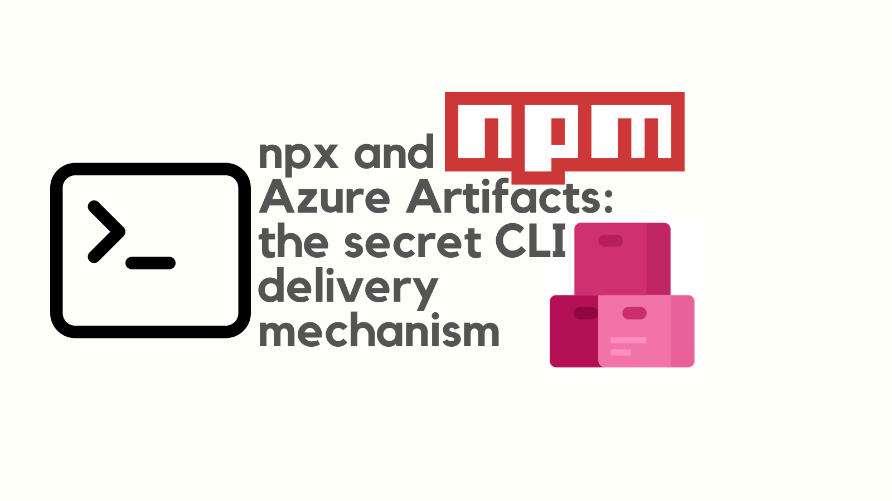
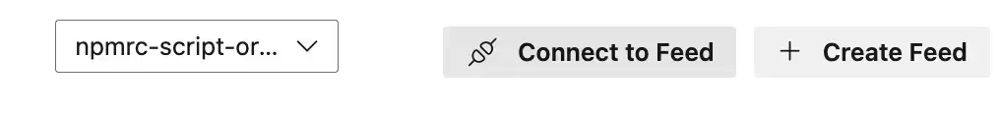

The [`npx` command](https://docs.npmjs.com/cli/v8/commands/npx) is a powerful tool for running CLI tools shipped as npm packages, without having to install them globally. If you have a private npm feed, you can use `npx` to run your CLI tool from that feed.

Azure Artifacts is a feature of Azure DevOps that supports publishing npm packages to a feed for consumption. By combining `npx` and Azure Artifacts, you can deliver your CLI tool to consumers in a way that's easy to use and secure.



This post shows how to use `npx` and Azure Artifacts to deliver your private CLI tool to consumers.

<!--truncate-->

## Why is combining `npx` with private npm feeds useful?

If you've ever found a need to deliver a private CLI tool to consumers, you'll know that it can be a challenge.

I work for a large organization and we need to share internal tools with our colleagues. The problem is, that it's hard to get people to install and update the tools. Either you need to provide detailed instructions on how to install the tool, or you need to create an installer that people can run. You then have the subsequent problem of how to update the tool.

By combining `npx` and Azure Artifacts you no longer need to worry about any of that. You can publish your tool to a private npm feed and then consumers can run it with a single command. They don't need to install anything up front, and they don't need to worry about updates.

A typical usecase is the one I've mentioned; sharing tools internally in an organisation. But, broader than that, if you want to deliver a private npm package to consumers, this is a great way to do it.

We're going to look at how we'd achieve this with Azure Artifacts as the host of the npm package. But, you could use any npm feed that you have access to.

## How to combine `npx` with Azure Artifacts

Before you can use `npx` to run your CLI tool, you need to publish it to a private npm feed. Here is a guide on [how to publish a private npm package with Azure Artifacts](../2024-12-07-npx-and-azure-artifacts-the-secret-cli-delivery-mechanism/index.md). In that example we published a package to a feed called `npmrc-script-organization` in the `johnnyreilly` organization of Azure DevOps / Azure Artifacts.

For the sake of our example, we'll say that our package is a CLI tool with the name `@johnnyreilly/my-cli-tool`. An npm package which houses a CLI tool is merely a package with a [`bin` entry in the `package.json`](https://docs.npmjs.com/cli/v10/configuring-npm/package-json#bin). This post is not about how to create a CLI tool, but rather how to deliver it to consumers. If you would like to see an example of what a CLI tool package looks like, you can check out the [`azdo-npm-auth` package on GitHub](https://github.com/johnnyreilly/azdo-npm-auth).

The question now is, how we can run the `@johnnyreilly/my-cli-tool` package with `npx`? First, I want to be clear on the pieces of information that we need to know:

1. The name of the organization in Azure DevOps / Azure Artifacts. In our case, it's `johnnyreilly`.
2. The name of the feed in Azure DevOps / Azure Artifacts. In our case, it's `npmrc-script-organization`.
3. The name of the package. In our case, it's `@johnnyreilly/my-cli-tool`.

All of the above will be different for you, so you'll need to replace these values with your own.

## The `registry` option of `npm` / `npx`

The secret sauce of running a CLI tool from a private npm feed with `npx` is the [`registry` option of `npm` / `npx`](https://docs.npmjs.com/cli/v8/using-npm/config#registry). The `registry` option allows you to specify the URL of the npm feed that you want to use. In our case, the URL is `https://pkgs.dev.azure.com/johnnyreilly/_packaging/npmrc-script-organization/npm/registry/`.

We constructed this by combining the organization and the feed names above into the following format:

`https://pkgs.dev.azure.com/[ORGANIZATION]/_packaging/[FEED]/npm/registry/`

Even easier is just to grab it from the Azure DevOps UI by clicking on the "Connect to Feed" button in the Azure Artifacts section:



Then select `npm` and you'll see the instructions for setting up the `.npmrc` file:


You can see the registry URL in the `.npmrc` file above.

## Running the CLI tool with `npx`

Equipped with this information, we can now run our CLI tool with `npx`:

```shell
npx -y --registry https://pkgs.dev.azure.com/johnnyreilly/_packaging/npmrc-script-organization/npm/registry/ @johnnyreilly/my-cli-tool
```

This command will download the `@johnnyreilly/my-cli-tool` package from the private npm feed and run it. The `--registry` option tells `npx` to use the specified registry to download the package.

There is another way to specify the registry URL, which is to use the `npm_config_registry` environment variable. This approach is more verbose and is not cross platform (it won't work on Windows). But, if you prefer this approach, you can use this style of command:

```shell
npm_config_registry=https://pkgs.dev.azure.com/johnnyreilly/_packaging/npmrc-script-organization/npm/registry/ npx -y @johnnyreilly/my-cli-tool
```

## What about authentication?

If you encounter an error like this:

```shell
npm error code E401
npm error Unable to authenticate, your authentication token seems to be invalid.
npm error To correct this please try logging in again with:
npm error npm login
```

Then you probably need a new token. You can get a new token by running [`azdo-npm-auth`](https://github.com/johnnyreilly/azdo-npm-auth) (the package I created to help with this problem). You can run it like this:

```shell
npx -y --registry https://registry.npmjs.org azdo-npm-auth --organization johnnyreilly --feed npmrc-script-organization
```

This is assuming your feed is organization-scoped. If your feed is project-scoped, you will need to supply the `project` value:

```shell
npx -y --registry https://registry.npmjs.org azdo-npm-auth --organization johnnyreilly --project my-project --feed project-feed-name
```

Then you can run the original command again; it should work this time.

## Conclusion

By combining `npx` and Azure Artifacts, you can deliver your CLI tool to consumers in a way that's easy to use and secure. Consumers can run your tool with a single command, without having to install anything up front. This is a great way to share private npm packages with consumers.

In this post we've used Azure Artifacts as the host of the npm package, but you could use any npm feed that you have access to. The key is to use the `registry` option of `npm` / `npx` to specify the URL of the npm feed.
