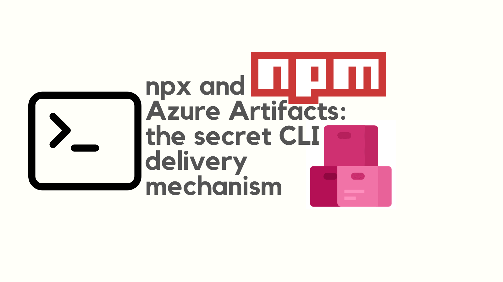
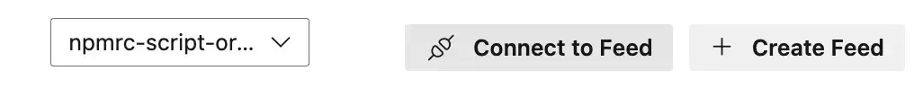

The [`npx` command](https://docs.npmjs.com/cli/v8/commands/npx) is a powerful tool for running CLI tools shipped as npm packages, without having to install them globally. `npx` is typically used to run packages on the public npm registry. However, if you have a private npm feed, you can also use `npx` to run packages available on that feed.

Azure Artifacts is a feature of Azure DevOps that supports publishing npm packages to a feed for consumption. (You might want to read [this guide on publishing npm packages to Azure Artifacts](../2024-12-01-azure-artifacts-publish-private-npm-package-with-azure-devops/index.md).) By combining `npx` and Azure Artifacts, you can deliver your CLI tool to consumers in a way that's easy to use and secure.



This post shows how to use `npx` and Azure Artifacts to deliver your private CLI tool to consumers.

<!--truncate-->

## Why is combining `npx` with private npm feeds useful?

If you've ever found a need to deliver a private CLI tool to consumers, you'll know that it can be a challenge.

I work for a large organization and we need to share internal tools with our colleagues. The problem is, that it's hard to get people to install tools. Either you need to provide detailed instructions on how to acquire and install the tool, or you need to work out some kind of internal distribution mechanism. You also have to think about how to update the tool. It's not simple.

By combining `npx` and Azure Artifacts it becomes much simpler. You can publish your CLI tool to a private npm feed and then consumers can run it with a single command. They don't need to install anything up front (apart from Node.js which they likely already have), and they don't need to worry about updates.

A typical usecase is the one I've mentioned; sharing tools internally in an organisation. But, broader than that, if you want to deliver a private CLI tool to consumers, this is a great way to do it.

We're going to look at how we'd achieve this with Azure Artifacts as the host of the npm package. But, you could use any private npm feed that you have access to.

## Publishing a package to Azure Artifacts

Before you can use `npx` to run your CLI tool, you need to publish it to a private npm feed. Here is a guide on [how to publish a private npm package with Azure Artifacts](../2024-12-01-azure-artifacts-publish-private-npm-package-with-azure-devops/index.md). In that example we published a package to a feed called `npmrc-script-organization` in the `johnnyreilly` organization of Azure DevOps / Azure Artifacts.

For the sake of this post, we'll say that our package is a CLI tool with the name `@johnnyreilly/my-cli-tool`.

Remember, an npm package which houses a CLI tool is merely an npm package with a [`bin` entry in the `package.json`](https://docs.npmjs.com/cli/v10/configuring-npm/package-json#bin). This post is not about how to create a CLI tool, but rather how to deliver one to private consumers. If you would like to see an example of what a CLI tool package looks like, you can check out the [`azdo-npm-auth` package on GitHub](https://github.com/johnnyreilly/azdo-npm-auth). (In fact, we'll use `azdo-npm-auth` later in this post - it's an example of a CLI tool published to the **public** npm registry.)

The question now is, how we can run the (private) `@johnnyreilly/my-cli-tool` package with `npx`?

## The `registry` config setting of `npm` / `npx`

The secret sauce of running a CLI tool from a private npm feed with `npx` is the [`registry` config setting of `npm` / `npx`](https://docs.npmjs.com/cli/v8/using-npm/config#registry). The `registry` option allows you to specify the URL of the npm feed that you want to use.

For our case, we grabbed the registry URL from the Azure DevOps UI by clicking on the "Connect to Feed" button in the Azure Artifacts section:



When we selected `npm`, ADO displayed instructions for setting up an `.npmrc` file for private consumption:


We don't need to set up an `.npmrc` file to run the CLI tool with `npx`, but we do need to grab the registry URL, which we can see in the example `.npmrc` file above. In our case, the URL is `https://pkgs.dev.azure.com/johnnyreilly/_packaging/npmrc-script-organization/npm/registry/`. This is the URL of the registry (private npm feed) that we want to use.

## Running the CLI tool with `npx`

Equipped with the registry URL, we can now run our CLI tool with `npx`:

```shell
npx -y --registry https://pkgs.dev.azure.com/johnnyreilly/_packaging/npmrc-script-organization/npm/registry/ @johnnyreilly/my-cli-tool
```

This command will download the `@johnnyreilly/my-cli-tool` package from the private npm feed and run it. The `--registry` option tells `npx` to use the specified registry URL to download the package and the `-y` option tells `npx` to answer "yes" to the installation prompt.

If you need to pass arguments to the CLI tool, you can simply add them to the end of the command as you would with any CLI tool: (I'll put this over multiple lines for readability, but you can run it as a single line)

```shell
npx -y \
  --registry https://pkgs.dev.azure.com/johnnyreilly/_packaging/npmrc-script-organization/npm/registry/ \
  @johnnyreilly/my-cli-tool --arg1 hello
```

There is another way to specify the registry URL, which is to use the `npm_config_registry` environment variable. This approach is more verbose and is not cross platform (it won't work on Windows). But, if you prefer this approach, you can use this style of command:

```shell
npm_config_registry=https://pkgs.dev.azure.com/johnnyreilly/_packaging/npmrc-script-organization/npm/registry/ npx -y @johnnyreilly/my-cli-tool
```

## What about authentication?

If you encounter an error like this:

```shell
npm error code E401
npm error Unable to authenticate, your authentication token seems to be invalid.
npm error To correct this please try logging in again with:
npm error npm login
```

Then npm is telling you to authenticate with the private npm feed / registry. This is because the feed is private and requires authentication. This is a good thing; it means that your package is secure; just as you'd hoped.

You may have your own way of authenticating with the feed. If so, great! Do that now and skip the next section.

## Using `azdo-npm-auth` to authenticate with Azure Artifacts

On the other hand, if you're using Azure Artifacts ([and your Azure DevOps organisation is connected with your Azure account / Microsoft Entra ID](https://learn.microsoft.com/en-us/azure/devops/organizations/accounts/connect-organization-to-azure-ad?view=azure-devops)), you can use [`azdo-npm-auth`](https://github.com/johnnyreilly/azdo-npm-auth) to solve your authentication needs. You can run `azdo-npm-auth` like this:

```shell
npx -y azdo-npm-auth --registry https://pkgs.dev.azure.com/johnnyreilly/_packaging/npmrc-script-organization/npm/registry/
```

The above command will acquire a PAT (Personal Access Token) from Azure DevOps and use it to create a user `.npmrc` file, which will be used by `npx` to authenticate with the feed subsequently.

If you encounter a `npm error code E401` as you run the `azdo-npm-auth` command, it's possible that you have a local `.npmrc` file that is tripping `npx` up. You can get around that by explicitly passing the `--registry` of the public npm feed / registry to `npx`:

```shell
npx -y --registry https://registry.npmjs.org azdo-npm-auth --registry https://pkgs.dev.azure.com/johnnyreilly/_packaging/npmrc-script-organization/npm/registry/
```

That's right; we're passing the public npm registry to `npx`'s `--registry` and we're passing our private npm feed / registry to `azdo-npm-auth`'s `--registry`. This gets around the `npm error code E401` issue.

## Running the original command again

Whichever way you authenticated, you should now be ready. You can now run the original command again; it should work this time. For example:

```shell
npx -y --registry https://pkgs.dev.azure.com/johnnyreilly/_packaging/npmrc-script-organization/npm/registry/ @johnnyreilly/my-cli-tool
```

And that's it! You've successfully run your CLI tool from a private npm feed with `npx`.

## Conclusion

In this post we've used Azure Artifacts as the host of the npm package, but you could use any npm feed that you have access to. The key is to use the `registry` option of `npm` / `npx` to specify the URL of the npm feed.

By combining `npx` and private npm feeds, you can deliver your CLI tool to consumers in a way that's easy to use and secure. Consumers can run your tool with a single command, without having to install anything up front. This is a powerful way to share private CLI tools.
