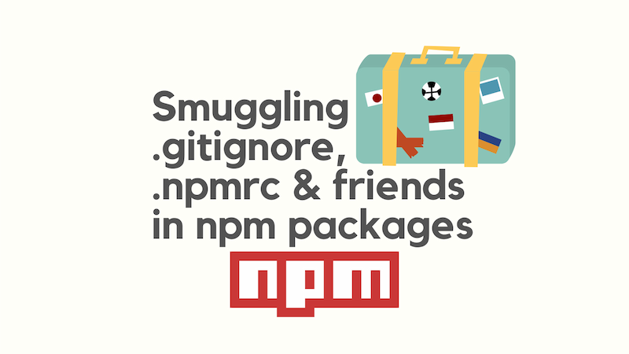

I recently needed to include a number of `.gitignore` and `.npmrc` files in an npm package. I was surprised to find that the `npm publish` command strips these out of the published package by default. As a consequence, This broke my package, and so I needed to find a way to get round this shortcoming.

I ended up using zipping and unzipping with `postinstall` and `prepare` scripts to include these files into my npm package.



This post shows how to use zipping and unzipping with `postinstall` and `prepare` scripts to include these files into your npm package.

<!--truncate-->

## A little backstory

I'm currently beavering away on a "create-\*-app" tool that generates new projects from a number of available templates. That tool takes the form of a CLI tool built with TypeScript, published as a package to an npm registry and consumed with `npx`. Significantly, the templates that ship with the CLI take the form of a `templates` folder in the package, and the folders in those templates include `.npmrc` and `.gitignore` files; which are key to the functionality of the templates.

When publishing my npm package, I discovered that the `.npmrc` and `.gitignore` files in subfolders were being stripped from the package. After a little research, I happened upon this [GitHub issue about npm](https://github.com/npm/npm/issues/3763) which describes some of the behaviour I was seeing. After a touch more digging, I came to understand that this behaviour is a result of npm treating the `.gitignore` and `.npmrc` files as configuration files rather than part of the package's intended content.

However, given these files are essential to the templates' functionality, I needed to find a way to include them in the package.

I mused with explicitly including the specific files in the `files` section of the `package.json` file, but this would have been a maintenance headache. I wanted a more automated solution. Given that I have a single "special" folder called `templates` that contains all the templates, I pondered whether I could zip the folder on publish and unzip it on install. This would allow me to include the `.gitignore` and `.npmrc` files in the templates and have them copied into the new project when the template was used. And if there was another other curious behaviour around publishing, this solution should cover that too.

## `prepare` and `postinstall` scripts

I achieved this by using `prepare` and `postinstall` scripts in the `package.json` file.

The `prepare` and `postinstall` scripts are two of the lifecycle scripts that npm runs when installing a package. The `prepare` script runs before the package is packaged and published, and the `postinstall` script runs after the package is installed. I opted to use these scripts to zip and unzip the `templates` folder in my package.

I performed the actual zipping and unzipping with some Node.js scripts. We'll look into the implementation of these scripts in a moment, but first please note the scripts we added to the `package.json` file:

```json
  "scripts": {
    "postinstall": "node ./scripts/postinstall.js",
    "prepare": "node ./scripts/prepare.js"
  },
```

These scripts contain the paths to the Node.js scripts that perform the zipping and unzipping. The `postinstall` script runs after the package is installed, and the `prepare` script runs before the package is packaged and published.

When it comes to zipping and unzipping, I used the [`adm-zip`](https://github.com/cthackers/adm-zip) package. This package provides a simple API for zipping and unzipping files and folders.

## `prepare.js`

We'll first look at the `prepare.js` script. This script zips the `templates` folder in the package into a `templates.zip` file. The script then writes the zip file to the package's root directory.

```js
import AdmZip from 'adm-zip';
import fs from 'node:fs';
import { fileURLToPath } from 'node:url';

function packTemplates() {
  console.log('prepare running - packing templates');

  const templatesZipPath = fileURLToPath(
    new URL('../templates.zip', import.meta.url),
  );
  const templatesDir = fileURLToPath(new URL('../templates', import.meta.url));

  const zip = new AdmZip();

  console.log(`removing existing ${templatesZipPath}`);
  fs.rmSync(templatesZipPath, {
    force: true,
  });

  console.log(`adding ${templatesDir} to zip file`);
  zip.addLocalFolder(templatesDir);

  console.log(`writing zip to ${templatesZipPath}`);
  zip.writeZip(templatesZipPath);
}

packTemplates();
```

It also removes any existing `templates.zip` file in the package's root directory before creating a new one. This is to ensure that the zip file is always up to date.

## `postinstall.js`

Now we'll look at the `postinstall.js` script. This script unzips the `templates.zip` file in the package into a `templates` folder. The script then writes the unzipped folder to the package's root directory.

```js
import AdmZip from 'adm-zip';
import fs from 'node:fs';
import { fileURLToPath } from 'node:url';

function extractTemplates() {
  console.log('postinstall running - extracting templates');
  const templatesZipPath = fileURLToPath(
    new URL('../templates.zip', import.meta.url),
  );
  const templatesDir = fileURLToPath(new URL('../templates', import.meta.url));

  let templatesExistsAlready = true;
  try {
    fs.accessSync(templatesDir);
  } catch {
    templatesExistsAlready = false;
  }

  if (templatesExistsAlready) {
    console.log('templates already extracted');
    return;
  }

  console.log(`extracting from ${templatesZipPath} to ${templatesDir}`);

  const extractZip = new AdmZip(templatesZipPath);
  extractZip.extractAllTo(templatesDir, /* overwrite */ false);

  console.log('templates extracted');
}

extractTemplates();
```

You'll notice that the script checks whether the `templates` folder already exists before unzipping the `templates.zip` file. This is to ensure that the folder is only unzipped once.

## Conclusion

So here we have a method for including `.gitignore` and `.npmrc` files in an npm package. By using zipping and unzipping with `postinstall` and `prepare` scripts, we can include these files in the package and have them copied into the new project when the package is installed.

My example is a `templates` folder - yours could be anything. And likewise if you have other files that are being stripped from your package, you could use this method to include them too.
