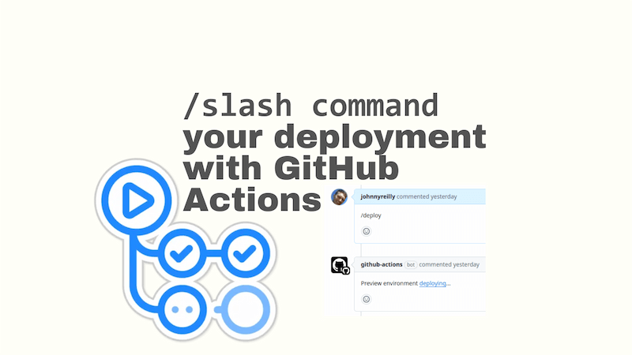
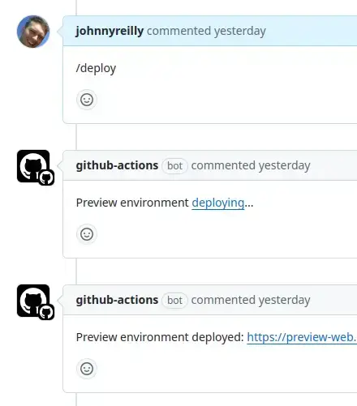

In the world of computing, slash commands have a proud and noble history. They are a way to interact with a system by typing a command into a chat or terminal, usually with a `/` preceding the command; hence the name "slash commands". [GitHub has its own slash commands](https://docs.github.com/en/issues/tracking-your-work-with-issues/using-issues/about-slash-commands) that you can use in issues and pull requests to add code blocks and tables etc. The slash commands are, in truth, quite limited.

However, through clever use of the GitHub Actions platform, it's possible to build something quite powerful which is "slash-command-shaped". In this post, we'll look at how to implement a `/deploy` slash command which, when invoked in a pull request, will deploy an Azure Container App with GitHub Actions.



The technique we'll use is covering a deployment usecase, as we'll see, it could be adapted to many other scenarios.

<!--truncate-->

## First a bit about nuns

I have an aunt that is a Poor Clare nun, and I've been [over-engineering her convent's website for years](../2015-02-11-the-convent-with-continuous-delivery/index.md). Most of the time the site moulders away, but every now and then I get a flurry of requests for minor changes. Once I've made the changes, they go live thanks to the magic of continuous deployment. But there's only ever been a single environment; production or "main".

Sometimes I'd like to eyeball a change before I've shipped it. Not always, sometimes. A particular case where this is useful, is when [Renovate](https://www.mend.io/renovate/) has submitted a dependency upgrade PR, and I'd like to see the impact without having to install and run it locally somewhere. Because, unless I instead hit "merge" with crossed fingers, that's what I'll need to do. (I have done this and it doesn't always end well.)

So I decided it was time that the "Convent with Continuous Delivery™️" had a staging environment. And I decided that I'd like to be able to deploy to it by entering the slash command `/deploy` in a pull request comment. Like this:



As we can see, I entered `/deploy` in a comment. In response, a GitHub Actions workflow then kicked off and deployed the staging environment. How did I do this? Let's find out.

## The GitHub Actions workflow

The secret sauce that makes implementing slash commands in GitHub Actions possible is the [`issue_comment` event](https://docs.github.com/en/actions/writing-workflows/choosing-when-your-workflow-runs/events-that-trigger-workflows#issue_comment). This event is triggered when an issue or pull request comment is created, edited, or deleted. We're interested in the situation where a pull request comment is created, and it contains the `/deploy` command.

Based upon the [example here](https://docs.github.com/en/actions/writing-workflows/choosing-when-your-workflow-runs/events-that-trigger-workflows#issue_comment-on-issues-only-or-pull-requests-only) it's possible to create a workflow that is triggered by the `issue_comment` event, but only when the comment is on a pull request, and that comment contains the text `/deploy`.

Here's the workflow:

```yaml
on:
  issue_comment:
    types: [created]

jobs:
  run-for-pr-comment-with-deploy-command:
    # check if the comment comes from a pull request and contains the command `/deploy`
    if: github.event.issue.pull_request && contains(github.event.comment.body, '/deploy')
    # ...
```

The `if` statement is the key to this workflow. It checks if the comment comes from a pull request and contains the command `/deploy`. If both conditions are met, the workflow continues. We're in business!

## Avoiding duplication with a reusable workflow

I already have a GitHub Actions workflow that deploys the main environment. I don't want to duplicate this logic in the new workflow. Instead, I want to reuse the existing workflow and just pass in a different environment name. This is where [reusable workflows](https://docs.github.com/en/actions/learn-github-actions/reusing-workflows) come in.

I think of these as functions that can be called from other workflows. They have inputs and outputs, and can be parameterised.

I migrated the deployment logic to a reusable workflow called `util-build-and-deploy.yaml`. I pondered the best way to share this information with you, and I've finally opted to include the entire workflow here. It's a bit long, but I think it's the best way to show you how it all fits together:

```yaml
name: Build and deploy

on:
  workflow_call:
    inputs:
      deploy:
        required: true
        type: boolean
      branchName:
        required: true
        type: string

    outputs:
      containerAppUrl:
        description: 'The URL of the deployed container app'
        value: ${{ jobs.deploy.outputs.containerAppUrl }}

env:
  RESOURCE_GROUP: rg-my-convent
  REGISTRY: ghcr.io

jobs:
  build:
    runs-on: ubuntu-latest
    permissions:
      contents: read
      packages: write
    outputs:
      image-name: ${{ steps.vars.outputs.image_name }}
      sha-short: ${{ steps.vars.outputs.sha_short }}
      built-at: ${{ steps.vars.outputs.built_at }}
    steps:
      - name: Checkout repository
        uses: actions/checkout@v4
        with:
          ref: ${{ inputs.branchName }}

      - name: Set sha-short and image-name environment variables
        id: vars
        run: |
          image_name=$(echo "${{ env.REGISTRY }}/${{ github.repository }}/node-service" | tr '[:upper:]' '[:lower:]')
          echo "image_name=$image_name" >> $GITHUB_OUTPUT
          sha_short=$(echo "$(git rev-parse --short HEAD)" | tr '[:upper:]' '[:lower:]')
          echo "sha_short=$sha_short" >> $GITHUB_OUTPUT
          echo "built_at=$(date +'%Y-%m-%dT%H:%M:%S')" >> $GITHUB_OUTPUT

      # Login against a Docker registry
      # https://github.com/docker/login-action
      - name: Log into registry ${{ env.REGISTRY }}
        uses: docker/login-action@v3
        with:
          registry: ${{ env.REGISTRY }}
          username: ${{ github.actor }}
          password: ${{ secrets.GITHUB_TOKEN }}

      # Extract metadata (tags, labels) for Docker
      # https://github.com/docker/metadata-action
      - name: Extract Docker metadata
        id: meta
        uses: docker/metadata-action@v5
        with:
          images: ${{ steps.vars.outputs.image_name }}
          context: git # so it uses the git branch that is checked out
          tags: |
            type=semver,pattern={{version}}
            type=semver,pattern={{major}}.{{minor}}
            type=semver,pattern={{major}}
            type=ref,event=branch
            type=ref,event=pr
            type=sha

      # Build and push Docker image with Buildx (don't push if deploy is false)
      # https://github.com/docker/build-push-action
      - name: Build and push Docker image
        uses: docker/build-push-action@v6
        with:
          context: ./
          push: ${{ inputs.deploy }}
          tags: ${{ steps.meta.outputs.tags }}
          labels: ${{ steps.meta.outputs.labels }}
          build-args: |
            VITE_BRANCH_NAME=${{ inputs.branchName }}
            VITE_GIT_SHA=${{ steps.vars.outputs.sha_short }}
            VITE_BUILT_AT=${{ steps.vars.outputs.built_at }}

  deploy:
    runs-on: ubuntu-latest
    if: inputs.deploy == true
    needs: build
    outputs:
      containerAppUrl: ${{ steps.deploy.outputs.CONTAINER_APP_URL }}
    permissions:
      id-token: write
      contents: read
      packages: write
    steps:
      - name: Checkout repository
        uses: actions/checkout@v4
        with:
          ref: ${{ inputs.branchName }}

      - name: Azure login
        uses: azure/login@v2
        with:
          client-id: ${{ secrets.AZURE_CLIENT_ID }}
          tenant-id: ${{ secrets.AZURE_TENANT_ID }}
          subscription-id: ${{ secrets.AZURE_SUBSCRIPTION_ID }}

      - name: Deploy to Azure
        id: deploy
        uses: azure/CLI@v2
        with:
          inlineScript: |
            RESOURCE_GROUP="${{ env.RESOURCE_GROUP }}"
            BUILT_AT="${{ needs.build.outputs.built-at }}"
            BRANCH_NAME="${{ inputs.branchName }}"
            SHA_SHORT="${{ needs.build.outputs.sha-short }}"
            REF_SHA="${{ inputs.branchName }}.${{ needs.build.outputs.sha-short }}"
            DEPLOYMENT_NAME="${REF_SHA////-}"
            echo "DEPLOYMENT_NAME=$DEPLOYMENT_NAME"

            webServiceImage="${{ needs.build.outputs.image-name }}:sha-$SHA_SHORT"
            echo "webServiceImage=$webServiceImage"

            if [ "$BRANCH_NAME" == "main" ]; then
              webServiceContainerAppName="main-web"
            else
              webServiceContainerAppName="preview-web"
            fi
            echo "webServiceContainerAppName=$webServiceContainerAppName"

            TAGS='{"owner":"johnnyreilly", "email":"johnny_reilly@hotmail.com"}'
            az deployment group create \
              --resource-group $RESOURCE_GROUP \
              --name "$DEPLOYMENT_NAME" \
              --template-file ./infra/main.bicep \
              --parameters \
                  webServiceImage="$webServiceImage" \
                  containerRegistry=${{ env.REGISTRY }} \
                  containerRegistryUsername=${{ github.actor }} \
                  containerRegistryPassword=${{ secrets.PACKAGES_TOKEN }} \
                  branchName="$BRANCH_NAME" \
                  gitSha="$SHA_SHORT" \
                  builtAt="$BUILT_AT" \
                  workspaceName='shared-log-analytics' \
                  appInsightsName='shared-app-insights' \
                  managedEnvironmentName='shared-env' \
                  webServiceContainerAppName="$webServiceContainerAppName" \
                  tags="$TAGS" \
                  APPSETTINGS_API_KEY="${{ secrets.APPSETTINGS_API_KEY }}" \
                  APPSETTINGS_DOMAIN="${{ vars.APPSETTINGS_DOMAIN }}" \
                  APPSETTINGS_PRAYER_REQUEST_FROM_EMAIL="${{ vars.APPSETTINGS_PRAYER_REQUEST_FROM_EMAIL }}" \
                  APPSETTINGS_PRAYER_REQUEST_RECIPIENT_EMAIL="${{ vars.APPSETTINGS_PRAYER_REQUEST_RECIPIENT_EMAIL }}"

            CONTAINER_APP_URL=$(az containerapp show \
              --resource-group "$RESOURCE_GROUP" \
              --name "$webServiceContainerAppName" \
              --query properties.configuration.ingress.fqdn \
              --output tsv)

            echo "CONTAINER_APP_URL=$CONTAINER_APP_URL"
            echo "CONTAINER_APP_URL=$CONTAINER_APP_URL" >> $GITHUB_OUTPUT
```

Let's talk through what this workflow does:

- It's triggered by a `workflow_call` event, which is how reusable workflows are triggered.
- It has two jobs: `build` and `deploy` and the `deploy` job is only run if the `deploy` input is `true`. (This allows us to call the workflow with `deploy: false` to only build the image)
- The `build` job checks out the code, sets some environment variables, logs into the Docker registry, extracts metadata for Docker, builds and pushes the Docker image.
- The `deploy` job checks out the code, logs into Azure, and deploys the container app to Azure Container Apps. It then outputs the URL of the deployed container app in order that we can display it to the user.

Now most of this workflow is the same as the one I was originally using to deploy to the main environment. The key difference is it is now parameterised with the `branchName` input. This is important for two reasons:

1. It allows us to deploy to different environments based on the branch name. In our case we'll deploy to the `preview-web` container app if the branch name is not `main`. Otherwise we'll deploy to `main-web`.
2. (and this is more subtle) We need to checkout the relevant branch of the repository in our workflow, so that we're building and deploying the correct thing. So you'll see us use the `branchName` input in the `actions/checkout` steps and you'll see us use `context: git` in the `docker/metadata-action` step.

You might be thinking at this point, "fine - but I don't have a containerised application and I don't have an Azure Container Apps service to deploy to". That's great! You can adapt this workflow to build any type of app you would like and deploy to any type of service. The crucial part is that you must build and deploy the code for the correct branch. This is why we pass the `branchName` input to the workflow.

And now some bad news: the `issue_comment` event **doesn't** know the branch that the pull request is for. We're going to need to build _another_ reusable workflow that we will use to determine the branch name of the pull request.

## Getting the branch name of the pull request

Now we're old hands at creating reusable workflows, we're going to create another one that will determine the branch name of the pull request. We'll call this workflow `util-get-pr-branch-name.yaml`:

```yaml
name: Get PR branch name

on:
  workflow_call:
    inputs:
      pullRequestNumber:
        required: true
        type: number

    outputs:
      branchName:
        description: 'The source branch name for the pull request'
        value: ${{ jobs.get-pr-branch-name.outputs.branchName }}

jobs:
  get-pr-branch-name:
    runs-on: ubuntu-latest
    outputs:
      branchName: ${{ steps.get-pr-branch-name.outputs.branchName }}
    steps:
      - id: get-pr-branch-name
        run: |
          branchName=$(gh pr view ${{ inputs.pullRequestNumber }} --json "headRefName" --jq ".headRefName" --repo ${{ github.repository }})
          echo "branchName=$branchName" >> $GITHUB_OUTPUT
        env:
          GH_TOKEN: ${{ github.token }}
```

This is fairly self explanatory. The workflow takes a `pullRequestNumber` input and outputs the `branchName` of the pull request. It uses the `gh` CLI to get the branch name of the pull request using the `headRefName` property of a pull request. (Incidentally, the `env: GH_TOKEN: ${{ github.token }}` line is important as it allows the workflow to authenticate with GitHub.)

## Putting it all together

Now we have our two reusable workflows, we can put them together in a workflow that is triggered by the `issue_comment` event. This workflow will call the `util-get-pr-branch-name.yaml` workflow to get the branch name of the pull request, and then call the `util-build-and-deploy.yaml` workflow to build and deploy the code for that branch. Here's the `pull-request-commands.yaml` workflow:

```yaml
name: Pull request commands

on:
  issue_comment:
    types: [created]

jobs:
  get-pr-branch-name:
    uses: ./.github/workflows/util-get-pr-branch-name.yaml
    with:
      pullRequestNumber: ${{ github.event.issue.number }}

  pre-deploy:
    # check if the comment comes from a pull request and contains the command `/deploy`
    if: github.event.issue.pull_request && contains(github.event.comment.body, '/deploy')
    runs-on: ubuntu-latest
    steps:
      - run: |
          gh issue comment ${{ github.event.issue.number }} --body "Preview environment [deploying](https://github.com/johnnyreilly/poorclaresarundel-aca/actions/runs/${{ github.run_id }})..." --repo ${{ github.repository }}
        env:
          GH_TOKEN: ${{ secrets.GITHUB_TOKEN }}

  deploy:
    # check if the comment comes from a pull request and contains the command `/deploy`
    if: github.event.issue.pull_request && contains(github.event.comment.body, '/deploy')
    needs: [get-pr-branch-name, pre-deploy]
    uses: ./.github/workflows/util-build-and-deploy.yaml
    with:
      deploy: true
      branchName: ${{ needs.get-pr-branch-name.outputs.branchName }}
    secrets: inherit

  post-deploy:
    runs-on: ubuntu-latest
    needs: deploy
    steps:
      - run: |
          gh issue comment ${{ github.event.issue.number }} --body "Preview environment deployed: https://${{ needs.deploy.outputs.containerAppUrl }}" --repo ${{ github.repository }}
        env:
          GH_TOKEN: ${{ secrets.GITHUB_TOKEN }}
```

What you're hopefully gleaning from the above is that we have 4 jobs in this workflow:

- `get-pr-branch-name` - this job calls the `util-get-pr-branch-name.yaml` workflow to get the branch name of the pull request. Note that we pass the `github.event.issue.number` as the `pullRequestNumber` input.
- `pre-deploy` - this job runs immediately to post a comment in the pull request to let the user know that the preview environment is being deployed. (Again using the GitHub CLI.) The comment gives the user feedback that the command has been received and is being actioned. Based upon my experience, this response will show up in the pull request 5-10 seconds after the `/deploy` command is entered. Not as fast as I'd like, but reasonable. For bonus points, I've chosen to include a link to the GitHub Actions run that is deploying the preview environment. This is useful as it allows the user to see the progress of the deployment.
- `deploy` - this job calls the `util-build-and-deploy.yaml` workflow to build and deploy the code for the branch. Note that we pass the `branchName` input to the workflow using the `get-pr-branch-name.outputs.branchName` output. Note also that we're passing `deploy: true` to the workflow to ensure that the code is deployed, and that we're inheriting the secrets from the parent workflow. This is important as it allows the child workflow to access the secrets it needs to deploy the code.
- `post-deploy` - this job posts a comment in the pull request to let the user know that the preview environment has been deployed and where they can find it.

Or maybe I should have said it better as a screenshot:


Yup! That's the same screenshot as before. I'm just showing it again to remind you that this is what we've built.

## Writing other slash commands

We've written a slash command for deployment in this post, but you could write a slash command for anything you like. The key is to use the `issue_comment` event to trigger the workflow, and to check the comment body for the command you're interested in. You could pass more information in the comment body than just the slash command. For example, you could pass the name of the environment you want to deploy to, or the version of the app you want to deploy. You could even pass multiple commands in a single comment. The world is your oyster!

You can then call other workflows to do the heavy lifting for you, remembering to pass in any inputs that are needed.

If you would like to see the repo where this was implemented, [look here](https://github.com/johnnyreilly/poorclaresarundel-aca/tree/f052dd2f5d55bcec8547624e928bbf90432f3872).
