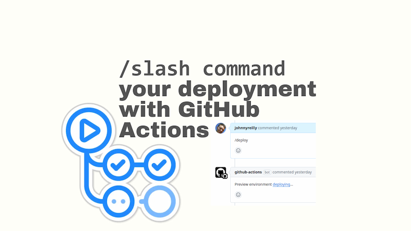
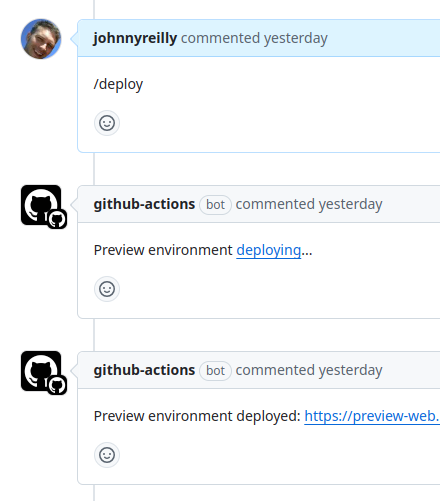

In the world of computing, slash commands have a proud and noble history. They are a way to interact with a system by typing a command into a chat or terminal, usually with a `/` preceding the command; hence the name "slash commands". [GitHub has its own slash commands](https://docs.github.com/en/issues/tracking-your-work-with-issues/using-issues/about-slash-commands) that you can use in issues and pull requests to add code blocks and tables etc. The slash commands are, in truth, quite limited.

However, through clever use of the GitHub Actions platform, it's possible to build something quite powerful which is "slash-command-shaped". In this post, we'll look at how to implement a `/deploy` slash command which, when invoked in a pull request, will deploy an Azure Container App with GitHub Actions.



The technique we'll use is covering a deployment usecase, as we'll see, it could be adapted to many other scenarios.

<!--truncate-->

## First a bit about nuns

I have an aunt that is a Poor Clare nun, and I've been [over-engineering her convent's website for years](../2015-02-11-the-convent-with-continuous-delivery/index.md). Most of the time the site moulders away, but every now and then I get a flurry of requests for minor changes. Once I've made the changes, they go live thanks to the magic of continuous deployment. But there's only a single environment; production or "main".

Sometimes I'd like to eyeball a change before I've shipped it. Not always, sometimes. A particular case where this is useful, is when [Renovate](https://www.mend.io/renovate/) has submitted a dependency upgrade PR, and I'd like to see the impact without having to install and run it locally somewhere. Because that's what I'll need to do, unless I instead hit submit with crossed fingers. (I have done this and it doesn't always end well.)

So I decided it was time that the "Convent with Continuous Delivery™️" had a staging environment. And I decided that I'd like to be able to deploy to it by entering the slash command `/deploy` in a pull request comment. Like this:



As you can see, I entered `/deploy` in the comment box and hit submit. The GitHub Actions workflow then kicked off and deployed the staging environment. How did I do this? Let's find out.

## The GitHub Actions workflow

The secret sauce that makes implementing slash commands in GitHub Actions possible is the [`issue_comment` event](https://docs.github.com/en/actions/writing-workflows/choosing-when-your-workflow-runs/events-that-trigger-workflows#issue_comment). This event is triggered when an issue or pull request comment is created, edited, or deleted. We're interested in the situation where a pull request comment is created, and it contains the `/deploy` command.

Based upon the [example here](https://docs.github.com/en/actions/writing-workflows/choosing-when-your-workflow-runs/events-that-trigger-workflows#issue_comment-on-issues-only-or-pull-requests-only) it's possible to create a workflow that is triggered by the `issue_comment` event, but only when the comment is on a pull request, and that comment contains the text `/deploy`.

Here's the workflow:

```yaml
on:
  issue_comment:
    types: [created]

jobs:
  run-for-pr-comment-with-deploy-command:
    # check if the comment comes from a pull request and contains the command `/deploy`
    if: github.event.issue.pull_request && contains(github.event.comment.body, '/deploy')
    # ...
```

The `if` statement is the key to this workflow. It checks if the comment comes from a pull request and contains the command `/deploy`. If both conditions are met, the workflow continues. We're in business!
