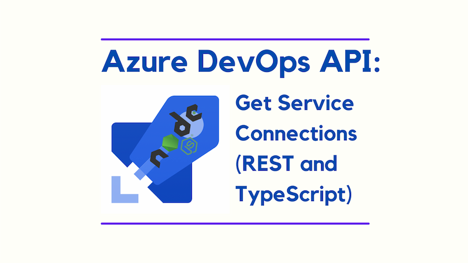
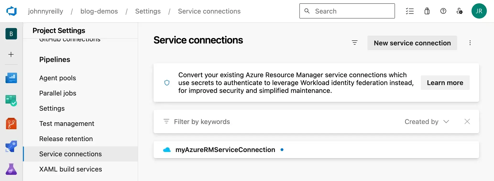

If you work with Azure Pipelines, you'll likely have come upon the need to create service connections. These are the connections to external services that your pipelines need to run. You can interrogate these connections using the Azure DevOps REST API. This post goes through how to do this; both using curl and using TypeScript.



I'm writing this post because when I attempted to use the [Azure DevOps Client for Node.js](https://github.com/microsoft/azure-devops-node-api) package to acquire them I found it lacking, and [not for the first time](../2021-05-08-create-pipeline-with-azure-devops-api/index.md). I am going to allow myself a little moan here; ever since Microsoft acquired GitHub, the Azure DevOps ecosystem feels like it has had insufficient investment.

However, as is often the case, there is a way. The Azure DevOps REST API is there for us, and with a little `fetch` we can get the job done.

<!--truncate-->

## Service connections vs service endpoints

Before we get into the code, let's clarify the terminology. In Azure DevOps, service connections are the connections to external services that your pipelines need to run. However, the Azure DevOps REST API refers to these as "service endpoints".



So when you're looking the screenshot above and you see "service connections", remember that in the API they're referred to as "service endpoints". If there is an actual distinction between "service connections" and "service endpoints" I'm not aware of it. If you know, please do let me know!

## Curling service connections

Once you know that service connections are referred to as "service endpoints" in the Azure DevOps REST API, you can use the [documentation](https://learn.microsoft.com/en-us/rest/api/azure/devops/serviceendpoint/endpoints/get-service-endpoints?view=azure-devops-rest-7.2&tabs=HTTP) to get them. Here's a curl to get you started:

```bash
curl  --user '':'PERSONAL_ACCESS_TOKEN' --header "Content-Type: application/json" --header "Accept:application/json" https://dev.azure.com/{organization}/{project}/_apis/serviceendpoint/endpoints?api-version=7.1
```

## What if I want to use TypeScript?

Now that we can see there's a way to get service connections with curl, let's look at how we can do this with TypeScript. Effectively we'll want to `fetch` (instead of using curl) and statically type the response with some interfaces. Here's a function that will retrieve service connections:

```ts
export async function getAzureDevOpsServiceConnections({
  personalAccessToken,
  organization,
  projectName,
}: {
  /** requires the vso.serviceendpoint scope which grants the ability to read service endpoints / service connections */
  personalAccessToken: string;
  /** eg "johnnyreilly" */
  organization: string;
  /** eg "blog-demos" */
  projectName: string;
}): Promise<ServiceConnection[]> {
  // https://learn.microsoft.com/en-us/rest/api/azure/devops/serviceendpoint/endpoints/get-service-endpoints?view=azure-devops-rest-7.1&tabs=HTTP
  const url = `https://dev.azure.com/${organization}/${projectName}/_apis/serviceendpoint/endpoints?api-version=7.1`;

  const response = await fetch(url, {
    method: 'GET',
    headers: {
      Accept: 'application/json',
      'Content-Type': 'application/json',
      Authorization: `Basic ${Buffer.from(`PAT:${personalAccessToken}`).toString('base64')}`,
      'X-TFS-FedAuthRedirect': 'Suppress',
    },
  });

  if (!response.ok) {
    throw new Error(`HTTP error! status: ${response.status.toString()}`);
  }

  const data = (await response.json()) as Wrapper;

  return data.value;
}

interface Wrapper {
  count: number;
  value: ServiceConnection[];
}

export interface ServiceConnection {
  authorization: Authorization;
  createdBy: CreatedBy;
  data: Record<string, null | string>;
  description: string;
  id: string;
  isOutdated: boolean;
  isReady: boolean;
  isShared: boolean;
  modificationDate?: string;
  modifiedBy?: ModifiedBy;
  name: string;
  owner: string;
  serviceEndpointProjectReferences: ServiceEndpointProjectReference[];
  serviceManagementReference: null;
  type: string;
  url: string;
}

export interface CreatedBy {
  _links: Links;
  descriptor: string;
  displayName: string;
  id: string;
  imageUrl: string;
  uniqueName: string;
  url: string;
}

export interface Links {
  avatar: Avatar;
}

export interface Avatar {
  href: string;
}

export interface Authorization {
  parameters: Record<string, null | string>;
  scheme: string;
}

export interface ServiceEndpointProjectReference {
  description: string;
  name: string;
  projectReference: ProjectReference;
}

export interface ProjectReference {
  id: string;
  name: string;
}

export interface ModifiedBy {
  displayName: null | string;
  id: string;
}
```

The function `getAzureDevOpsServiceConnections` is the one you'll want to call. It takes the following inputs:

- `personalAccessToken`: the personal access token you've created in Azure DevOps with the `vso.serviceendpoint` scope. You could equally use the [`System.AccessToken`](https://learn.microsoft.com/en-us/azure/devops/pipelines/build/variables?view=azure-devops&tabs=yaml#systemaccesstoken) that's available in your pipeline if that was appropriate.
- `organization`: the name of your Azure DevOps organization
- `projectName`: the name of the project you're interested in

The function returns an array of `ServiceConnection` objects. You'll note that the API actually returns a `Wrapper` object that contains a `count` and an array of `ServiceConnection` objects. This isn't actually useful for my purposes, so I've just returned the array of `ServiceConnection` objects.

## Conclusion

Honestly the hardest part about writing this post was being sure that "service connections" and "service endpoints" were the same thing. Truly naming things is hard.

Hopefully this post has helped you get the service connections you need. And as I mentioned earlier, if you know an actual distinction between "service connections" and "service endpoints" please do let me know!
