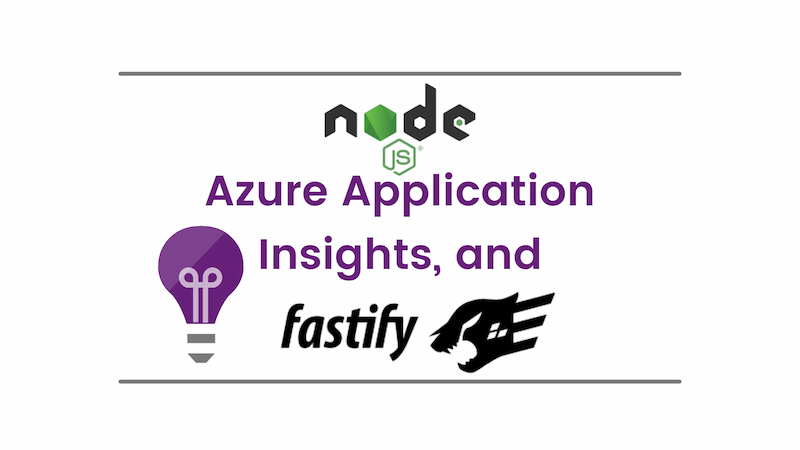
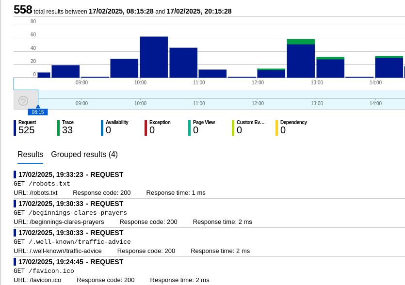

If you deploy a Node.js application to Azure, you might want to use Azure Application Insights to monitor it. This post shows you how to set up a Node.js application with Azure Application Insights. It also includes a Fastify plugin to automatically track requests. (Given the out of the box mechanism for tracking requests does not work with Fastify.)



This is one of those posts that gathers together information I found doing research and puts it in one place.

<!--truncate-->

## Setting up Azure Application Insights with Node.js

Setting up Azure Application Insights with Node.js is straightforward. You need to install the [`applicationinsights`](https://github.com/microsoft/ApplicationInsights-node.js) package which integrates Node.js and Azure Application Insights:

```sh
npm install applicationinsights --save
```

Then configure it with your connection string. You want to do this as early as possible when your application starts, so if there are issues, you know as soon as possible. Here's how you can do this:

```ts
import appInsights from 'applicationinsights';

let client: appInsights.TelemetryClient | undefined;

if (process.env.APPLICATIONINSIGHTS_CONNECTION_STRING) {
  // https://github.com/microsoft/applicationinsights-node.js?tab=readme-ov-file#configuration
  appInsights
    .setup(process.env.APPLICATIONINSIGHTS_CONNECTION_STRING)
    .setAutoCollectRequests(true)
    .setAutoCollectPerformance(true, true)
    .setAutoCollectExceptions(true)
    .setAutoCollectDependencies(true)
    .setAutoCollectConsole(true, true) // this will enable console logging
    .setAutoCollectPreAggregatedMetrics(true)
    .setSendLiveMetrics(false)
    .setInternalLogging(false, true)
    .enableWebInstrumentation(false)
    .start();

  client = appInsights.defaultClient;
}
```

The above code does two things of interest:

1. It sets up Azure Application Insights with the connection string you provide. For Node.js applications, the connection string tends to be stored in the environment variable `APPLICATIONINSIGHTS_CONNECTION_STRING` and I see no reason to deviate from that.
2. It configures the telemetry client to collect various types of telemetry data. You can see the full list of options [here](https://github.com/microsoft/applicationinsights-node.js?tab=readme-ov-file#configuration). In the example above, all the defaults are used with one exception. That exception is `setAutoCollectConsole(true, true)` which enables console logging. This is in response to this part of the docs:

> Note that by default `setAutoCollectConsole` is configured to _exclude_ calls to `console.log`
> (and other `console` methods). By default, only calls to supported third-party loggers
> (e.g. `winston`, `bunyan`) will be collected. You can change this behavior to _include_ calls
> to `console` methods by using `setAutoCollectConsole(true, true)`.

I'm not using a third-party logger in this example, so I want to include calls to `console` methods.

## Setting up Fastify with Azure Application Insights

If you're not a [Fastify](https://fastify.dev/) user you can stop here. But if you are a Fastify user, you may have discovered that `setAutoCollectRequests` appears not to be be working. There's a [GitHub issue to track this](https://github.com/microsoft/ApplicationInsights-node.js/issues/627), but no discernible sign that it's going to be fixed soon. So, I've created a Fastify plugin to track requests manually based upon [@stefanpeer's comment](https://github.com/microsoft/ApplicationInsights-node.js/issues/627#issuecomment-2194527018):

```ts
import { FastifyInstance, FastifyPluginOptions } from 'fastify';
import fp from 'fastify-plugin';
import appInsights from 'applicationinsights';

declare module 'fastify' {
  export interface FastifyRequest {
    // here we augment FastifyRequest interface as advised here: https://fastify.dev/docs/latest/Reference/Hooks/#using-hooks-to-inject-custom-properties
    app: { start: number };
  }
}

// based on https://github.com/microsoft/ApplicationInsights-node.js/issues/627#issuecomment-2194527018
export const appInsightsPlugin = fp(
  async (fastify: FastifyInstance, options: FastifyPluginOptions) => {
    if (!options.client) {
      console.log('App Insights not configured');
      return;
    }

    const client: appInsights.TelemetryClient = options.client;
    const urlsToIgnore = options.urlsToIgnore || [];

    fastify.addHook(
      'onRequest',
      async function (this: FastifyInstance, request, _reply) {
        // store the start time of the request
        const start = Date.now();
        request.app = { start };
      },
    );

    fastify.addHook(
      'onResponse',
      async function (this: FastifyInstance, request, reply) {
        if (urlsToIgnore.includes(request.raw.url)) return;

        const duration = Date.now() - request.app.start;
        client.trackRequest({
          name: request.raw.method + ' ' + request.raw.url,
          url: request.raw.url,
          duration: duration,
          resultCode: reply.statusCode.toString(),
          success: reply.statusCode < 400,
          properties: {
            method: request.raw.method,
            url: request.raw.url,
          },
          measurements: {
            duration: duration,
          },
        });
      },
    );
  },
);
```

The above code creates a Fastify plugin that tracks requests manually. It does this by adding two hooks to Fastify:

- `onRequest` - This hook stores the start time of the request.
- `onResponse` - This hook calculates the duration of the request and sends it to Azure Application Insights.

It also includes an `urlsToIgnore` option. This is an array of URLs that you don't want to track. For example, you might not want to track requests to the root of your application. You can pass this option when you register the plugin.

To make the code play nicely with TypeScript, we augment the `FastifyRequest` interface to include a `start` property. This is where we store the start time of the request that we supply to the `onResponse` hook and read from the `onRequest` hook to calculate the duration of the request.

To consume the plugin in a Fastify application, you can do something like this:

```ts
import appInsights from 'applicationinsights';
import Fastify, { FastifyInstance } from 'fastify';

import { appInsightsPlugin } from './appInsightsPlugin.js';

let client: appInsights.TelemetryClient | undefined;

if (process.env.APPLICATIONINSIGHTS_CONNECTION_STRING) {
  // https://github.com/microsoft/applicationinsights-node.js?tab=readme-ov-file#configuration
  appInsights
    .setup(process.env.APPLICATIONINSIGHTS_CONNECTION_STRING)
    .setAutoCollectRequests(true)
    .setAutoCollectPerformance(true, true)
    .setAutoCollectExceptions(true)
    .setAutoCollectDependencies(true)
    .setAutoCollectConsole(true, true) // this will enable console logging
    .setAutoCollectPreAggregatedMetrics(true)
    .setSendLiveMetrics(false)
    .setInternalLogging(false, true)
    .enableWebInstrumentation(false)
    .start();

  client = appInsights.defaultClient;
}

export const fastify: FastifyInstance = Fastify({
  logger: true,
});

fastify.register(appInsightsPlugin, { client, urlsToIgnore: ['/'] });
```

This both sets up Azure Application Insights and registers the Fastify plugin. The `urlsToIgnore` option is set to `['/']` which means that requests to the root of the application will not be tracked.

With this in place you'll see traffic in Azure Application Insights:



## Conclusion

Using Azure Application Insights with Node.js is straightforward. However, if you're using Fastify, you'll need to track requests manually. This post shows you how to do that with a Fastify plugin. I hope you find it useful!
