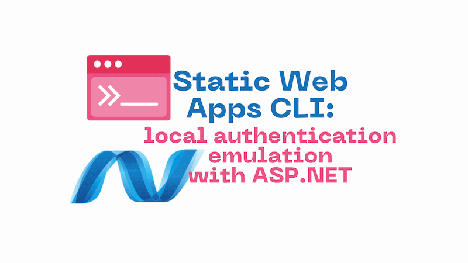
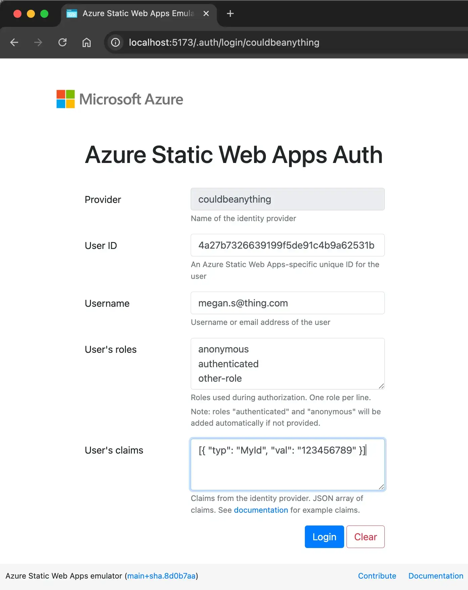
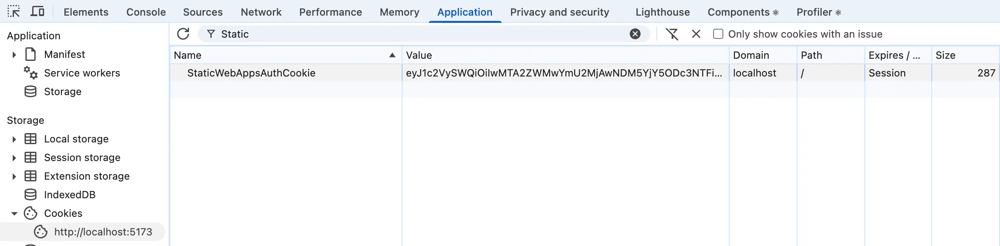
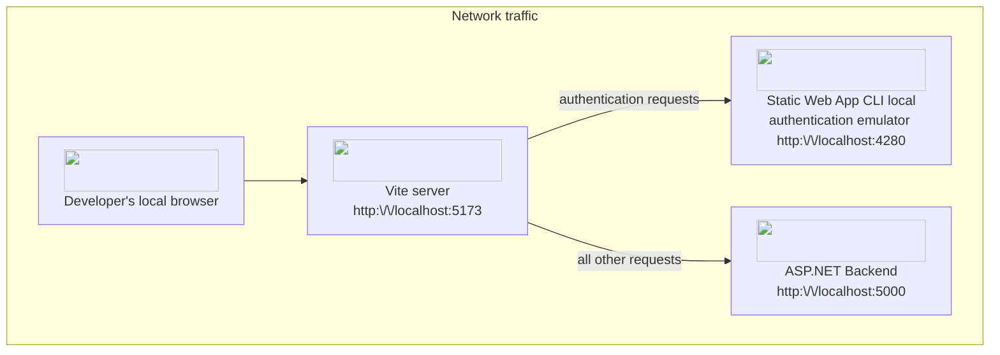
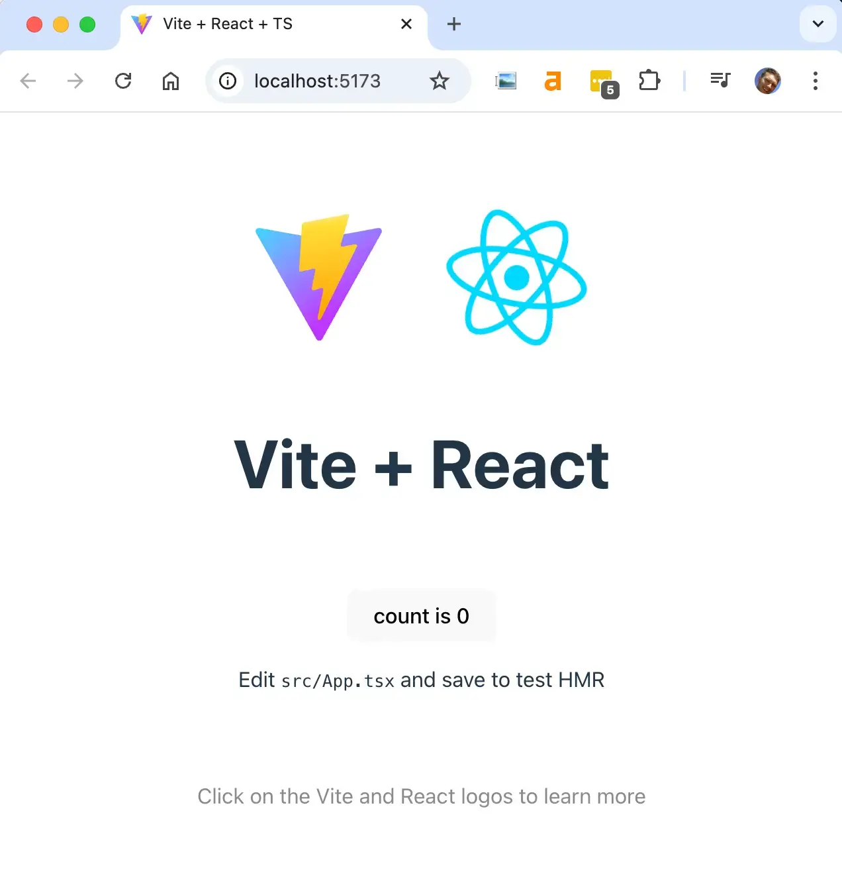
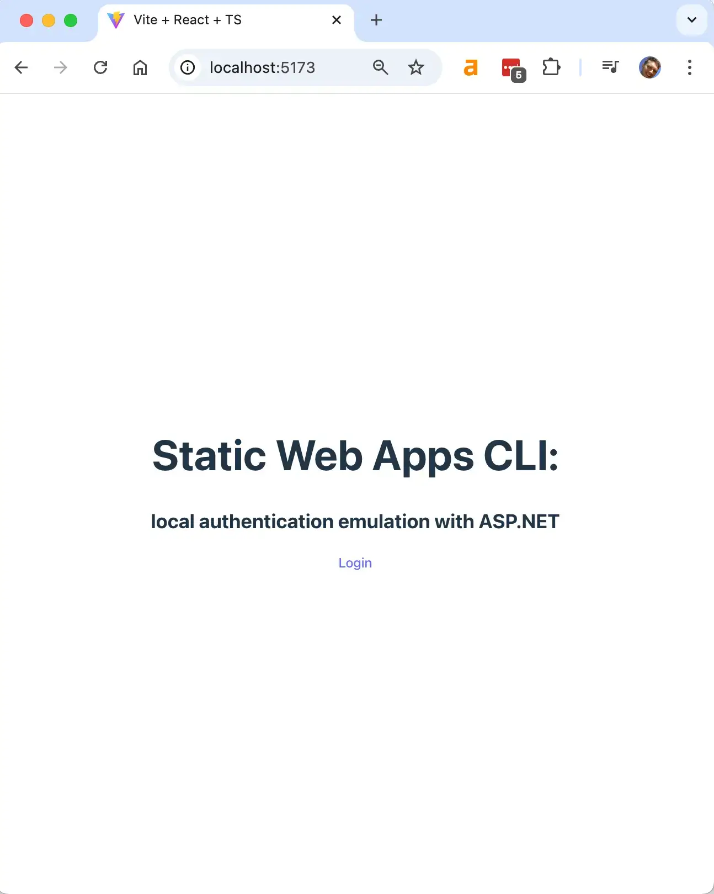
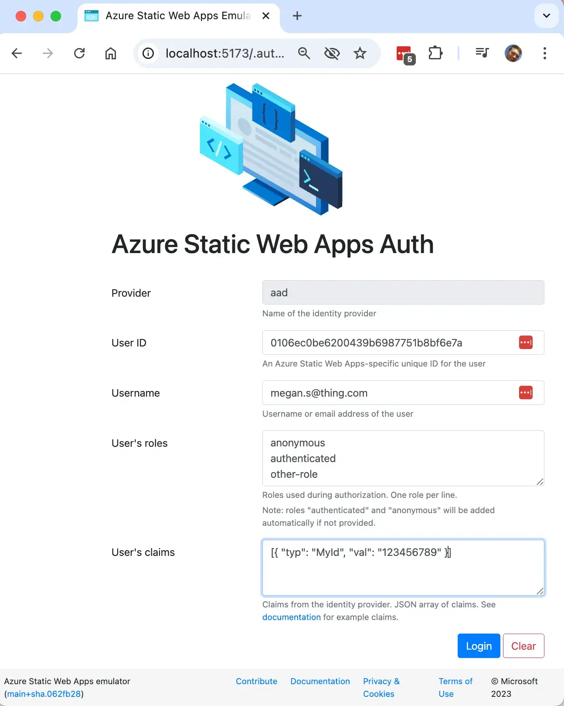
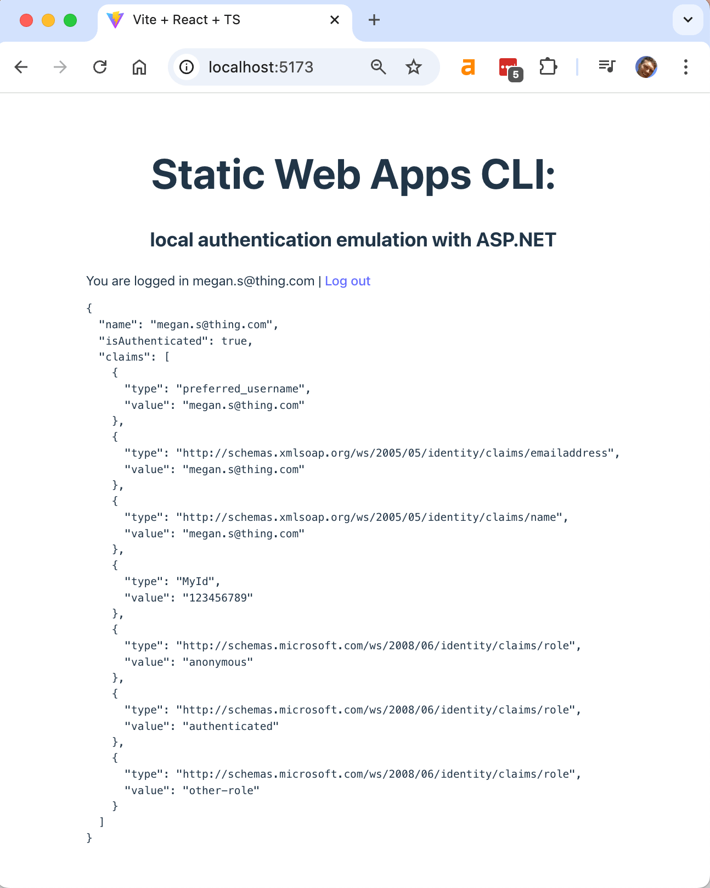

When developing web applications that have some dependency on authentication, it can be tricky to get a local development setup that allows you to manage authentication effectively. However, there's a way to achieve this, using the Static Web Apps CLI local authentication emulator.



I build a lot of SPA style applications that run JavaScript / TypeScript on the front end and C# / ASP.NET on the back end. The majority of those apps require some kind of authentication. In fact I'd struggle to think many apps that don't. This post will walk through how to integrate ASP.NET authentication with the Static Web Apps CLI local authentication emulator to achieve a great local development setup. Don't worry if that doesn't make sense right now, once we have walked through the setup, it will.

This post builds somewhat on posts I've written about using the Static Web Apps CLI [with the Vite proxy server with for enhanced performance](../2024-06-18-static-web-apps-cli-improve-performance-with-vite-server-proxy/index.md) and [how to use the `--api-location` argument to connect to a separately running backend API](../2023-05-20-static-web-apps-cli-node-18-could-not-connect-to-api/index.md). However, you need not have read either post to understand what we're doing.

We're going to first walk through what we're trying to achieve, and then we'll walk through the steps to get there. When it comes to implementation, we're going to use Vite as our front end server, and ASP.NET as our back end server. The Static Web Apps CLI will be used for local authentication emulation.

<!--truncate-->

## Local authentication choices

When we're building an application, let's think about the options that we have, with regards to our local development setup. It's pretty typical for applications to use some kind of third party authentication provider, rather than providing their own. This could be [Okta](https://www.okta.com/), [Microsoft Entra / Azure AD](https://learn.microsoft.com/en-us/entra/identity/authentication/overview-authentication), [Auth0](https://auth0.com/) or something else.

It's possible to configure a local development setup which integrates with a third party authentication provider. However, is that wise? Do you want to couple your ability to be able to test scenarios on your local machine, to a server, somewhere out there on the internet? You certainly can. It typically involves setting a redirect URI on the authentication provider to `http://localhost:5173` (or wherever your local setup runs).

But it is inconvenient to get that set up in the first place. And even once it is set up, you're then coupled to being online whenever you're testing locally. We're offline more than we appreciate. I'm writing these words on an aeroplane which is currently flying over Botswana. I have no internet access right now. But as you've gathered, I'm on my computer and I'm able to do things. How? Because I'm using the Azure Static Web Apps CLI local authentication emulator for local development.

That's what this post is about. How to use the Static Web Apps CLI local authentication emulator with ASP.NET authentication to enable a great (and offline-first) local development setup.

## What is the Static Web Apps CLI?

We should probably talk about what the [Static Web Apps CLI](https://azure.github.io/static-web-apps-cli/) is. It describes itself as:

> The Static Web Apps (SWA) CLI is an open-source commandline tool that streamlines local development and deployment for Azure Static Web Apps.

It's original purpose was to provide a local development server for an Azure service known as [Azure Static Web Apps](https://learn.microsoft.com/en-us/azure/static-web-apps/). However, it has a number of features that make it useful for general web application development. For example, it can be used to [proxy requests to a backend API server](https://azure.github.io/static-web-apps-cli/docs/cli/swa-start#serve-both-the-front-end-app-and-api), and it can also be used to [emulate authentication](https://azure.github.io/static-web-apps-cli/docs/cli/local-auth).

We're going to use the authentication emulator to provide a local authentication server whilst we're developing. Just that piece of functionality; we're intentionally only using a subset of the Static Web Apps CLI functionality.

Incidentally, there are alternatives. I'm aware of one other local authentication emulator, which is the [Firebase Authentication Emulator](https://firebase.google.com/docs/emulator-suite/connect_auth). This could likely be used in a similar way. However, we'll be using the Static Web Apps CLI local authentication emulator.

## How does the Static Web Apps CLI local authentication emulator work?

When running the Static Web Apps `start` command, it surfaces login endpoints at this location: `http://localhost:4280/.auth/login/<PROVIDER_NAME>`. `<PROVIDER_NAME>` is the name of the authentication provider you want to use. This might be `aad`, `github` etc. If you look at the code ([and you can here](https://github.com/Azure/static-web-apps-cli/blob/062fb288d34126a095be6f3e1dc57fe5adb3f4bf/src/public/auth.html)) you'll realise that the `<PROVIDER_NAME>` can actually be any string; it's not limited to the names of the authentication providers that are supported by Azure Static Web Apps. So if you want to use an arbitary name like `potato` as the provider name, you can do that. In terms of emulation, it doesn't matter what the provider name is.

When started, the CLI will serve a local authentication UI at this endpoint which looks like this:



When you hit the `Login` button, it will use the form data to create a fake user and [set a cookie in your browser named `StaticWebAppsAuthCookie`](https://github.com/Azure/static-web-apps-cli/blob/062fb288d34126a095be6f3e1dc57fe5adb3f4bf/src/public/auth.html#L193-L196). That cookie will look something like this:



And whilst it looks like a JWT, it isn't. It's actually a base64 encoded string which contains the user information that you provided in the form. In fact you can see what it is by flipping open the browser devtools and running this code in the console after you have hit the `Login` button:

```js
JSON.parse(
  atob(
    document.cookie
      .split('; ')
      .find((row) => row.startsWith('StaticWebAppsAuthCookie='))
      ?.split('=')[1],
  ),
);
```

This will acquire the cookie that has just been created by the Static Web Apps CLI local authentication emulator from your browser. It then decodes it and parses the JSON string to get the user information that you provided in the form. It produces something like this:

```json
{
  "userId": "4a27b7326639199f5de91c4b9a62531b",
  "userRoles": ["anonymous", "authenticated", "other-role"],
  "claims": [{ "typ": "MyId", "val": "123456789" }],
  "identityProvider": "couldbeanything",
  "userDetails": "megan.s@thing.com"
}
```

This cookie will be sent to your backend API server with every request.

## How is our solution going to work?

To make a working development setup, we need three things:

1. A front end server (Vite)
2. A back end server (ASP.NET)
3. A local authentication server (Static Web Apps CLI)

We'll bring these three things together to create a local development setup that allows us to develop our application locally, with authentication. This diagram shows how the three components will work together:



From the developer's browser, HTTP requests will be sent to the Vite server running on `http://localhost:5173`. The Vite server will proxy authentication emulation requests to the Static Web Apps CLI local authentication emulator running on `http://localhost:4280`. All other requests will be proxied to the ASP.NET backend server running on `http://localhost:5000`.

This setup means that the cookie that is set by the Static Web Apps CLI local authentication emulator will be sent to the ASP.NET backend server with every request. So to make the ASP.NET authentication work, we need to make sure that the ASP.NET server is configured to accept this cookie and use it to authenticate the user.

## Time to implement

Now that we've talked about what we're trying to achieve, let's walk through the steps to get there. We'll need both the .NET SDK and Node.js installed on our machine. From here on out it's code. The full example can be found in [this GitHub repository](https://github.com/johnnyreilly/swa-local-auth-emulator-and-dotnet).

We'll start by creating a new Vite project in a folder we'll call `AppFrontEnd`. We'll use the React + TypeScript template. You can use whatever template you like:

```bash
npm create vite@latest AppFrontEnd -- --template react-ts
```

Next we'll create a new ASP.NET project in a folder we'll call `AppBackEnd`:

```bash
dotnet new web -n AppBackEnd
```

And we'll initialise a `package.json` in the root of our project:

```bash
npm init -y
```

This `package.json` will be used as a general purpose task runner later on.

## Setting up the back end

We'd first like to adjust the port that our ASP.NET server runs on in development. We'll update the `launchSettings.json` file to look like this:

```json
{
  "$schema": "https://json.schemastore.org/launchsettings.json",
  "profiles": {
    "http": {
      "commandName": "Project",
      "dotnetRunMessages": true,
      "launchBrowser": false,
      "applicationUrl": "http://localhost:5000",
      "environmentVariables": {
        "ASPNETCORE_ENVIRONMENT": "Development"
      }
    }
  }
}
```

This will set the ASP.NET server to run on `http://localhost:5000` in development. You can run the server with `dotnet run`.

We need to build an `AuthenticationHandler` that will accept the cookie set by the Static Web Apps CLI local authentication emulator. This is a custom authentication handler that will be used to authenticate users based on the cookie set by the Static Web Apps CLI local authentication emulator. So here the `StaticWebAppsCLIAuthentication.cs` in all its glory:

```cs
using System.Security.Claims;
using System.Text.Encodings.Web;
using System.Text.Json;
using System.Text.Json.Serialization;

using Microsoft.AspNetCore.Authentication;
using Microsoft.Extensions.Options;

namespace AppBackEnd;

public static class StaticWebAppsCLIAuthentication
{
    public const string STATICWEBAPPSCLIAUTH_SCHEMENAME = "StaticWebAppsCLIAuthScheme";

    public static AuthenticationBuilder AddStaticWebAppsCLIAuth(
        this AuthenticationBuilder builder,
        Action<AuthenticationSchemeOptions>? configure = null)
    {
        if (configure == null) configure = o => { };

        return builder.AddScheme<AuthenticationSchemeOptions, StaticWebAppsCLIAuthenticationHandler>(
            STATICWEBAPPSCLIAUTH_SCHEMENAME,
            STATICWEBAPPSCLIAUTH_SCHEMENAME,
            configure
        );
    }
}

public class StaticWebAppsCLIAuthenticationHandler : AuthenticationHandler<AuthenticationSchemeOptions>
{
    public StaticWebAppsCLIAuthenticationHandler(
        IOptionsMonitor<AuthenticationSchemeOptions> options,
        ILoggerFactory logger,
        UrlEncoder encoder)
        : base(options, logger, encoder)
    {
    }

    protected override async Task<AuthenticateResult> HandleAuthenticateAsync()
    {
        try
        {

            var principal = await MakeClaimsPrincipalFromHeaderOrCookie(
                // eg eyJ1c2VySWQiOiIwMTA2ZWMwYmU2MjAwNDM5YjY5ODc3NTFiOGJmNmU3YSIsInVzZXJSb2xlcyI6WyJhbm9ueW1vdXMiLCJhdXRoZW50aWNhdGVkIl0sImNsYWltcyI6W3sidHlwIjoibmFtZSIsInZhbCI6IkF6dXJlIFN0YXRpYyBXZWIgQXBwcyJ9XSwiaWRlbnRpdHlQcm92aWRlciI6ImFhZCIsInVzZXJEZXRhaWxzIjoiam9obm55cmVpbGx5In0
                Context.Request.Cookies["StaticWebAppsAuthCookie"] ??
                // eg eyJ1c2VySWQiOiIwMTA2ZWMwYmU2MjAwNDM5YjY5ODc3NTFiOGJmNmU3YSIsInVzZXJSb2xlcyI6WyJhbm9ueW1vdXMiLCJhdXRoZW50aWNhdGVkIl0sImlkZW50aXR5UHJvdmlkZXIiOiJhYWQiLCJ1c2VyRGV0YWlscyI6ImpvaG5ueXJlaWxseSJ9
                // for reasons that are unclear, the X-MS-CLIENT-PRINCIPAL header presently excludes claims; see https://github.com/Azure/static-web-apps-cli/blob/062fb288d34126a095be6f3e1dc57fe5adb3f4bf/src/msha/handlers/function.handler.ts#L38-L42
                Context.Request.Headers["X-MS-CLIENT-PRINCIPAL"].FirstOrDefault()
            );

            if (principal == null)
                return AuthenticateResult.NoResult();

            Context.User = principal;

            return AuthenticateResult.Success(new AuthenticationTicket(principal, principal.Identity?.AuthenticationType ?? "unknown"));
        }
        catch (Exception ex)
        {
            return AuthenticateResult.Fail(ex);
        }
    }

    private async Task<ClaimsPrincipal?> MakeClaimsPrincipalFromHeaderOrCookie(string? headerOrCookie)
    {
        if (string.IsNullOrEmpty(headerOrCookie))
            return null;

        var decodedBytes = Convert.FromBase64String(headerOrCookie);
        using var memoryStream = new MemoryStream(decodedBytes);
        var staticWebAppClientPrinciple = await JsonSerializer.DeserializeAsync<StaticWebAppsCLIClientPrinciple>(memoryStream);

        if (staticWebAppClientPrinciple == null ||
            string.IsNullOrWhiteSpace(staticWebAppClientPrinciple.UserDetails) ||
            string.IsNullOrWhiteSpace(staticWebAppClientPrinciple.UserId))
            return null;

        var claims = DefaultMapClaims(staticWebAppClientPrinciple);

        var principal = new ClaimsPrincipal();
        principal.AddIdentity(new ClaimsIdentity(
            claims,
            authenticationType: staticWebAppClientPrinciple.IdentityProvider ?? "unknown",
            nameType: ClaimTypes.Email,
            roleType: ClaimTypes.Role
        ));

        return principal;
    }

    /// <summary>
    /// Method takes the StaticWebAppClientPrinciple and produces a list of claims constructed
    /// from the claims, user details and user roles
    /// </summary>
    static Claim[] DefaultMapClaims(StaticWebAppsCLIClientPrinciple staticWebAppClientPrinciple)
    {
        var claims = new List<StaticWebAppsCLIClaim>();
        if (!string.IsNullOrWhiteSpace(staticWebAppClientPrinciple.UserDetails))
        {
            claims.Add(new StaticWebAppsCLIClaim
            {
                Type = "preferred_username",
                Value = staticWebAppClientPrinciple.UserDetails
            });
            claims.Add(new StaticWebAppsCLIClaim
            {
                Type = ClaimTypes.Email,
                Value = staticWebAppClientPrinciple.UserDetails
            });
            claims.Add(new StaticWebAppsCLIClaim
            {
                Type = ClaimTypes.Name,
                Value = staticWebAppClientPrinciple.UserDetails
            });
        }

        if (staticWebAppClientPrinciple.Claims != null)
        {
            claims.AddRange(staticWebAppClientPrinciple.Claims);
        }

        var mappedClaims = claims.Select(claim => new Claim(claim.Type, claim.Value));
        // translate the user roles into claims with the type ClaimTypes.Role
        // eg "userRoles": ["anonymous", "authenticated"]
        var userRoleClaims = staticWebAppClientPrinciple.UserRoles?.Select(role =>
            new Claim(ClaimTypes.Role, role)) ?? [];

        Claim[] combinedClaims = [..mappedClaims, ..userRoleClaims];

        return combinedClaims;
    }
}

/// <summary>
/// This is the JSON object that is decoded from either the
/// StaticWebAppsAuthCookie cookie or the X-MS-CLIENT-PRINCIPAL header
/// when working with the Static Web Apps CLI local authentication emulator.
///
/// The claims element is not present on the X-MS-CLIENT-PRINCIPAL header
///
/// {
///     "userId": "9b516349fcf5caf60f715703d8804aa7",
///     "userRoles": [
///         "anonymous",
///         "authenticated"
///     ],
///     "claims": [{"typ":"blarg","val":"Azure Static Web Apps"}],
///     "identityProvider": "aad",
///     "userDetails": "someone.name@company.com"
/// }
/// </summary>
public class StaticWebAppsCLIClientPrinciple
{
    /// <summary>
    /// User Id
    /// </summary>
    [JsonPropertyName("userId")]
    public string? UserId { get; set; }

    /// <summary>
    /// User roles
    /// </summary>
    [JsonPropertyName("userRoles")]
    public IEnumerable<string>? UserRoles { get; set; }

    /// <summary>
    /// Identity provider typically "aad"
    /// </summary>
    [JsonPropertyName("identityProvider")]
    public string? IdentityProvider { get; set; }

    /// <summary>
    /// User details typically email address
    /// </summary>
    [JsonPropertyName("userDetails")]
    public string? UserDetails { get; set; }

    /// <summary>
    /// Claims for the user
    /// </summary>
    [JsonPropertyName("claims")]
    public IEnumerable<StaticWebAppsCLIClaim>? Claims { get; set; } = [];
}

public class StaticWebAppsCLIClaim
{
    /// <summary>
    /// Type of claim eg "name"
    /// </summary>
    [JsonPropertyName("typ")]
    public string Type { get; set; } = string.Empty;
    /// <summary>
    /// Value of claim eg "Someone Name"
    /// </summary>
    [JsonPropertyName("val")]
    public string Value { get; set; } = string.Empty;
}
```

Whilst there's a good amount of code here, what we're actually doing is relatively simple:

- We define a custom authentication scheme called `StaticWebAppsCLIAuthScheme`
- We define a custom authentication handler called `StaticWebAppsCLIAuthenticationHandler`. The handler will decode the cookie and create a `ClaimsPrincipal` object that contains the user information it. This will be used to authenticate users based on the cookie that has been set by the Static Web Apps CLI local authentication emulator. If the `StaticWebAppsAuthCookie` cookie is not detected, the handler will fallback to the `X-MS-CLIENT-PRINCIPAL` header. (This should never happen in practice, but it's there for completeness.)

With our handler in place, we need to update the `Program.cs` file in the `AppBackEnd` project to use it. We'll also add a `/api/me` endpoint to test the authentication. So the modified `Program.cs` file looks like this:

```cs
using AppBackEnd;

var builder = WebApplication.CreateBuilder(args);

if (builder.Environment.IsDevelopment())
{
    // in development, we want to use the Static Web Apps CLI authentication scheme
    builder.Services
        .AddAuthentication(StaticWebAppsCLIAuthentication.STATICWEBAPPSCLIAUTH_SCHEMENAME)
        .AddStaticWebAppsCLIAuth();
}
else
{
    // in production we will use an alternative authentication scheme
    // ...
}

builder.Services.AddAuthorization();

var app = builder.Build();

app.UseAuthentication();
app.UseAuthorization();

app.MapGet("/", () => "Hello World!");

app.MapGet("/api/me", (context) => {
    var user = context.User;
    var roleClaimType = user.Identities.First().RoleClaimType;

    var userDetails = new {
        user.Identity?.Name,
        user.Identity?.IsAuthenticated,
        Claims = user.Claims.Select(claim => new { claim.Type, claim.Value }).ToArray(),
    };

    return context.Response.WriteAsJsonAsync(userDetails);
});

app.Run();
```

I haven't included the production authentication scheme here; that will be specific to your application. The important part is that we are using the `StaticWebAppsCLIAuthentication` scheme in only in development.

Let's test this works. We'll start the ASP.NET server with `dotnet run`. Then we'll use the `curl` command to call the `/api/me` endpoint:

```bash
curl http://localhost:5000/api/me --cookie "StaticWebAppsAuthCookie=eyJ1c2VySWQiOiIxNDdmMTVjNmFiODBhNmY3NjJhOWQyZDRmNzczNzUwOSIsInVzZXJSb2xlcyI6WyJhbm9ueW1vdXMiLCJhdXRoZW50aWNhdGVkIiwib3RoZXItcm9sZSJdLCJjbGFpbXMiOlt7InR5cCI6Ik15SWQiLCJ2YWwiOiIxMjM0NTY3ODkifV0sImlkZW50aXR5UHJvdmlkZXIiOiJjb3VsZGJlYW55dGhpbmciLCJ1c2VyRGV0YWlscyI6Im1lZ2FuLnNAdGhpbmcuY29tIn0="
```

This will return the user information that was set in the cookie by the Static Web Apps CLI local authentication emulator:

```json
{
  "name": "megan.s@thing.com",
  "isAuthenticated": true,
  "claims": [
    {
      "type": "preferred_username",
      "value": "megan.s@thing.com"
    },
    {
      "type": "http://schemas.xmlsoap.org/ws/2005/05/identity/claims/emailaddress",
      "value": "megan.s@thing.com"
    },
    {
      "type": "http://schemas.xmlsoap.org/ws/2005/05/identity/claims/name",
      "value": "megan.s@thing.com"
    },
    {
      "type": "MyId",
      "value": "123456789"
    },
    {
      "type": "http://schemas.microsoft.com/ws/2008/06/identity/claims/role",
      "value": "anonymous"
    },
    {
      "type": "http://schemas.microsoft.com/ws/2008/06/identity/claims/role",
      "value": "authenticated"
    },
    {
      "type": "http://schemas.microsoft.com/ws/2008/06/identity/claims/role",
      "value": "other-role"
    }
  ]
}
```

So our authentication mechanism works! Now we just need to set up the Vite server and the Static Web Apps CLI local authentication emulator to provide the full local development experience.

## Setting up the front end

Now we'll move over to the `AppFrontEnd` folder.

### Set up the Static Web Apps CLI

We'll install the Static Web Apps CLI as a development dependency:

```bash
npm install -D @azure/static-web-apps-cli
```

And we'll add a `start` script to the `package.json` file to start the Static Web Apps CLI and the Vite server. The `start` script will look like this:

```json
{
  "scripts": {
    "start": "swa start http://localhost:5173 --run \"npm run dev\" --api-devserver-url http://127.0.0.1:5000"
  }
}
```

When run, this will start the Static Web App CLI and the Vite server. The `--run` argument will start the Vite server, and the `--api-devserver-url` argument will set the URL of the ASP.NET backend server. We'll create a mechanism for starting the ASP.NET server alongside the front end shortly.

### Set up the Vite server

We already have the Vite server in place, but it needs a little configuration.

I'm now going to borrow from [this post on using the Vite proxy server with for enhanced performance](../2024-06-18-static-web-apps-cli-improve-performance-with-vite-server-proxy/index.md). We'll update the `vite.config.ts` file to add a proxy configuration. The `vite.config.ts` file will look like this:

```ts
import { defineConfig } from 'vite';

// https://vitejs.dev/config/
export default defineConfig({
  // ...
  server: {
    proxy: {
      '/api': {
        target: 'http://127.0.0.1:5000', // our .NET application is running on port 5000
        changeOrigin: true,
        autoRewrite: true,
      },
      '/.auth': {
        target: 'http://127.0.0.1:4280', // the Static Web Apps local auth emulator is running on port 4280
        changeOrigin: true,
        autoRewrite: true,
      },
    },
  },
});
```

The code above is responsible for ensuring that requests to the Vite server with the prefix `/.auth` are proxied to the Static Web Apps CLI local authentication emulator. Requests with the prefix `/api` (most requests) are proxied to the ASP.NET backend server.

With this in place, the Static Web Apps CLI local authentication emulator will be able to set the `StaticWebAppsAuthCookie` cookie in the browser, and the Vite server will proxy requests with that cookie to the ASP.NET backend server for use.

## Bringing front end and back end together

We now have a back end and a front end in place. We need both to be running for local development. We mentioned earlier we'd be using the `package.json` in the root of the project as a task runner.

We'll use the `concurrently` package to run both the ASP.NET server and the Static Web Apps CLI local authentication emulator at the same time.

```bash
npm install -D concurrently
```

And we'll update the `scripts` section of the `package.json` as follows:

```json
{
  "scripts": {
    "postinstall": "npm run install:frontend && npm run install:backend",
    "install:frontend": "cd AppFrontEnd && npm install",
    "install:backend": "cd AppBackEnd && dotnet restore",
    "start": "concurrently -n \"FE,BE\" -c \"bgBlue.bold,bgMagenta.bold\" \"npm run start:frontend\" \"npm run start:backend\"",
    "start:frontend": "cd AppFrontEnd && npm run start",
    "start:backend": "cd AppBackEnd && dotnet watch run"
  }
}
```

We can now install all our dependencies (front end and backend) with a single command:

```bash
npm install
```

Then we can start the local development server with:

```bash
npm start
```

If we then go to `http://localhost:5173`, we should see the Vite server running:



So far, this is just the Vite server. Time to get our login mechanism in place.

## Testing the authentication

We're going to replace the contents of the `src/App.tsx` file in the `AppFrontEnd` project with the following code. This code will call the `/api/me` endpoint on the ASP.NET backend server to get the user information from the cookie set by the Static Web Apps CLI local authentication emulator and display it in the browser. If the user is not authenticated, it will show a login link.

```tsx
import { useState, useEffect } from 'react';
import './App.css';

interface UserData {
  name: string | null;
  isAuthenticated: boolean;
  claims: { type: string; value: string }[];
}

function App() {
  const [userData, setUserData] = useState<UserData>();

  useEffect(() => {
    async function fetchData() {
      try {
        const response = await fetch('/api/me');
        if (!response.ok) {
          throw new Error('Failed to fetch user data');
        }
        const data = await response.json();
        setUserData(data);
      } catch (error) {
        console.error('Error fetching user data:', error);
      }
    }

    fetchData();
  }, []);

  return (
    <>
      <h1>Static Web Apps CLI:</h1>
      <h2>local authentication emulation with ASP.NET</h2>
      {userData ? (
        userData.isAuthenticated ? (
          <p style={{ textAlign: 'left' }}>
            You are logged in {userData.name} |{' '}
            <a href="/.auth/logout">Log out</a>
            <pre>{JSON.stringify(userData, null, 2)}</pre>
          </p>
        ) : (
          <p>
            <a href="/.auth/login/aad">Log in</a>
          </p>
        )
      ) : (
        <p>Loading user data...</p>
      )}
    </>
  );
}

export default App;
```

Let's test it! First we'll start our local dev setup with `npm start`. When we browse to `http://localhost:5173`, we should see the Vite server running:



If we click the `Login` link, we'll be taken to the Static Web Apps CLI local authentication emulator. We'll fill in the form and hit `Login`. This will set the `StaticWebAppsAuthCookie` cookie in our browser.



We'll be redirected back to the Vite server, and the cookie will be sent to the ASP.NET backend server. The ASP.NET backend server will use the cookie to authenticate the user and return the user information when the browser calls the `/api/me` endpoint. This will be displayed in the browser:



It works!

## Summing up

This has been a long post, but hopefully it has been useful. We've walked through how to set up a local development environment that uses the Static Web Apps CLI local authentication emulator with ASP.NET authentication. This allows us to develop our application locally, with authentication, without being coupled to a third party authentication provider.

The code built in this post [can be found here](https://github.com/johnnyreilly/swa-local-auth-emulator-and-dotnet).

## Credits

- Server icon by Konstantin Velichko from [Noun Project](https://thenounproject.com/browse/icons/term/server/) (CC BY 3.0)
- Browser icon by syahruni from [Noun Project](https://thenounproject.com/browse/icons/term/browser/) (CC BY 3.0)
