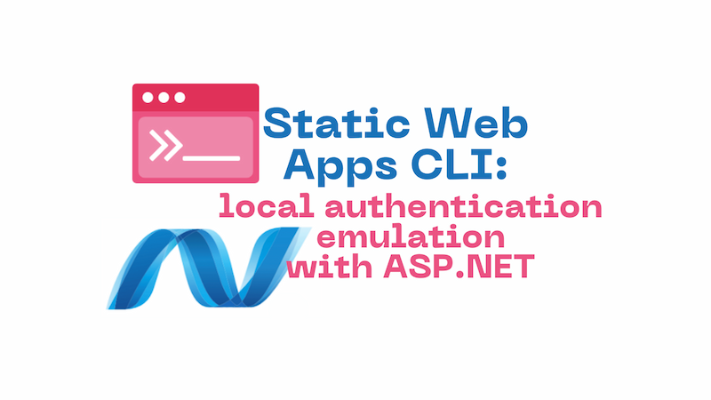

When developing web applications locally that have some dependency on authentication, it can be tricky to get a setup that allows you to manage authentication effectively. However, there's a way to achieve this, using the Static Web Apps CLI local authentication emulator.

I build a lot of SPA style applications that run JavaScript / TypeScript on the front end and C# / ASP.NET on the back end. The majority of those apps require some kind of authentication. In fact I'd struggle to think many apps that don't. This post will walk through how to integrate .NET authentication with the Static Web Apps CLI local authentication emulator to achieve a great local development setup. Don't worry if that doesn't make sense right now, hopefully as we walk through this post, it will start to!

This post builds somewhat on what I've written about [using the Vite proxy server with the Static Web Apps CLI for enhanced performance](../2024-06-18-static-web-apps-cli-improve-performance-with-vite-server-proxy/index.md) and [connecting directly to the `--api-location`](../2023-05-20-static-web-apps-cli-node-18-could-not-connect-to-api/index.md). However, you need not have read either post to understand what we're doing.

<!--truncate-->

## Local authentication choices

Let's think about the options that we have, when it comes to authentication on our local development machines. It's pretty typical for applications to be using some kind of SAAS authentication provider, rather than providing their own. So whether it's Okta, or Entra ID / Azure AD, Auth0 or something else - these are all third party services. Do you want to couple your ability to be able to do local development to a server, somewhere out on the internet?

You certainly can, and it does work. It typically involves setting a redirect URI on the authentication provider to `http://localhost:5173` (or wherever your local setup runs). But it's inconvenient to have to do that setup, and also you're then coupled to being online whenever you're doing local development.

We're offline more than we appreciate. I'm writing these words on an aeroplane which is currently flying over Botswana. I have no internet access. But as you've gathered, I'm on my computer and I'm able to do things. How? Because I'm using the Azure Static Web Apps CLI local auth emulator for local development.

And you can too!

## What is the Static Web Apps CLI?

https://azure.github.io/static-web-apps-cli/docs/cli/local-auth

surely it's inappropriate and madness to use it
we're just using start / auth
a subset of it
doug crockford javascript the good parts

---
