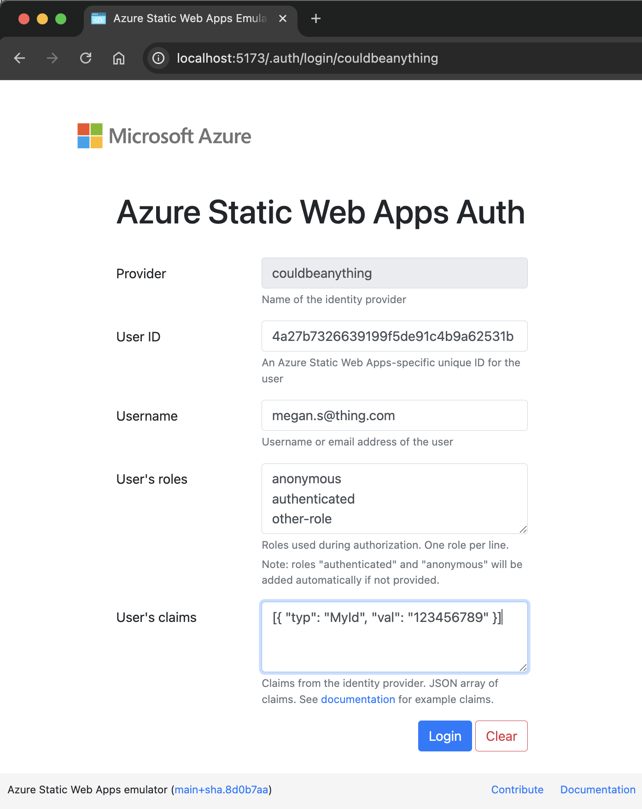

When developing web applications that have some dependency on authentication, it can be tricky to get a local development setup that allows you to manage authentication effectively. However, there's a way to achieve this, using the Static Web Apps CLI local authentication emulator.


I build a lot of SPA style applications that run JavaScript / TypeScript on the front end and C# / ASP.NET on the back end. The majority of those apps require some kind of authentication. In fact I'd struggle to think many apps that don't. This post will walk through how to integrate ASP.NET authentication with the Static Web Apps CLI local authentication emulator to achieve a great local development setup. Don't worry if that doesn't make sense right now, once we have walked through the setup, it will.

This post builds somewhat on posts I've written about using the Static Web Apps CLI [with the Vite proxy server with for enhanced performance](../2024-06-18-static-web-apps-cli-improve-performance-with-vite-server-proxy/index.md) and [how to use the `--api-location` argument to connect to a separately running backend API](../2023-05-20-static-web-apps-cli-node-18-could-not-connect-to-api/index.md). However, you need not have read either post to understand what we're doing.

We're going to first walk through what we're trying to achieve, and then we'll walk through the steps to get there. When it comes to implementation, we're going to use Vite as our front end server, and ASP.NET as our back end server. The Static Web Apps CLI will be used for local authentication emulation.

<!--truncate-->

## Local authentication choices

When we're building an application, let's think about the options that we have, with regards to our local development setup. It's pretty typical for applications to use some kind of third party authentication provider, rather than providing their own. This could be [Okta](https://www.okta.com/), [Microsoft Entra / Azure AD](https://learn.microsoft.com/en-us/entra/identity/authentication/overview-authentication), [Auth0](https://auth0.com/) or something else.

It's possible to configure a local development setup which integrates with a third party authentication provider. However, is that wise? Do you want to couple your ability to be able to test scenarios on your local machine, to a server, somewhere out there on the internet? You certainly can. It typically involves setting a redirect URI on the authentication provider to `http://localhost:5173` (or wherever your local setup runs).

But it is inconvenient to get that set up in the first place. And even once it is set up, you're then coupled to being online whenever you're testing locally. We're offline more than we appreciate. I'm writing these words on an aeroplane which is currently flying over Botswana. I have no internet access right now. But as you've gathered, I'm on my computer and I'm able to do things. How? Because I'm using the Azure Static Web Apps CLI local authentication emulator for local development.

That's what this post is about. How to use the Static Web Apps CLI local authentication emulator with ASP.NET authentication to enable a great (and offline-first) local development setup.

## What is the Static Web Apps CLI?

We should probably talk about what the [Static Web Apps CLI](https://azure.github.io/static-web-apps-cli/) is. It describes itself as:

> The Static Web Apps (SWA) CLI is an open-source commandline tool that streamlines local development and deployment for Azure Static Web Apps.

It's original purpose was to provide a local development server for Azure Static Web Apps. However, it has a number of features that make it useful for other types of web applications as well. For example, it can be used to [proxy requests to a backend API server](https://azure.github.io/static-web-apps-cli/docs/cli/swa-start#serve-both-the-front-end-app-and-api), and it can also be used to [emulate authentication](https://azure.github.io/static-web-apps-cli/docs/cli/local-auth).

We're going to use the authentication emulator to provide a local authentication server. So we're using a subset of the Static Web Apps CLI functionality. I'm aware of one other local authentication emulator, which is the [Firebase Authentication Emulator](https://firebase.google.com/docs/emulator-suite/connect_auth). However, I prefer the Static Web Apps CLI local authentication emulator.

## How does the Static Web Apps CLI local authentication emulator work?

http://localhost:5173/.auth/login/aad




https://github.com/Azure/static-web-apps-cli/blob/062fb288d34126a095be6f3e1dc57fe5adb3f4bf/src/public/auth.html

code that saves cookie:

https://github.com/Azure/static-web-apps-cli/blob/062fb288d34126a095be6f3e1dc57fe5adb3f4bf/src/public/auth.html#L193-L196

```js
function saveCookie(formElement) {
  const data = localStorage[hashStorageKey(formElement)];
  document.cookie = `StaticWebAppsAuthCookie=${btoa(data)}; path=/`;
}
```

## How is our solution going to work?


