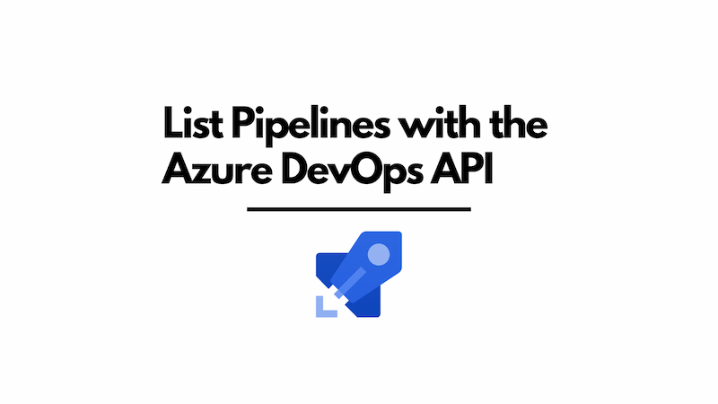

Listing the Azure Pipelines using the Azure DevOps REST API and TypeScript is possible, but if you use the official [Azure DevOps Client for Node.js](https://github.com/microsoft/azure-devops-node-api), you might have issues. This is because it does not support pagination. So if you have a project with a large number of pipelines, then using the official client might mean you cannot retrieve it.



This post implements an alternative mechanism, directly using the Azure DevOps API and thus handling pagination.

<!--truncate-->

Here's the TypeScript code:

```ts
export interface AzureDevOpsPipeline {
  _links: {
    self: {
      /** eg "https://dev.azure.com/my-ado-organisation/87cf415b-a062-4f62-93e2-b37c26aa268b/_apis/pipelines/6805?revision=1" */
      href: string;
    };
    web: {
      /** eg "https://dev.azure.com/my-ado-organisation/87cf415b-a062-4f62-93e2-b37c26aa268b/_build/definition?definitionId=6805" */
      href: string;
    };
  };
  /** eg "\\my-app" or "\\" */
  folder: string;
  /** eg 25978 */
  id: number;
  /** eg "pipeline-name" */
  name: string;
  /** eg 1 */
  revision: number;
  /** eg "https://dev.azure.com/my-ado-organisation/87cf415b-a062-4f62-93e2-b37c26aa268b/_apis/pipelines/25978?revision=1" */
  url: string;
}

export async function getAzureDevOpsPipelines({
  personalAccessToken,
  organization,
  projectName,
}: {
  personalAccessToken: string;
  /** eg "my-ado-organisation" */
  organization: string;
  /** eg "my-ado-project" */
  projectName: string;
}) {
  const batchSize = 100;
  let continuationToken = '';
  const pipelines: AzureDevOpsPipeline[] = [];

  // eslint-disable-next-line @typescript-eslint/no-unnecessary-condition
  while (true) {
    // https://learn.microsoft.com/en-us/rest/api/azure/devops/pipelines/pipelines/list?view=azure-devops-rest-7.1
    const url = `https://dev.azure.com/${organization}/${projectName}/_apis/pipelines?api-version=7.1&$top=${batchSize.toString()}&continuationToken=${continuationToken}`;
    try {
      const response = await fetch(url, {
        method: 'GET',
        headers: {
          Accept: 'application/json',
          'Content-Type': 'application/json',
          Authorization: `Basic ${Buffer.from(`PAT:${personalAccessToken}`).toString('base64')}`,
          'X-TFS-FedAuthRedirect': 'Suppress',
        },
      });

      if (!response.ok) {
        throw new Error(`HTTP error! status: ${response.status.toString()}`);
      }

      // this will be the name of the next pipeline or not present if there are no more pipelines
      continuationToken = response.headers.get('x-ms-continuationtoken') ?? '';

      // eslint-disable-next-line @typescript-eslint/no-unsafe-assignment
      const json = await response.json();
      const nextPipelines = json as { value: AzureDevOpsPipeline[] }; // TODO: validate with Zod

      if (nextPipelines.value.length > 0) {
        pipelines.push(...nextPipelines.value);
      }

      const noMorePipelines =
        nextPipelines.value.length === 0 || !continuationToken;
      if (noMorePipelines) {
        break;
      }
    } catch (error) {
      console.error('Error:', error);
      throw error;
    }
  }
  return pipelines;
}
```

The above code uses the `fetch` API to list the Azure DevOps pipelines, but significantly, it takes the `x-ms-continuationtoken` from the response headers, so you can keep paginating if the number of pipelines exceeds the page size.
