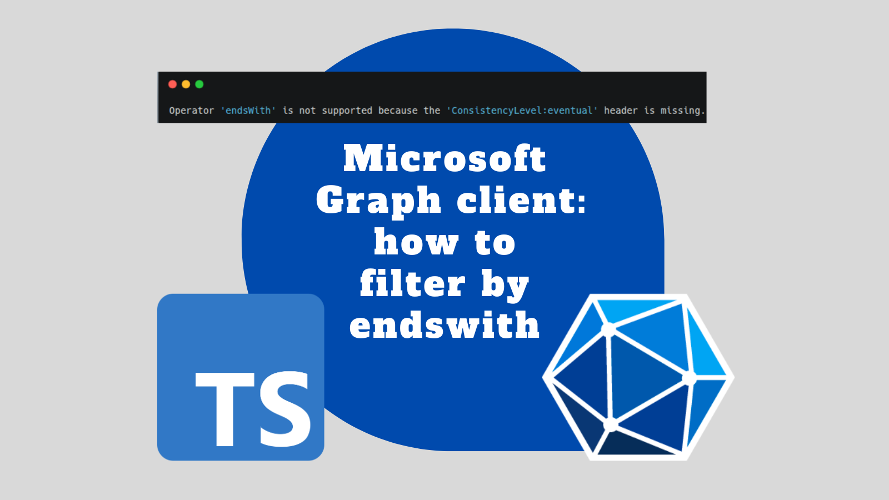

In this post we're going to look at filtering using an `endswith` filter with the [Microsoft Graph client](https://learn.microsoft.com/en-us/graph/sdks/create-client?tabs=typescript). This fals into the category of "Advanced query capabilities on Microsoft Entra ID objects" and I found tricky to get working.



Performing an `endsWith` or similar filter shouldn't be difficult. But the method of how to do so isn't obvious. If you've ever encountered a message like this:

> Operator 'endsWith' is not supported because the 'ConsistencyLevel:eventual' header is missing. Refer to https://aka.ms/graph-docs/advanced-queries for more information

Then this blog post is for you.

<!--truncate-->

I've written before about the Microsoft Graph client, and how to use it with Azure AD groups. You can find those posts here:

- [Azure AD Claims with Static Web Apps and Azure Functions](../2022-11-17-azure-ad-claims-static-web-apps-azure-functions/index.md)
- [Graph API: getting users Active Directory group names and ids with the C# SDK](../2023-11-23-graph-api-ad-users-group-name-ids-csharp-sdk/index.md)

## Advanced query capabilities on Microsoft Entra ID objects

First let's quote from the documentation around [advanced query capabilities on Microsoft Entra ID objects](https://learn.microsoft.com/en-us/graph/aad-advanced-queries?tabs=javascript):

> Microsoft Graph supports advanced query capabilities on various Microsoft Entra ID objects, also called directory objects, to help you efficiently access data. For example, the addition of **not** (`not`), **not equals** (`ne`), and **ends with** (`endsWith`) operators on the `$filter` query parameter.

You may find that you have a need for the `endsWith` operator or similar, for example: when querying for Entra ID / Azure AD groups. You may want to filter for groups that end with a certain string. And you can, but it does not work by default.

This is quite disappointing, and the documentation explains why this is the case:

> The Microsoft Graph query engine uses an index store to fulfill query requests. To add support for additional query capabilities on some properties, those properties might be indexed in a separate store. This separate indexing improves query performance. However, these advanced query capabilities aren't available by default but, the requestor must set the `ConsistencyLevel` header to eventual and, except for `$search`, use the `$count` query parameter. The `ConsistencyLevel` header and `$count` are referred to as advanced query parameters.

I find this quite surprising. Essentially, the implementation of the `endsWith` and similar operators are bleeding through into the API design. This is quite clunky, and not something that I would expect from a modern API. It feels like a design decision that is more about performance than usability. Even if you do want to discourage the use of the `endsWith` operator, it would be nice to have a more user-friendly way of doing so. For example, you could have a separate endpoint for advanced queries, or simple query parameter that enables advanced queries without having to set headers and a seemingly arbitrary query parameter.

However, the good news is that it is possible to use the `endsWith` operator (and others like it) with the Microsoft Graph client. The bad news is the way you have to do it.

## Failing to use the `endsWith` operator with the Microsoft Graph client

We'll make what we're looking into concrete in this post, by having a meaningful example of querying the Graph client. We'll query for Entra ID / Azure AD groups. First let's see what a broken example looks like:

```ts
import { Client, type PageCollection } from '@microsoft/microsoft-graph-client';

export async function getAzureADGroups(
  graphClient: Client,
): Promise<PageCollection> {
  return (await graphClient
    .api('/groups')
    .filter(`startsWith(displayName, 'startfilter-')`)
    .filter(`endsWith(displayName, '-endfilter')`)
    .select(['displayName', 'id'])
    .get()) as PageCollection;
}
```

The above code is intended to query for Azure AD groups that start with `startfilter-` and end with `-endfilter`. However, it will fail with this error:

> Operator 'endsWith' is not supported because the 'ConsistencyLevel:eventual' header is missing. Refer to https://aka.ms/graph-docs/advanced-queries for more information

This error is at least helpful in that it points you to the documentation. But it doesn't mention the `$count` query parameter. And it doesn't suggest how you might use them with the Microsoft Graph client.

## Successfully using the `endsWith` operator with the Microsoft Graph client

To use the `endsWith` operator with the Microsoft Graph client, you need to set the `ConsistencyLevel` header to `eventual` and use the `$count` query parameter as you make your call.

I pieced together how to do this with the Microsoft Graph client based upon these two pieces of documentation:

- https://learn.microsoft.com/en-us/graph/sdks/create-requests?tabs=typescript#use-http-headers-to-control-request-behavior
- https://learn.microsoft.com/en-us/graph/sdks/create-requests?tabs=typescript#provide-custom-query-parameters

Based upon this, I was able to produce the following code:

```ts
import { Client, type PageCollection } from '@microsoft/microsoft-graph-client';

export async function getAzureADGroups(
  graphClient: Client,
): Promise<PageCollection> {
  return (await graphClient
    .api('/groups')
    .query({
      $count: 'true',
    })
    .header('ConsistencyLevel', 'eventual')
    .filter(`startsWith(displayName, 'startfilter-')`)
    .filter(`endsWith(displayName, '-endfilter')`)
    .select(['displayName', 'id'])
    .get()) as PageCollection;
}
```

This code sets the `ConsistencyLevel` header to `eventual` and uses the `$count` query parameter. This allows you to use the `endsWith` operator in your query. It works as expected and returns the groups that start with `startfilter-` and end with `-endfilter`.

## A complete example

To make this a complete example, let's look at how you might use this in a real application. We'll create a function that retrieves Azure AD groups using the Microsoft Graph client. This function will use the `endsWith` operator and the `ConsistencyLevel` header.

```ts
import { DefaultAzureCredential } from '@azure/identity';
import { Client, type PageCollection } from '@microsoft/microsoft-graph-client';

export interface AzureADGroup {
  /** eg name-of-group */
  displayName: string;
  /** eg GUID-GUID-GUID-GUID-GUID */
  id: string;
}

export async function getMyAzureADGroups(): Promise<AzureADGroup[]> {
  return getAzureADGroupsImpl({
    queryProvider: async (graphClient: Client) => {
      return (await graphClient
        .api('/me/memberOf')
        .select(['displayName', 'id'])
        .get()) as PageCollection;
    },
  });
}

export async function getAzureADGroups(): Promise<AzureADGroup[]> {
  return getAzureADGroupsImpl({
    queryProvider: async (graphClient: Client) => {
      return (await graphClient
        .api('/groups')
        .query({
          $count: 'true',
        })
        .header('ConsistencyLevel', 'eventual')
        .filter(`startsWith(displayName, 'startfilter-')`)
        .filter(`endsWith(displayName, '-endfilter')`)
        .select(['displayName', 'id'])
        .get()) as PageCollection;
    },
  });
}

async function getAzureADGroupsImpl({
  queryProvider,
}: {
  queryProvider: (graphClient: Client) => Promise<PageCollection>;
}): Promise<AzureADGroup[]> {
  // Use DefaultAzureCredential to authenticate
  const credential = new DefaultAzureCredential();

  // Initialize the Graph client
  const graphClient = Client.initWithMiddleware({
    authProvider: {
      getAccessToken: async () => {
        const tokenResponse = await credential.getToken([
          'https://graph.microsoft.com/.default',
        ]);
        return tokenResponse.token;
      },
    },
  });

  const groups: AzureADGroup[] = [];
  try {
    let response = await queryProvider(graphClient);

    while (response.value.length > 0) {
      for (const group of response.value as AzureADGroup[]) {
        // {
        //   '@odata.type': '#microsoft.graph.group',
        //   displayName: 'azure-our-engteam',
        //   id: 'GUID-GUID-GUID-GUID-GUID'
        // }
        groups.push(group);
      }

      if (response['@odata.nextLink']) {
        response = (await graphClient
          .api(response['@odata.nextLink'])
          .get()) as PageCollection;
      } else {
        break;
      }
    }

    return { data: groups };
  } catch (err) {
    const errorMessage = `Error listing Entra ID / Azure AD groups: ${err instanceof Error ? err.message : 'UNKNOWN'}`;
    console.error(errorMessage);
    throw new Error(errorMessage, { cause: err });
  }
}
```

This code has an implementation method `getAzureADGroupsImpl` that takes a `queryProvider` function. This function is responsible for providing the query to the Microsoft Graph client. The `getAzureADGroupsImpl` function handles the pagination of the results. It uses the `@odata.nextLink` property to retrieve the next page of results until there are no more pages left.

The `getAzureADGroups` and `getMyAzureADGroups` functions call this `getAzureADGroupsImpl` function method with their respective queries.

The `getMyAzureADGroups` function queries for the groups that the signed-in user is a member of. It does **not** use the `endsWith` operator. It simply queries for all groups that the user is a member of. This will work just fine without the `ConsistencyLevel` header or the `$count` query parameter.

The `getAzureADGroups` function queries for all groups that start with `startfilter-` and end with `-endfilter`. It uses the `endsWith` operator and consequently needs the `ConsistencyLevel` header and the `$count` query parameter. If it doesn't have these, it will fail with the error we saw earlier.

This code is a complete example of how to use the Microsoft Graph client to query for Azure AD groups using the `endsWith` operator. It handles authentication, pagination, and error handling. You can use this code as a starting point for your own applications that need to query Azure AD groups using the Microsoft Graph client.

## Conclusion

In this post, we looked at how to use the `endsWith` operator (and similar "advanced query" operators) with the Microsoft Graph client. We saw that it is possible to use advanced query operators with the Microsoft Graph client, but it requires setting the `ConsistencyLevel` header to `eventual` and using the `$count` query parameter.
