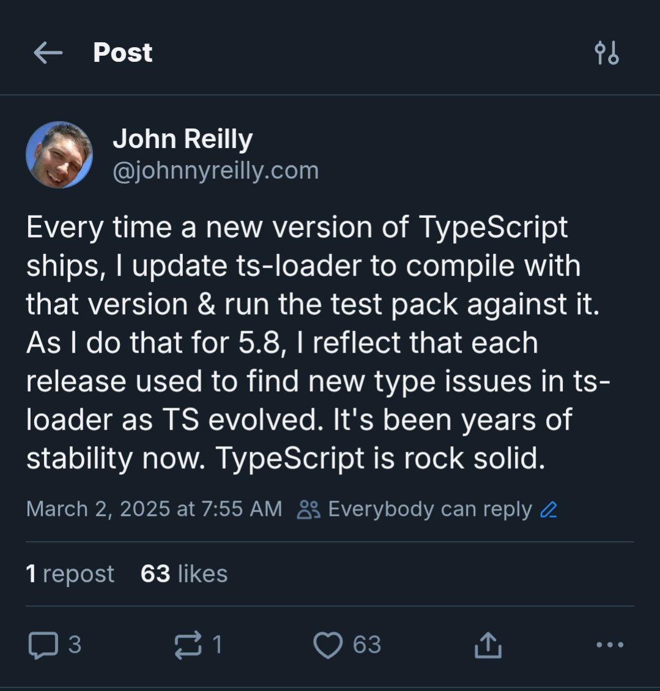

TypeScript is [being ported to Go](https://devblogs.microsoft.com/typescript/typescript-native-port/). This is known as "TypeScript 7" (it is currently on 5.8). It's quite likely that you know this by now, as there have been excellent communications from the TypeScript team in a variety of forums. In fact, hats off to the team; it's been an object lesson in how to communicate well; straightforward, clear and open.


There's no shortage of content out there detailing what is known about the port. This piece is not that. Rather, it's the reflections of two people in the TypeScript community. What our thoughts, feelings and reflections on the port are.

It's going to be a somewhat unstructured wander through our reactions and hopes. Buckle up for opinions and feelings.

<!--truncate-->

## Who are John Reilly and Ashley Claymore?

John Reilly is a software engineer and an early adopter of TypeScript. He worked on Definitely Typed, the home of high quality type definitions which allow the integration of TypeScript and JavaScript. John wrote the [history of Definitely Typed](https://johnnyreilly.com/definitely-typed-the-movie) and featured in the TypeScript documentary. He also worked (and works) on `ts-loader`, the webpack loader for TypeScript. In his day job, he works at Investec, a South African bank and is based in London. The greatest city on earth (in his opinion).

Ashley is a software engineer who has the pleasure of living not too far from John, occasionally joining him on his morning walks, where we can kick start our day talking about TypeScript together. Ashley first started writing TypeScript when it was on version 1.8 and has thoroughly enjoyed following its evolution. He has [contributed to TypeScript](https://github.com/microsoft/TypeScript/pulls?q=author%3Aacutmore+is%3Aclosed) and works at Bloomberg as part of the 'JavaScript Infrastructure &amp; Tooling' team. Opinions are his own.

## Was a port necessary?

I mean, weren't we happy with each other anyway? Just as we were? Yes, but also no.

If you're in the JavaScript / TypeScript ecosystem, recent years have been notable for the number of projects that have appeared to support JavaScript related development, but built in non-JavaScript languages. We've had [esbuild](https://esbuild.github.io/), written in Go. We've had [SWC](https://swc.rs/), written in Rust. We've had [Bun](https://bun.sh/), written in Zig. We've had [Deno](https://deno.com/), written in Rust.

The list goes on, and was getting longer and longer. All of these increased performance, which was and is a wonderful thing. We'll talk more about performance later. One hold-out was TypeScript. It remained being written in TypeScript. Whilst performance improvements did happen, and were an area of focus for the team, the level of improvements that happened were incremental; not transformative.

You could see the impatience in the community, as people started making their own efforts to speed up TypeScript by building their own implementations. Most notable here was [DongYoon Kang](https://github.com/kdy1/); the creator of SWC. SWC, amongst other things, implemented the transpilation aspect of TypeScript. Donny decided to see if he could implement the type checker as well, again using Rust. He then switched to [attempting a port using Go](https://kdy1.dev/2022-1-26-porting-tsc-to-go). After some time he then switched back to [trying to implement in Rust](https://kdy1.dev/2022-10-27-open-sourcing-stc).

It didn't end up succeeding, but the fact there were people out there willing to try this demonstrated the desire for performance in the community. At some point a port was likely to succeed, and if it wasn't driven by the actual TypeScript team it would probably have landed the ecosystem in a tricky situation. A port of TypeScript, to a language other than TypeScript, seemed to be inevitable. And here we are.

## Performance

It's useful to think about what the Go port meaningfully changes about TypeScript. Josh Goldberg has [provided a useful framing on different aspects of TypeScript](https://www.learningtypescript.com/articles/what-is-typescript). It's four things:

1. Language
2. Type Checker
3. Compiler
4. Language services

The language is unaffected by the port. Syntax is unchanged. You'll still be writing `type`s and `interfaces`s as you were before. No difference.

The same applies to the checks that the type checker is performing. The code that was detected as an error before will still fail to type check with TypeScript 7:

```ts
const i: number = 'not actually a number';
// ts: Type 'string' is not assignable to type 'number'
```

This is where the differences begin. The type checker, compiler, and the language services do change. They become an order of magnitude faster.

Put your hands up if you don't care about performance. That's right, no hands went up. We all care about performance. If you ever have the misfortune to work with technology that lags, which breaks you out of flow as you are working, you notice it. It's almost the only thing you can notice.

The TypeScript team has always cared about performance, particularly in the area of development tooling. Anders Hejlsberg in particular has mentioned in interviews, the need for language servers to provide fast feedback as people work. Something measured in milliseconds and not seconds.

What are the implications of these changes to the TypeScript ecosystem? Put simply: a faster VS Code and faster builds.

Where John works, at Investec, there are many engineers who use VS Code, and spend part of their engineering life writing TypeScript and JavaScript. All those engineers will benefit from a snappier development experience. When they open up a project in VS Code, the time taken for the language service to wake up will drop dramatically. As they refactor their code, the experience will be faster. The "time to red squiggly line" metric will decrease. And that's a good thing.

As a consequence, engineers should be incrementally more effective, given that there are fewer pauses in their workflow.

The same incremental gain applies to builds. As our engineers build applications, they run TypeScript builds on their machines and in a Continuous Integration context. These will all be faster than they were before. We'll continually experience a performance improvement which is a benefit.

This, of course, is not Investec specific. Rather this is a general improvement that everyone will benefit from. Across the world, wherever anyone writes and builds TypeScript, they will do so faster.

## The TypeScript team will write less TypeScript

Many languages have [bootstrapping compilers](<https://en.wikipedia.org/wiki/Bootstrapping_(compilers)>). This means the compiler is written in the program language that it is the compiler for. TypeScript has been an example of this since it was first open sourced. That is about to change; the compiler will stop being written in TypeScript and will start being written in Go. This is possibly the first example of a language moving away from having a bootstrapping compiler. This is done in the name of performance.

Of all the aspects about the Go port, this one was the one that gave John most anxiety. (It's John writing this by the way, writing in the third person feels very strange.) The TypeScript team will be moving away from writing TypeScript in their day to day lives. They won't abandon it of course, but they will certainly write less TypeScript and more Go. An implication of this is that there will be reduced [dogfooding](https://en.wikipedia.org/wiki/Eating_your_own_dog_food) - which means less direct feedback to the makers of TypeScript about what it's like to write TypeScript.

Given how broad the TypeScript community is, this is perhaps not the concern that it might be. The team are very connected with the community and even if they are writing TypeScript less, people who are writing more will be sure to be vocal. It's maybe worth remembering that for most of the time TypeScript has been around, the team has often written TypeScript in a style that is not necessarily representative of the broader community. We're thinking here of classes (talked about below), and until recently modules. Before Jake Bailey's mammoth work to [migrate the TypeScript codebase to use modules](https://devblogs.microsoft.com/typescript/typescripts-migration-to-modules/), the codebase used namespaces. This didn't stop TypeScript working with on improving support for these JavaScript features at all. So it seems reasonable we need not fear.

Another angle on this, is wondering if the TypeScript team might become less involved with TC39 (the committee that develops the JavaScript language specification). TypeScript have been instrumental in language development over the years, from optional chaining to decorators and beyond. As the TypeScript team will be writing less TypeScript, there's a view that they might become less directly involved in influencing the development of JavaScript.

Ashley, who is one of Bloomberg's TC39 delegates, is not at all worried about this. The Principal Product Manager of TypeScript, Daniel Rosenwasser, recently became one of the [two incoming TC39 Facilitators](https://github.com/tc39/agendas/blob/main/2025/TC39%20Chair%20Group%20Election%20-%20106th%20Meeting.pdf). There is also Ron Buckton, another TC39 delegate from the TypeScript team, who continues to champion multiple exciting proposals such as [Explicit Resource Management](https://github.com/tc39/proposal-explicit-resource-management). The importance of having the TypeScript team's input into the evolution of JavaScript remains the same regardless of which language is used to implement TypeScript's analysis of JavaScript.

## Interacting with TypeScript

There are four primary ways to interact with the TypeScript package. Let's have a think about how these might change.

- Via its command line interface `tsc`
  - There will still be a CLI and it sounds like the goal will be very close compatibility. The implementation may change to be Go, but you would still be able to interact with the CLI in the same way
- Via its JavaScript API, importing it as a module `import ts from "typescript"`
  - The TypeScript team are still working on this part. There will still be a JavaScript API, though it's almost certain that there will be changes here, but exactly how different they are is not yet known.
  - One core question is if the currently synchronous API will need to become asynchronous due to calling Go, as this can be [a difficult change to migrate to](https://journal.stuffwithstuff.com/2015/02/01/what-color-is-your-function/). The good news here is that [it looks like it will be able to retain a synchronous API](https://github.com/microsoft/typescript-go/pull/711).
- Via the language server `tsserver`
  - Editors such as VSCode, and even linters, can interact with TypeScript via its language server.
  - Interestingly even though TypeScript helped inspire the LSP specification it [currently doesn't actually implement it](https://github.com/microsoft/TypeScript/issues/39459). The TypeScript team are using the port as an opportunity to align with the LSP specification. This is a positive change.
- Via another tool that uses TypeScript internally
  - Tools use one or a combination of the above to use TypeScript on their user's behalf. There will be work for the tools, but this might be done transparently to the end developer.

## Ecosystem tools

Let's drill further into tools that use TypeScript internally. There will be an impact. John is the maintainer of [`ts-loader`](https://github.com/TypeStrong/ts-loader), a widely used webpack loader for TypeScript. This loader depends upon TypeScript APIs which have been unchanged in years.

In fact, in John went so far as to comment as such on [Bluesky in early March](https://bsky.app/profile/johnnyreilly.com/post/3ljexijnmdk2m):



Only to have the TypeScript team effectively come out and say "hold my beer".

It's very early days, but we know for sure that the internal APIs of TypeScript (that `ts-loader` depends upon) will [change](https://github.com/microsoft/typescript-go/discussions/455#discussion-8063819). To quote Daniel Rosenwasser of the TypeScript team:

> While we are porting most of the existing TypeScript compiler and language service, that does not necessarily mean that all APIs will be ported over.

`ts-loader` has two modes of operation:

1. With type checking
2. Without type checking; transpilation only

It's very unlikely that TypeScript 7 will work with `ts-loader`s type checking mode, without significant refactoring. However, it's quite likely that `ts-loader` might be able to support transpilation only mode with minimal changes. This mode only really depends on the [`transpileModule`](https://github.com/TypeStrong/ts-loader/blob/847a24936aa12fa18dab21ca8ec37595cadc72c6/src/index.ts#L644-L650) API of TypeScript. If the `transpileModule` API lands, then the transpilation only mode of `ts-loader` should just work. On the other hand, this might be the natural end of the road for the type checking mode of `ts-loader`.

Ashley is the author of [`ts-blank-space`](https://github.com/bloomberg/ts-blank-space) (an open source TypeScript to JavaScript transform published by Bloomberg that avoids the need for source maps). It also depends on TypeScript's API so may be affected by the port. It's too early to say but the change here may turn into an opportunity. A not uncommon request of `ts-blank-space` is to investigate using a different parser. This is because while `ts-blank-space` itself is very small and only uses TypeScript's parsing API, this is not an isolated part of TypeScript so still ends up importing the whole type checker. For projects that already depend on TypeScript there is no added cost, but it makes `ts-blank-space` less appealing for use-cases that are not already importing TypeScript as a library.

Some tooling will have a natural path forwards. For instance, `typescript-eslint` will continue onwards with TypeScript 7. The TypeScript team are planning to help with typed linting with the new, faster APIs. So this means that ESLint (which many people are used to using), will become faster, as TypeScript becomes faster.

However, it's likely that tooling that depends upon internal TypeScript APIs which are going to radically change, may cease to be in their current forms. This will vary project by project, but expect change. And this is fine. Change is a constant.

## Was Go a good language choice?

Given that TypeScript decided to move away from being written with TypeScript, many people had and have opinions on the language being picked: Go. The folk who like C# wish that the team had picked C#. Particularly given Anders' involvement with C#. Those people that like Rust would very much have liked for the team to have picked Rust. The good news for Rust fans is that there is a chance that the Node.js bindings for TypeScript 7 will use [a package that was written in Rust](https://github.com/microsoft/libsyncrpc).

If John was to guess what the team might have picked he would have either said Rust or Zig (what Bun is built with). Go felt like a slightly leftfield choice, but upon reflection it completely makes sense. ESBuild is written in Go, so there's prior art. Go has a garbage collector (Rust does not) which means the work of porting the code is significantly reduced. Likewise, C# is all about `class`es and so a port from TypeScript (which makes only light use of `class`es in the compiler codebase) to C# would be uphill work.

The Go choice represents pragmatism; which is very much a TypeScript ethos. In fact if you look at the [TypeScript Design goals](https://github.com/microsoft/TypeScript/wiki/TypeScript-Design-Goals), you can see how TypeScript has always espoused a pragmatic approach. Perhaps most famously by having soundness as a "non-goal". Instead, striking a balance between correctness and productivity.

Pragmatism is the TypeScript way. Go is a pragmatic choice.

## Is this evidence that JavaScript is slow?

This is evidence that JavaScript can be a slow language to implement a type-checker. To re-purpose a quote from Anders in this ['why Go' post](https://github.com/microsoft/typescript-go/discussions/411#discussioncomment-12476218a):

> No single language is perfect for every task

The task of type-checking is an intensive one. One way to think of type-checking is that it is taking the program it is checking, emulating executing every line of code, and detecting when the emulation breaks a rule. So the larger a program is, the more work there is to do. When the type-checker is written in a dynamic language this means that it requires another program to run it. For TypeScript this means we effectively have a JavaScript engine, running the TypeScript checker which is running an emulation of another program. It's not a surprise that if the type-checker itself can be run natively that it will run noticeable faster.

Going ten times faster with Go has been attributed to roughly 3.5 times faster by being native, and another speed up comes from being able to run more in parallel ([source](https://youtu.be/10qowKUW82U?t=538)).

Considering how much more work it is to execute a dynamic language like JavaScript than to execute a pre-compiled native binary, if anything it's amazing that the switch to native isn't a larger difference. This shows how much work has gone into V8, the JavaScript engine used by Node.js, to execute JavaScript very effectively.

It is possible to write JavaScript programs that do work in parallel today, but the APIs to do this efficiently are things like the low-level [`SharedArrayBuffer`](https://developer.mozilla.org/en-US/docs/Web/JavaScript/Reference/Global_Objects/SharedArrayBuffer), where you are now dealing with the raw bytes. There is a Stage 2 proposal to add ["Shared Structs"](https://github.com/tc39/proposal-structs) to JavaScript - if this progresses it will be interesting to see JavaScript programs more easily benefit from using multiple cores.

There are still many benefits to using JavaScript for other tasks. Just some of the benefits:

- tend to be smaller in size, due to having higher-level concepts
- easier to combine together dynamically, great for 3rd party plugin ecosystems
- easier to modify while they are still running, which is great for UI development
- are not specific to a particular operating systems and CPU architecture

## Conclusion

The ecosystem demanded a faster TypeScript. Performance cannot be ignored these days. As a consequence, some kind of port of TypeScript was bound to happen. If we accept that view, then what next? Well, the way that the TypeScript team has started executing on the migration fills us with confidence. The TypeScript team are talented, they are pragmatists and their choices are wise.

This is going to Go well.

## Credits

Thanks to Jake Bailey, of the TypeScript team, for reviewing this piece - greatly appreciated! Also to Josh Goldberg to writing up his classification of what makes up TypeScript; many thanks!

[This post was originally published on LogRocket.](https://blog.logrocket.com/typescript-go-pragmatic-choice/)

<head>
    <link rel="canonical" href="https://blog.logrocket.com/typescript-go-pragmatic-choice/" />
</head>
