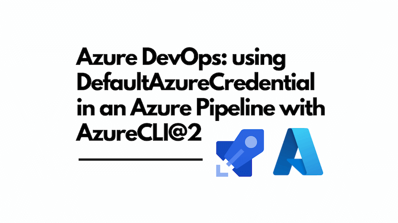

I frequently build scripts that work against Azure resources using the [Azure SDK for JavaScript](https://github.com/Azure/azure-sdk-for-js). I use the [`DefaultAzureCredential`](https://learn.microsoft.com/en-gb/dotnet/azure/sdk/authentication/credential-chains?tabs=dac#defaultazurecredential-overview) to authenticate against Azure resources - this is also available in other platforms such as .NET.



The `DefaultAzureCredential` is a great way to authenticate locally; I can `az login` and then run my script, safe in the knowledge that the `DefaultAzureCredential` will authenticate successfully. However, how can I use the `DefaultAzureCredential` in an Azure DevOps pipeline?

This post will show you how to use the `DefaultAzureCredential` in an Azure DevOps pipeline, specifically by using the `AzureCLI@2` task.

<!--truncate-->

## What is `DefaultAzureCredential`?

To quote the documentation:

> `DefaultAzureCredential` is an opinionated, preconfigured chain of credentials. It's designed to support many environments, along with the most common authentication flows and developer tools. In graphical form, the underlying chain looks like this:
>
> 

The first credential in the chain is [`EnvironmentCredential`](https://learn.microsoft.com/en-us/dotnet/api/azure.identity.environmentcredential?view=azure-dotnet&preserve-view=true), which looks for environment variables to authenticate. This means that if you set the right environment variables, you can use `DefaultAzureCredential` and it will authenticate with them.

The specific environment variables that `DefaultAzureCredential` looks for are:

- `AZURE_TENANT_ID` - The Microsoft Entra tenant (directory) ID.
- `AZURE_CLIENT_ID` - The client (application) ID of an App Registration in the tenant.
- `AZURE_CLIENT_SECRET` - A client secret that was generated for the App Registration.

The fifth credential in the chain is [`AzureCliCredential`](https://learn.microsoft.com/en-us/dotnet/api/azure.identity.azureclicredential?view=azure-dotnet&preserve-view=true), which uses the Azure CLI to authenticate. This means that if you have already authenticated using `az login`, you can use `DefaultAzureCredential` without setting any environment variables.

## Why have you told me about `EnvironmentCredential` and `AzureCliCredential`?

Great question! When I'm developing locally, I can use `DefaultAzureCredential` without thinking further about it. I just run `az login` and then run my script. `DefaultAzureCredential` will do what I need.

You can just make use of `AzureCliCredential`, both locally and in an Azure DevOps pipeline, and it will work as long as you have a service connection set up in Azure DevOps that uses the same credentials as your local `az login`. Should you need it, `EnvironmentCredential` is another option which can be used in an Azure DevOps pipeline, and we'll show you how to use that as well.

The nice thing about `DefaultAzureCredential` is that it support both approaches, so you can use it in your code without worrying about which credential type is being used.

## Using the `AzureCLI@2` task with `AzureCliCredential`

To use the Azure CLI in an Azure DevOps pipeline, you can use the [`AzureCLI@2`](https://learn.microsoft.com/en-us/azure/devops/pipelines/tasks/reference/azure-cli-v2?view=azure-pipelines) task. This task allows you to run Azure CLI commands in your pipeline, given it is configured to use a service connection that has the necessary permissions to access your Azure resources.

Consider the following example pipeline YAML:

```yml
- task: AzureCLI@2
  displayName: Run with AzureCliCredential
  inputs:
    azureSubscription: myServiceConnection # this is the name of your Azure service connection in Azure DevOps
    scriptType: bash
    scriptLocation: inlineScript
    inlineScript: npm start # where `npm start` is your command that uses DefaultAzureCredential
```

The above will run the `npm start` command in the context of the Azure CLI, using the service connection specified by `azureSubscription`. This service connection will authenticate using the credentials of the service principal associated with it. When the code runs and `DefaultAzureCredential` is used, it will use the `AzureCliCredential` to authenticate, as at this point the pipeline is effectively a logged user with the Azure CLI.

## Using the `AzureCLI@2` task with `EnvironmentCredential`

If, for whatever reason, you want to use `EnvironmentCredential` in your Azure DevOps pipeline, you can do so by setting the necessary environment variables in the pipeline. I don't have a specific reason to do this, but you may. To achieve this, you can modify the approach as follows:

```yml
- task: AzureCLI@2
  displayName: Set service principal variables
  inputs:
    azureSubscription: myServiceConnection # this is the name of your Azure service connection in Azure DevOps
    scriptType: bash
    scriptLocation: inlineScript
    addSpnToEnvironment: true
    inlineScript: |
      echo "##vso[task.setvariable variable=AZURE_CLIENT_ID;issecret=true]${servicePrincipalId}"
      echo "##vso[task.setvariable variable=AZURE_CLIENT_SECRET;issecret=true]${servicePrincipalKey}"
      echo "##vso[task.setvariable variable=AZURE_SUBSCRIPTION_ID;issecret=true]$(az account show --query 'id' -o tsv)"
      echo "##vso[task.setvariable variable=AZURE_TENANT_ID;issecret=true]${tenantId}"

- bash: npm start
  displayName: 'Run with EnvironmentCredential'
  env:
    # see https://github.com/Azure/azure-sdk-for-net/blob/main/sdk/identity/Azure.Identity/README.md#environment-variables
    AZURE_CLIENT_ID: $(AZURE_CLIENT_ID)
    AZURE_CLIENT_SECRET: $(AZURE_CLIENT_SECRET)
    AZURE_SUBSCRIPTION_ID: $(AZURE_SUBSCRIPTION_ID)
    AZURE_TENANT_ID: $(AZURE_TENANT_ID) # this is optional and not necessary for EnvironmentCredential to work
```

You can see this is a little different from the previous example. We're now using the `AzureCLI@2` task to set the necessary environment variables for `DefaultAzureCredential` to work. The `addSpnToEnvironment` input is set to `true`, which ensures that the service principal's credentials are added to the environment.

The second task is a simple bash task that runs `npm start`, but it now has an `env` section that sets the necessary environment variables for `DefaultAzureCredential` to work. The environment variables are set using the variables exposed by the previous task.

## Conclusion

In this post, we explored how to use `DefaultAzureCredential` in an Azure DevOps pipeline, specifically when using the `AzureCLI@2` task. We discussed the two main approaches: using `AzureCliCredential` and `EnvironmentCredential`, and how to configure the pipeline to support both.

It's worth noting that whilst my own use case is JavaScript / TypeScript, the same principles apply to other languages that support `DefaultAzureCredential`, such as .NET. The key takeaway is that you can use `DefaultAzureCredential` in an Azure DevOps pipeline just as easily as you can locally, allowing for a consistent development and deployment experience.
