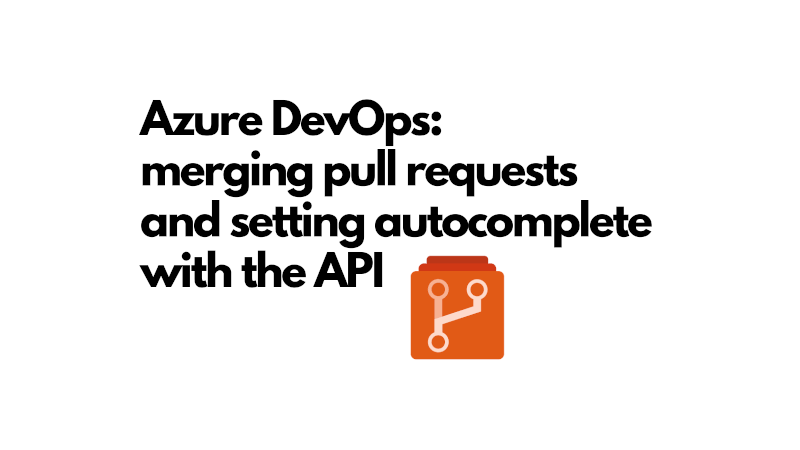

Have you ever wanted to merge a pull request in Azure DevOps using the Azure DevOps API? Or set a pull request to autocomplete, so it automatically merges when all policies are satisfied? If so, you're in the right place. In this post, I'll show you how to do just that using the Azure DevOps Client for Node.js.



I'm using the Azure DevOps Client for Node.js; but if you want to use the REST API directly, you can do that too. The principles are the same, but you'll need to make HTTP requests instead of using the client library.

To get up and running with the Azure DevOps Client for Node.js, you can [see how we work with it in this post on dynamic required reviewers in Azure DevOps](../2025-06-25-azure-devops-pull-requests-dynamic-required-reviewers/index.md) post. This will help you set up your environment and authenticate with Azure DevOps.

<!--truncate-->

## Merging a pull request

To merge a pull request with the API, you need to use the `GitApi` class from the Azure DevOps Client for Node.js. Here's what merging a pull request looks like:

```ts
async function mergePullRequest({
  gitApi,
  repositoryName,
  pullRequest,
  projectName,
}: {
  gitApi: IGitApi;
  repositoryName: string;
  pullRequest: GitPullRequest;
  projectName: string;
}): Promise<void> {
  try {
    await gitApi.updatePullRequest(
      {
        status: PullRequestStatus.Completed,
        lastMergeSourceCommit: pullRequest.lastMergeSourceCommit,
        completionOptions: {
          mergeStrategy: GitPullRequestMergeStrategy.Squash,
        },
      },
      /** repositoryId */ repositoryName,
      pullRequest.pullRequestId!,
      /** project */ projectName
    );
    console.log(
      `✅ Successfully merged pull request ${pullRequest.pullRequestId}`
    );
  } catch (error) {
    const errorMessage = `❌ Failed to merge pull request ${pullRequest.pullRequestId}`;
    console.error(errorMessage, error);
  }
}
```

This expects that you provide the `gitApi` instance, the name of the repository, the pull request object, and the project name. The `mergeStrategy` is set to `Squash`, but you can change it to `Rebase` or `NoFastForward` if you prefer those strategies.

If you have policies that restrict your merge type, you must pick the merge strategy that complies with those policies. For example, if your project requires squash merges, you should use `GitPullRequestMergeStrategy.Squash`. AKA the one true merge strategy.

## Setting a pull request to autocomplete

Setting a pull request to autocomplete means that it will automatically merge when all policies are satisfied. This is useful for ensuring that the pull request is merged without manual intervention once it meets the requirements. For example when build validations have passed, and the required reviewers have approved.

Here's how you can set a pull request to autocomplete:

```ts
async function setPullRequestToAutocomplete({
  gitApi,
  locationsApi,
  repositoryName,
  pullRequest,
  projectName,
}: {
  gitApi: IGitApi;
  locationsApi: ILocationsApi;
  repositoryName: string;
  pullRequest: GitPullRequest;
  projectName: string;
}): Promise<void> {
  if (pullRequest.autoCompleteSetBy) {
    return;
  }

  try {
    const { authenticatedUser } = await locationsApi.getConnectionData();

    console.log(
      `Setting pull request ${pullRequest.pullRequestId} to auto-complete with squash merge as ${authenticatedUser?.providerDisplayName} (${authenticatedUser?.id})`
    );

    await gitApi.updatePullRequest(
      {
        autoCompleteSetBy: {
          id: authenticatedUser?.id,
        },
        completionOptions: {
          mergeStrategy: GitPullRequestMergeStrategy.Squash,
        },
      },
      /** repositoryId */ repositoryName,
      pullRequest.pullRequestId!,
      /** project */ projectName
    );
    console.log(
      `✅ Successfully set pull request ${pullRequest.pullRequestId} to auto-complete`
    );
  } catch (error) {
    const errorMessage = `❌ Failed to set pull request ${pullRequest.pullRequestId} to auto-complete`;
    console.error(errorMessage, error);
  }
}
```

What might be surprising about this code is that you have explicitly provide your user id when setting the pull request to autocomplete. The unlovely aspect of this is that you need to discover that id somehow.  We achieve it here by fetching the authenticated user from the `locationsApi`.

Once you have the user id, you can set the `autoCompleteSetBy` property of the pull request to that user id. This will allow the pull request to be set to autocomplete. Again we must specify the `mergeStrategy` so it knows how to merge when the time comes.

## Conclusion

In this post, we've seen how to merge a pull request and set it to autocomplete using the Azure DevOps Client for Node.js. This can be a powerful way to automate your workflow and ensure that pull requests are merged when they meet the necessary criteria.

I'm personally using this in build validation pipelines to ensure that pull requests are merged automatically when all policies are satisfied. This helps to streamline the development process and reduce manual intervention.