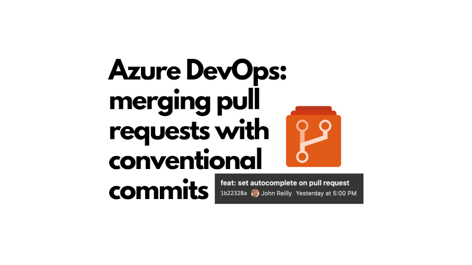
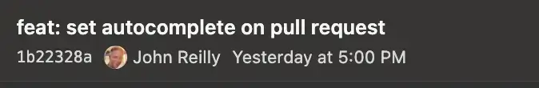

There was a time in my life when I didn't really care about commit messages. I would just write whatever I felt like, and it was fine. Over time, I learned that good commit messages are important for understanding the history of a project, especially when working in a team. And also, because I tend to forget what I've been working on surprisingly quickly.

There's also more technical reasons to care about commit messages. For example, if you're using a tool like [semantic-release](https://semantic-release.gitbook.io/semantic-release/) to automate your release process, it relies on conventional commit messages to determine the next version number and generate release notes. It turns out that Azure DevOps has some challenges when it comes to maintaining a git commit history of conventional commits, especially when merging pull requests. By default, Azure DevOps uses a commit strategy that creates a merge commit with a message like "Merge PR 123: Title of pull request". This is acts against conventional commits.



You can use the UI to change the commit message when completing a pull request, but it's very easy to forget to do this. And if you're using squash merges, you lose the individual commit messages from the feature branch, which can be a problem if you're trying to maintain a history of conventional commits.

There is a way to bend Azure DevOps to our will; to allow us to control our commit messages. In this post, I'll show you how to do just that using the Azure DevOps API, some TypeScript and build validations. The fact this mechanism lives in a build validation means you cannot forget to set the commit message. That's the feature.

This post is not, in fact, specifically about using conventional commits. That's just a common use case. Rather this post is about being able to control the commit message when merging pull requests in Azure DevOps.

<!--truncate-->

## The approach

The internet has been angry about Azure DevOps pull request commit messages for a while. There are [feature requests](https://developercommunity.visualstudio.com/t/change-default-title-for-pull-request-commits-to-n-1/365716) which have been open since 2018 and [Stack Overflow questions](https://stackoverflow.com/questions/55636169/how-to-change-pr-merge-commit-message) on the topic.

Azure DevOps very rarely gets new features these days, and so it's unlikely that we'll see any changes here. However, there is one avenue that is open to us. Azure DevOps has the ability for a pull request to be set to autocomplete, which means that it will automatically merge when all policies are satisfied. This is useful for ensuring that the pull request is merged without manual intervention once it meets the requirements. For example when build validations have passed, and the required reviewers have approved.

I've written about [merging pull requests and setting autocomplete with the Azure DevOps API](../2025-07-25-azure-devops-api-pull-requests-merge-set-autocomplete/index.md) previously. We're going to build on that knowledge here, but add in the magic of setting the merge commit message when we set the pull request to autocomplete. This is achieved by the [pull requests API](https://learn.microsoft.com/en-us/rest/api/azure/devops/git/pull-requests/update?view=azure-devops-rest-7.1#gitpullrequestcompletionoptions). It allows us to update a pull request and set it autocomplete with a specific message commit message.

This should allow us to go from commits like this:


To commits like this:



I should say that I'm using conventional commits as my commit message style, but you can use whatever style you like. The important thing is that you have control over the commit message.

## The code

We're going to write a script that can be run in a build validation pipeline. This script will set the pull request to autocomplete with a specific merge commit message. This means that if you use conventional commits, you'll get to maintain a history of conventional commits in your git history.

Before we dive into the full code, here's the bit that does the magic of setting the merge commit message when setting the pull request to autocomplete:

```ts
const updateData = {
  autoCompleteSetBy: {
    id: authenticatedUser.id,
  },
  completionOptions: {
    mergeStrategy: 'squash',
    mergeCommitMessage: 'feat: conventional commit message', // <- set your commit message here
  },
};

const response = await fetch(
  `https://dev.azure.com/${org}/${project}/_apis/git/repositories/${repo}/pullrequests/${pullRequestId}?api-version=7.1`,
  {
    method: 'PATCH',
    headers: defaultHeaders,
    body: JSON.stringify(updateData),
  },
);
```

Here we are:

- Setting the `autoCompleteSetBy` property to the authenticated user. This is required when setting a pull request to autocomplete.
- Setting the `completionOptions.mergeStrategy` to `squash`. [You can change this to `rebase` or `noFastForward` if you prefer those strategies.](https://learn.microsoft.com/en-us/rest/api/azure/devops/git/pull-requests/update?view=azure-devops-rest-7.1#gitpullrequestmergestrategy)
- Setting the `completionOptions.mergeCommitMessage`. This is where we set our conventional commit message. Or if you wanted to use a different style, you could set it to whatever you like.

### The full TypeScript script

Now that we understand the principle, here's the full `set-autocomplete-and-commit-message.ts` script that you can use in your build validation pipeline:

```ts
import { Buffer } from 'buffer';
import { parseArgs } from 'util';

interface LocationData {
  authenticatedUser?: AuthenticatedUser;
}

interface AuthenticatedUser {
  customDisplayName?: string;
  id: string;
  providerDisplayName: string;
}

function getArgs() {
  const { values } = parseArgs({
    options: {
      token: {
        type: 'string',
        short: 't',
        description: 'Personal Access Token for Azure DevOps API',
      },
      'pr-id': {
        type: 'string',
        short: 'i',
        description: 'Pull Request ID',
      },
      org: {
        type: 'string',
        short: 'o',
        description: 'Azure DevOps organization name',
      },
      project: {
        type: 'string',
        short: 'j',
        description: 'Azure DevOps project name',
      },
      repo: {
        type: 'string',
        short: 'r',
        description: 'Repository name',
      },
    },
  });

  const token = values.token;
  const currentPullRequestId = values['pr-id'];
  const org = values.org
    ?.replace('https://dev.azure.com/', '')
    .replace('/', '');
  const project = values.project;
  const repo = values.repo;

  if (!token) {
    throw new Error('PAT token must be provided using --token');
  }
  if (!currentPullRequestId) {
    throw new Error('Pull Request ID must be provided using --pr-id');
  }
  if (!org) {
    throw new Error('Organization must be provided using --org');
  }
  if (!project) {
    throw new Error('Project must be provided using --project');
  }
  if (!repo) {
    throw new Error('Repository must be provided using --repo');
  }

  return { token, currentPullRequestId, org, project, repo };
}

async function getAuthenticatedUser(
  org: string,
  defaultHeaders: Record<string, string>,
) {
  console.log('Fetching authenticated user info...');

  const connectionDataResponse = await fetch(
    `https://dev.azure.com/${org}/_apis/ConnectionData?api-version=7.2-preview.1`,
    {
      method: 'GET',
      headers: defaultHeaders,
    },
  );

  if (!connectionDataResponse.ok) {
    const errorText = await connectionDataResponse.text();
    throw new Error(
      `Failed to fetch connection data: HTTP ${String(connectionDataResponse.status)}: ${errorText}`,
    );
  }

  const connectionData = (await connectionDataResponse.json()) as LocationData;

  const authenticatedUser = connectionData.authenticatedUser;

  if (!authenticatedUser?.id) {
    throw new Error('Could not determine authenticated user');
  }

  console.log(
    `Authenticated as: ${authenticatedUser.customDisplayName ?? authenticatedUser.providerDisplayName} (ID: ${authenticatedUser.id})`,
  );

  return authenticatedUser;
}

/**
 * Set the merge commit message for a pull request using squash merge strategy
 */
async function setMergeCommitMessageAndAutocomplete({
  pullRequestId,
  mergeCommitMessage,
  token,
  org,
  project,
  repo,
}: {
  pullRequestId: string;
  mergeCommitMessage: string;
  org: string;
  project: string;
  repo: string;
  token: string;
}) {
  const defaultHeaders = {
    Authorization: `Basic ${Buffer.from(`:${token}`).toString('base64')}`,
    'Content-Type': 'application/json',
  };

  const authenticatedUser = await getAuthenticatedUser(org, defaultHeaders);

  console.log(
    `Setting autocomplete and merge commit message for PR #${pullRequestId} as ${authenticatedUser.customDisplayName ?? authenticatedUser.providerDisplayName} (${authenticatedUser.id})...`,
  );

  const updateData = {
    autoCompleteSetBy: {
      id: authenticatedUser.id,
    },
    completionOptions: {
      mergeStrategy: 'squash',
      mergeCommitMessage,
    },
  };

  const response = await fetch(
    `https://dev.azure.com/${org}/${project}/_apis/git/repositories/${repo}/pullrequests/${pullRequestId}?api-version=7.1`,
    {
      method: 'PATCH',
      headers: defaultHeaders,
      body: JSON.stringify(updateData),
    },
  );

  if (!response.ok) {
    const errorText = await response.text();
    throw new Error(
      `Failed to set autocomplete and merge commit message: HTTP ${String(response.status)}: ${errorText}`,
    );
  }

  console.log(
    `Successfully set autocomplete and merge commit message for PR #${pullRequestId}`,
  );
}

async function main() {
  const { token, currentPullRequestId, org, project, repo } = getArgs();

  await setMergeCommitMessageAndAutocomplete({
    pullRequestId: currentPullRequestId,
    mergeCommitMessage: 'feat: conventional commit message', // <- set your commit message here
    token,
    org,
    project,
    repo,
  });
}

main().catch((err: unknown) => {
  const errorMessage =
    err instanceof Error ? err.message : 'Unknown error occurred';
  console.error(`[ERROR] ${errorMessage}`);
  throw err;
});
```

This can also be run locally with `node ./set-autocomplete-and-commit-message.ts --token [PAT TOKEN WITH SCOPES: vso.code_write and vso.identity] --pr-id [PULL_REQUEST_ID] --org [NAME_OF_ORGANISATION] --project [NAME_OF_PROJECT] --repo [NAME_OF_REPOSITORY]`. You'll need Node.js 24 or later to run this. (And yes, you can run TypeScript files directly with Node.js these days).

The thing I haven't included here is how you determine the `mergeCommitMessage`. In my case, I use the title of the pull request as the commit message. You can fetch the pull request details using the Azure DevOps API and extract the title. I left this out for brevity, but you can easily add it in. Or use whatever logic you like to determine the commit message. The point is that you have control over it.

### The build validation pipeline

Now we have our script, we need to run it in a build validation pipeline. Here's an example of an Azure DevOps pipeline that runs the script:

```yml
trigger: none

pool:
  vmImage: ubuntu-latest

variables:
  isPullRequest: ${{ eq(variables['Build.Reason'], 'PullRequest') }}

stages:
  - stage: AutoCompleteAndCommitMessage
    displayName: Set autocomplete and commit message
    condition: ${{ variables['isPullRequest'] }}
    jobs:
      - job:
        steps:
          - task: NodeTool@0
            inputs:
              versionSpec: 24
            displayName: Install Node.js

          - bash: node ./scripts/set-autocomplete-and-commit-message.ts --token $(System.AccessToken) --pr-id $(System.PullRequest.PullRequestId) --org "$(System.CollectionUri)" --project "$(System.TeamProject)" --repo "$(Build.Repository.Name)"
            displayName: Set autocomplete and commit message
```

Crucially, this pipeline is triggered only for pull requests; the `System.PullRequest.PullRequestId` is only available in build validations run as part of a pull request. The pipeline installs Node.js 24 and then runs our script, passing in the necessary parameters. The `System.AccessToken` is used to authenticate with the Azure DevOps API, so make sure that the pipeline has the necessary permissions to use it.

## Conclusion

And that's it! With this setup, you can maintain a git commit history of conventional commits in Azure DevOps, even when merging pull requests. By using the Azure DevOps API to set the merge commit message when setting a pull request to autocomplete, you can ensure that your commit messages are meaningful and consistent.
