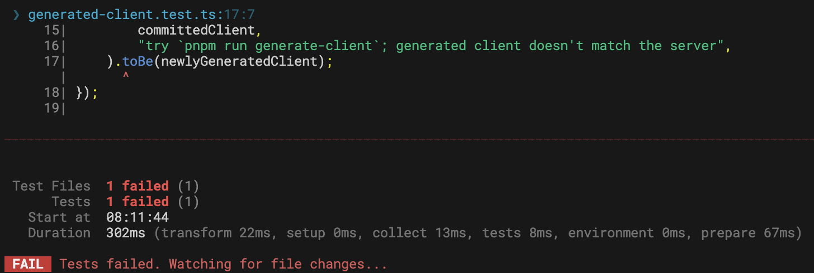
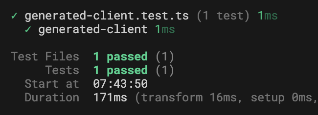

For many years I've been a big fan of using [NSwag](https://github.com/RicoSuter/NSwag) to generate TypeScript and CSharp clients for APIs. I've written about it before in [Generate TypeScript and CSharp clients with NSwag](../2021-03-06-generate-typescript-and-csharp-clients-with-nswag/index.md).

You're likely aware of the popularity of excellent projects like [tRPC](https://trpc.io/) which provide a way to use TypeScript end-to-end. However, if you're working in a polyglot environment where your back end is written in C# or [insert other language here], and your front end is written in TypeScript, then cannot take advantage of that. However, by auto-generating clients from OpenAPI specs, it's possible to have integration tests that check your front end and your back end are aligned.

This post will show you how to do that using NSwag.

<!--truncate-->

## The scenario

Let's talk about the kind of situation that I'm imagining. From reading the web, you'd think that every organisation is running both TypeScript on its front end and on its back end. In my experience, this is not the case. Many organisations have a particular technology stack on the back end - maybe C#/.NET - and a different one on the front end - often TypeScript/JavaScript.

The technique of generating clients from OpenAPI specs is useful in this scenario. It means that you can keep your front end and back end in sync, even if they are written in different languages. The source of truth is the Open API spec, which is typically generated from the back end code. The front end client code is generated from the Open API spec. And then, because TypeScript is compiled, you can do a compilation test to check that the front end code is in sync with the back end code.

It's a simple idea but it is powerful. I typically achieve it in two steps:

1. Make sure your continuous integration (CI) process compiles the front end code. This will ensure that the generated client code is in sync with the OpenAPI spec.
2. Add an integration test that checks that the generated client is up to date with the latest back end code.

Most people will have done the first step. If you have a front end project that is built as part of your CI process, then you will get a compilation errors if you're trying to do things using the client that the client code doesn't support. This is a great way to catch issues early.

But to really get value from this, you need to ensure that your front end and back end are in sync. This is the second step. This is where you add an integration test that checks that the generated client is up to date. There really isn't much to it. You just need to generate the client code as part of your test, and then check that the generated code is the same as the checked-in code.

Let's see what that looks like.

## The integration test

I'm going to use [Vitest](https://vitest.dev/) for this example. I love it, you could use pretty much any test framework you like. In my example, I'll have a separate `client-server-tests` project for the tests. Here's the `package.json` for that project:

```json
{
  "name": "client-server-tests",
  "version": "0.0.0",
  "scripts": {
    "copy-original-generated-client": "copyfiles --flat ../client-app/src/clients.ts tmp/",
    "regenerate-generated-client": "cd ../../ && pnpm run generate-client",
    "testprepare": "pnpm run copy-original-generated-client && pnpm run regenerate-generated-client",
    "test:ci": "pnpm run testprepare && vitest run --reporter=default --reporter=junit --outputFile=reports/junit.xml",
    "test": "pnpm run testprepare && vitest"
  },
  "devDependencies": {
    "copyfiles": "^2.4.1",
    "typescript": "^5.8.3",
    "vite": "^6.3.6",
    "vitest": "^3.2.4"
  }
}
```

But this could easily be part of your front end project if you prefer.

I'm not going to repeat the code of the previous post that demonstrated how to [generate TypeScript clients with NSwag](../2021-03-06-generate-typescript-and-csharp-clients-with-nswag/index.md) - but please imagine that the code for the TypeScript client has been generated and is available in a front end project. The code above refers to the front end of that project as `client-app` and the generated client code is in `client-app/src/clients.ts`.

You'll notice that both the `test:ci` and `test` scripts run a `testprepare` script first. This does two things:

1. It copies the currently checked-in generated client code to a temporary location.
2. It regenerates the client code from the OpenAPI spec (which would override the checked-in code).

Now that we have that, we can write a test that checks that the generated code is up to date. Here's what that looks like:

```ts
import { expect, test } from 'vitest';
import fs from 'fs';

test('generated-client', () => {
  const committedClient = fs.readFileSync('tmp/clients.ts', 'utf8');
  const newlyGeneratedClient = fs.readFileSync(
    '../client-app/src/clients.ts',
    'utf8',
  );

  expect(
    committedClient,
    "try `pnpm run generate-client`; generated client doesn't match the server",
  ).toBe(newlyGeneratedClient);
});
```

This test simply compares the previously generated client code with the newly generated client code. If they don't match, the test fails and the message suggests running the client generation command. So as well as being a useful test, it also provides a helpful hint to the developer. Like so:



Of course, you want to end up seeing a passing test:



## Finishing up

The last thing to do is to make sure that this test project is run as part of your CI process. I'm not going to show you how to do this, because it will depend on your CI system. But the idea is that you add a step to your CI process that installs your dependencies and runs the tests in the `client-server-tests` project.

With that in place, you now have a way to ensure that your front end and back end are in sync. If someone makes a change to the back end that affects the OpenAPI spec, and they forget to regenerate the client code, the test will fail and they'll be prompted to run the client generation command.

If the change that they made in some way breaks the front end code, then the front end build will fail because of the compilation errors. So you get two layers of protection.

This is a simple but effective way to keep your front end and back end in sync, even if they are written in different languages.
