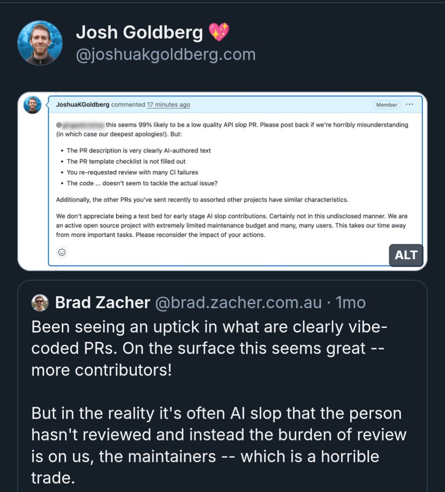
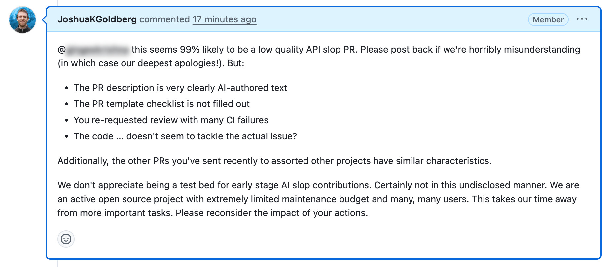

AI is a fantastic tool. In a short time, it has changed the way the whole industry builds software. Where we used to write every line ourselves, now the code we produce is generally a collaboration between an engineer and AI tooling. The likes of GitHub Copilot, Claude Code, ChatGPT, Replit etc., all combine to make being a software developer in 2025 quite different from what it was in 2022. The rate of change has been giddying.

This post exists to dig into a little of the nuance around how software development has been changed by the innovations of AI: both the positives and the negatives. We’ll also discuss the tooling and approaches that have carried the industry forward, and the brand new pitfalls that are now revealing themselves.

This post won’t be exhaustive. Given how fast AI has changed and keeps changing, many of the reference points in this post may seem out of date from the moment of publication. But hopefully, the underlying principles should be evergreen.

This will be a personal story, informed by the experiences both from the world of open source and from colleagues and friends in the industry.

## About me

A little information about myself: I work as a software engineer for Investec, a multinational financial services group. The story of engineering at Investec is relevant to this piece. Investec has been an early and enthusiastic adopter of AI generally, and AI software tooling particularly. I’ll seek to draw on this experience.

I also work on open source software outside of work and have done for many years, primarily in the world of TypeScript.

## Setting the table: GitHub Copilot and the emergence of agent mode

One of the most well-known AI coding tools is GitHub Copilot. In many ways, it was the original AI coding tool, and competitors like Claude Code and Cursor still can’t match Copilot’s dominance. Let’s consider for a moment what makes these IDE AI tools useful.

GitHub Copilot has ask and edit features which are not radically different from what you’d get with say ChatGPT, but something like agent mode was truly the game-changer. This feature transformed the way I approach complex coding tasks, shifting from line-by-line assistance to higher-level problem solving.

Rather than implementing a feature myself from scratch, I can describe a feature or a bug fix in natural language, and the AI will generate the necessary code changes across multiple files. This holistic approach to coding feels more like collaborating with a junior developer who can take on significant chunks of work. This allows me to focus on reviewing and refining the output rather than getting bogged down in the minutiae of implementation. AI is just fantastic at boilerplate, it turns out.

Another aspect that agent mode shines at is its ability to generate bash scripts and automation tasks rather than just making direct code changes. There’s something to be said for deterministic results. When AI generates a script that you can review, understand, and then execute, you maintain control over the process. This approach is far more reliable than having AI make direct modifications to your codebase that might introduce subtle bugs or architectural inconsistencies.

The predictable nature of scripted solutions means you can verify the approach before execution, understand exactly what will happen, and easily roll back if needed. It’s a more methodical approach that aligns well with engineering best practices around reproducible builds and transparent processes.

With that context in mind, let’s look at how these AI tools have reshaped application development — sometimes brilliantly, sometimes problematically.

## AI generated applications

One of the most interesting aspects of AI-assisted coding is the notion of prompting your way to an application using a tool like Replit.

Historically, you may have run multiple workshops, the output of which may have been a vague design and some wireframes. But with something like Replit, you can leave a workshop with a functioning application. Crucially, you also have access to the source code of the AI-generated application, so it‘s possible to take that, leave Replit, and deploy it to your environment of choice.

Let’s walk through some of the aspects of this.

### Prototype at speed

The time saved in the early stages of application development is considerable. The number of applications that would struggle to cross the chasm from idea to code is now vastly reduced. If you have an idea, it’s now possible to realise some form of it in hours. That’s incredibly useful.

A number of times in my career, I’ve been confronted by the idea of an application that just doesn’t work. A number of the underlying ideas are in conflict, in non-obvious ways. Discovering that information when you’ve already engaged your team and started developing is a waste of time, money, and good humor.

Using a tool like Replit to prototype drastically reduces the possibility that this might happen. By prompting AI to actually build a prototype of the app for you, it’s possible to surface poorly thought-out aspects of design before the actual build. This is really helpful and increases the chances of success.

### Build bespoke apps

Tools like Replit offer the ability to build bespoke applications. Recently, at Investec, the organisation was looking at a tool to manage vendors for the organisation. There are a number of products in the marketplace that perform this function.

But as the company examined these tools, it was clear that each tool was opinionated. If we wanted to use one of the tools, it wouldn’t quite fit our existing organisational processes and structures. We could use one of them, but we’d either be working around the differences or adjusting the way we worked to use the tool effectively.

The idea occurred: why not build our own? Historically, that would have taken a long time to achieve, and may not have been cost-effective given the number of users. But maybe we could prompt our way to an application that aligned with our processes?

Three people got in a room for an afternoon and “maybe” became “actually.” They left the room with an AI-generated application that was more aligned with Investec’s preferences and processes.

The question then was, can we take our prototype application and “productionise” it? To achieve that, we wanted:

- The application to live in our source control, where we run tooling like GitHub Advanced Security to ensure code quality
- We wanted to adjust the application tech stack towards one that better aligned with Investec’s standard choices
- We wanted our application to have a deployment pipeline and use CI/CD to deploy new versions
- We found that with a couple of engineers and five days’ work, we were able to achieve that. That’s going from idea to a fully working application in just over a week. It’s kind of mind-blowing when you think about it.

There’s maybe more detail here than you need, but what hopefully shines through is how it’s possible to build applications for dedicated purposes, in ways that wouldn’t have been practical previously. Brilliant stuff.

### Limitations of AI-generated applications

While AI-generated applications offer tremendous advantages, they’re not without their challenges. The very speed and ease that make these tools so appealing can also mask significant issues that only become apparent later in the development process. Let’s explore some of the key limitations and pitfalls.

### When app prompting fails

One of the most frustrating experiences with AI app generation occurs when you’re working with a tool like Replit and it starts making changes to one part of your stack while rendering another part meaningless. I’ve encountered situations where Replit created an app with a Python backend and a TypeScript front end.

At some point in the prompting journey, though, it stopped updating the TypeScript frontend and converted the Python into a full-stack web application, effectively leaving half the application non-functional.

The people prompting the app were not aware this had happened, and it wasn’t until we tried to migrate the application from Replit that we realised what had occurred. We’ve talked about AI saving time, but in this case, it cost us a good amount of effort to unravel what had happened.

This highlights a broader issue with AI-generated applications: they often struggle with the complexity of modern full-stack development, where changes in one layer can have cascading effects throughout the system.

### I'm depending on you: The issues of dependency management

Tools like Dependabot will often flag AI-generated applications for using outdated libraries with known vulnerabilities. This isn’t necessarily the AI’s fault; it’s working with training data that includes examples using older versions of libraries. But it does mean that the “finished” application isn’t actually ready for production without significant security updates.

Code quality is another concern. While AI can generate working code quickly, it doesn’t always generate good code. The applications work, but they may not follow best practices, lack proper error handling, or may have performance issues that only become apparent under load.
AI application generation works exceptionally well when you “own the domain”, i.e. when the application functionality is self-contained and doesn’t rely heavily on external integrations.

AI tools can, however, create a false sense of completion. This is especially true if parts of your app functionality depend on external systems, APIs that don’t exist in standardised forms, or data that isn’t readily available. The app appears finished, but the hard work of integration is still ahead of you.

Perhaps most concerning is when AI tools use libraries that simply don’t have vulnerability-free versions available. This puts you in the immediate position of choosing between security and functionality: a choice that shouldn’t exist.

At Investec, we are very biased in the direction of security. So when this presents, we will take some time to identify and securely resolve this. This often involves more work, which is fine. The point to note here is that AI will not necessarily land you with production-grade code.

### Design system challenges

For organisations with established design systems (and Investec certainly has one) AI tools present an interesting challenge. AI can generate visually appealing interfaces that work well functionally, but they often don’t align with your company’s design language and brand guidelines.

You might end up with a beautiful application that looks nothing like the rest of your company’s digital properties. This disconnect between AI capabilities and organisational standards creates additional work to bring AI-generated UIs into compliance with house styles.

### The AI tech stack / library choices

One of the unexpected consequences of AI-generated applications is how they expose the assumptions and biases embedded in AI training data and the system prompts. When you prompt for an application, the AI doesn’t just write code: it makes opinionated choices about which libraries, frameworks, and architectural patterns to use.

These choices often reflect what was popular in the AI’s training data, rather than what’s current or best suited to your specific needs. You might find your AI-generated application using React class components when functional components with Hooks would be more appropriate, or choosing older state management libraries when simpler solutions exist.

The challenge becomes more pronounced when you consider that AI tools tend to default to “safe” choices: libraries and patterns that were widely used and well-documented in their training period. While this reduces the likelihood of completely broken code, it can result in applications that feel outdated from the moment they’re generated.

This presents an interesting dilemma: do you accept the AI’s technology choices for the sake of speed, or do you invest time in modernising the stack to align with your preferences and current best practices? The answer often depends on whether you’re building a quick prototype or something intended for longer-term use.

### The knowledge gap challenge

One of the most significant benefits of AI coding tools is how they can help engineers work with languages and frameworks they’re not experts in. The AI becomes a bridge, allowing a Python developer to confidently work with TypeScript or a frontend engineer to write backend services. This democratisation of technical knowledge is genuinely powerful.

However, this strength also reveals a critical weakness. When AI generates code in domains where the engineer lacks expertise, it becomes much harder to review the output critically. The AI might know APIs that you don’t, and while this can accelerate development, it can also lead to situations where engineers ship code they don’t fully understand.

I’ve seen examples where smart engineers have relied on AI to write infrastructure code — Bicep templates, for instance — but then struggled when debugging issues arose. The problem isn’t that the AI wrote bad code; often, the code works perfectly. The issue is that when you don’t understand what’s been written, you can’t effectively maintain, debug, or extend it.

This creates a fundamental principle: if you don’t understand the code, you shouldn’t ship it. It’s important to hold fast to this principle for the long-term benefits of maintainable code. It’s easy to ignore the principle when AI makes it so easy to generate working solutions. But it pays off to do this in the long term.

### The testing paradox

Interestingly, one area where AI consistently excels is writing and fixing tests. AI-generated tests often surface actual issues in the codebase that human engineers might have missed. This creates an almost heretical situation for TDD advocates; the AI is finding bugs through tests that were written after the fact, not before.

While this approach might make purists uncomfortable, the practical benefit is undeniable. AI-generated tests serve as a safety net, catching edge cases and potential issues that improve overall code quality.

The flip side of this is that it can make some very silly decisions when writing tests. It may cover edge cases that are irrelevant, or miss important scenarios that a human would consider obvious. It often stubs out the implementation that you actually want to test.

Again, we’re highlighting the importance of human review and understanding when working with AI-generated code. We augment with AI; we don’t replace with AI.

## The curse of AI generated pull requests (PRs)

As with many things in my life, it was open source software that got me thinking about this topic. Some OSS pals Josh and Brad [posted this on Bluesky recently](https://bsky.app/profile/joshuakgoldberg.com/post/3luprjvrehs2c):

For a while now, the land of OSS had been awash with AI generated PRs. These are PRs that have been written by AI. This problem hasn't impacted my projects particularly but I've certainly been aware of the toll it takes on other projects in terms of maintainers time spent on reviews.

The most benign reading of this sort of PR is that the post is talking about, is that the contributor thinks they know what they want, but believes AI will do a better job of writing the code than they will.

It's not about OSS; it's a general software development concern. AI isn't the problem here; humans are. We talk often about working effectively with AI by having a "human in the loop". The issue we're seeing here, is use of AI without sufficient humans.

I've long had a personal rule when coding: _If you submit a PR you must be the first reviewer._

This predates Copilot by some years. The idea essentially came to me when someone reviewed one of my PRs and raised some perfectly reasonable questions. Essentially as I'd been working on something, I'd changed approaches a few times, and what ended up in the PR wasn't entirely coherent.

So now, before I share a PR, I try to review it and see if it all makes sense.

This rule of thumb has served me well, and the use of AI coding tools only heightens the need for something similar.

### Architectural concerns

While agent mode is undoubtedly a game-changer, the code it creates can sometimes be questionable from an architectural standpoint. I’ve seen AI choose unusual solutions that work but are suboptimal.

Here’s an example: I’d prompted Copilot to build a particular feature. The nature of the feature is not interesting, but the approach it used was. Rather than having an array of objects that represented the data it should use, it instead created a string array.

Each string in the array contained text that represented the data needed in a human-readable format. It then also created various regex-powered parsing mechanisms to extract the data it needed from the strings later on. It was a very roundabout way of achieving what I wanted. It was also very inefficient and buggy. The approach worked, but it was neither performant nor maintainable.

This highlights the importance of understanding not just what AI-generated code does, but how it does it. The “how” often reveals whether the solution will scale, perform well, and be maintainable over time. Other, less serious concerns I’ve seen include generating poorly factored code, using inefficient algorithms, or creating convoluted logic that is hard to follow.

## The broader implicationsof AI-assisted coding

Beyond anecdotal successes and challenges, the AI-assisted coding trend brings big-picture implications to the world of software development.

### AI verbosity and the default trap

One consistent characteristic of AI-generated code is its verbosity. AI tends to be wordy, both in code comments and in implementation approaches. While thorough documentation isn’t inherently bad, brevity often leads to more maintainable code. In my experience, developers tend to accept AI’s verbose defaults without question, but this can lead to codebases that are unnecessarily complex and harder to maintain.

The same principle applies to pull request descriptions and documentation; AI tends toward comprehensive but overly detailed explanations when concise clarity would be more valuable. Oh, and emojis, always with the emojis! It can be steered to be more concise, but that requires deliberate prompting and review.

### The acceleration metaphor

In many ways, AI functions like a travelator (aka a moving walkway) in an airport; it accelerates your movement in the direction you’re already going. If you’re heading in the right direction with solid engineering fundamentals, AI can dramatically speed up your progress. But if your approach or architecture is flawed, AI will help you get to the wrong destination much faster.

This acceleration effect means that the foundational skills of software engineering — understanding requirements, designing systems, and making architectural decisions — become even more critical in an AI-assisted world.

### Are we still learning?

I started out long before AI was a thing. I learned to code by reading books, writing code, making mistakes, and learning from those mistakes. I learned to debug by debugging. I learned to architect systems by studying good architecture and bad architecture and learning from both. With AI tooling, it’s possible to go a long way without really learning these foundational skills.

It’s too early to know what the implications of this will be. Will we see a generation of engineers who can deliver features but don’t understand the underlying principles? Will debugging skills atrophy because AI can often generate working code?

These are open questions, but they highlight the importance of maintaining a strong foundation in software engineering principles even as we embrace AI tools.

### Trust, but verify

The Zero Trust security principle operates on the concept of “never trust, always verify.” This means that no user, device, or application is inherently trusted, regardless of whether they are inside or outside the network perimeter. Although AI is a very different kettle of fish, this principle remains useful when considering AI inputs into your ecosystem.

GitHub Copilot wrote you some code that seems to do the job? Great! Look hard at what you received and be sure that you’re happy with what it’s doing and how it’s doing it. Source control becomes your safety belt when coding with AI; it provides the rollback mechanism when AI takes you down an unexpected path.

### The flow state dilemma

One unexpected consequence of AI-assisted coding is its impact on flow state. The traditional deep, uninterrupted focus that characterises productive programming sessions becomes harder to achieve when you’re constantly context-switching between writing code and reviewing AI suggestions.

Personally speaking, I derive great joy from getting deep into flow state as I build an application or a feature. It’s a wonderfully meditative state and genuinely improves my mental health.

The collaborative nature of AI-assisted development, while powerful, can disrupt this meditative quality of coding that many engineers cherish. It’s a trade-off between speed and the satisfying rhythm of sustained, focused work.

Every now and then, I’ll have a “feel the force, Luke” moment, turn off my Copilot, and intentionally enter into flow, unaccompanied by my AI buddy. I bet I’m not alone.

## Conclusion

AI has undoubtedly transformed software development, offering unprecedented speed in prototyping, unprecedented access to knowledge across domains, and unprecedented assistance in solving complex problems. It’s a great unblocker; you don’t always need to find the expert (or “Marcel,” as we call him at Investec) when AI can provide guidance.

However, the key to successful AI-assisted development lies in maintaining the human element. AI excels at generating code, but humans remain essential for understanding requirements, making architectural decisions, reviewing outputs critically, and ensuring that solutions align with business needs and engineering standards.

The future of software development isn’t about replacing engineers with AI; it’s about engineers learning to work effectively with AI as a powerful tool in their toolkit. The most successful teams will be those that embrace AI’s capabilities while maintaining rigorous standards for code quality, architectural soundness, and security practices.

As we continue to navigate this rapidly evolving landscape, the principles of good engineering remain constant: understand what you’re building, review what you’re shipping, and never lose sight of the bigger picture. AI can accelerate the journey, but human judgment must still set the destination.

[This post was originally published on LogRocket.](https://blog.logrocket.com/ai-assisted-coding/)

<head>
    <link rel="canonical" href="https://blog.logrocket.com/ai-assisted-coding/" />
</head>
