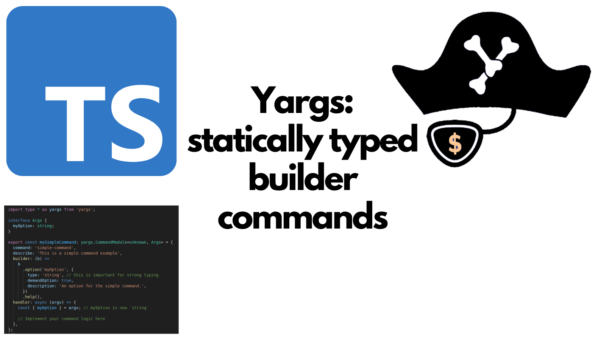

[Yargs](https://yargs.js.org/) is a popular library for building command line interfaces in Node.js. And the name is just fabulous. Yargs provides a way to define commands, options, and arguments in a structured way. However, Yargs has been around for a long time and it the documentation makes [little mention](https://github.com/yargs/yargs/blob/main/docs/typescript.md) of TypeScript support.



Whilst there is some documentation, if you're building more involved command line interfaces with Yargs in TypeScript, you may find that you need to do a bit of extra work to get strong typing working well with commands that have builders. In this post, I'll demonstrate how to use Yargs to create statically typed commands with builders in TypeScript.

Before we start, I should say that I'm working with Yargs version 18.0.0 in this post. The type definitions come from Definitely Typed and the version is 17.0.35. However, there is no significant difference in the types between Yargs 17 and 18 and so the difference is not an issue.

As an aside, it's possibly worth mentioning that these days it's possible to go without third party libraries entirely to parse command line arguments thanks to features like [`parseArgs`](https://nodejs.org/api/util.html#utilparseargsconfig) which have been part of Node.js since version 18. However, Yargs remains a popular choice and is still widely used. I have no plans to replace Yargs in my existing projects just yet.

<!--truncate-->

## Getting the builders in

Let's start with a simple example. Imagine we want to create a command line tool that has a number of commands. Each command has its own options, and we want to use builders to define those options. Here's how we might set that up with Yargs, first we have a main entry point:

```ts
import yargs from 'yargs';
import { hideBin } from 'yargs/helpers';

import { mySimpleCommand } from './commands/mySimpleCommand.js';

const _args = await yargs(hideBin(process.argv))
  .scriptName('my-cli')
  .option('verbose', { alias: 'v', type: 'boolean' })
  .demandCommand(1, 'Please specify a command')
  .command(mySimpleCommand)
  // Add more commands here as needed
  .help().argv;
```

As we can see, this imports a single command called `mySimpleCommand`. Let's look at how that command is defined:

```ts
import type * as yargs from 'yargs';

export const mySimpleCommand: yargs.CommandModule = {
  command: 'simple-command',
  describe: 'This is a simple command example',
  builder: (b) =>
    b
      .option('myOption', {
        type: 'string',
        demandOption: true,
        description: 'An option for the simple command.',
      })
      .help(),
  handler: async (argv) => {
    const { myOption } = argv; // myOption is `unknown` here

    // Implement your command logic here
  },
};
```

You can see we have a command called `simple-command` that has a single option called `myOption` in the `builder`. However, if we look at the `handler` function, we can see that `myOption` is of type `unknown`. This is because Yargs does not know the shape of the arguments that will be passed to the handler.

This is the problem we need to solve. Inside the handler, we want to have strongly typed access to the options defined in the builder.

## Statically typing command builders

To achieve strong typing, we can define an interface that describes the shape of the arguments for our command. We can then use this interface to type the `CommandModule`. Here's how we can modify the `mySimpleCommand` to achieve this:

```ts
import type * as yargs from 'yargs';

interface Args {
  myOption: string;
}

export const mySimpleCommand: yargs.CommandModule<unknown, Args> = {
  command: 'simple-command',
  describe: 'This is a simple command example',
  builder: (b) =>
    b
      .option('myOption', {
        type: 'string', // this is important for strong typing
        demandOption: true,
        description: 'An option for the simple command.',
      })
      .help(),
  handler: async (argv) => {
    const { myOption } = argv; // myOption is now `string`

    // Implement your command logic here
  },
};
```

There's three things to note here:

1. We've defined an `Args` interface that describes the shape of the arguments for the command.
2. We've updated the `CommandModule` type to use `Args` as the second type, which defines the return type of the builder.
3. In the `builder`, we've specified the type of `myOption` as `string`. This is crucial for strong typing to work correctly. Without this we will have compilation errors from TypeScript.

Now we have strongly typed access to `myOption` inside the handler. Yay!

## Sharing options among commands and builders

It's not unusual to have options that are shared among multiple commands. Imagine a common option that all commands need to use. How can we share that option definition among multiple commands while maintaining strong typing? We can achieve this by defining a shared interface for the common options and a function that adds those options to a builder. Here's how we can do that:

```ts
export interface SharedOptions {
  someSharedOption: string;
  // other shared options could go here
}

export function getSharedOptions<T>(y: yargs.Argv<T>) {
  return y.option('someSharedOption', {
    type: 'string',
    demandOption: true,
  });
  // other shared options could go here
}
```

Then, in our command files, we can import the interface and the function and use them like this:

```ts
import type * as yargs from 'yargs';
import { type SharedOptions, getSharedOptions } from './sharedOptions.js';

interface Args extends SharedOptions {
  myOption: string;
}

export const mySimpleCommand: yargs.CommandModule<unknown, Args> = {
  command: 'simple-command',
  describe: 'This is a simple command example',
  builder: (b) =>
    getSharedOptions(b)
      .option('myOption', {
        type: 'string',
        demandOption: true,
        description: 'An option for the simple command.',
      })
      .help(),
  handler: async (argv) => {
    const { myOption, someSharedOption } = argv;
    // Now you have strongly typed access to myOption and someSharedOption

    // Implement your command logic here
  },
};
```

By following this pattern, we can create strongly typed commands with builders in Yargs while also sharing common options among multiple commands.

It's a beautiful pattern that sparks joy in my soul. Happy coding!
