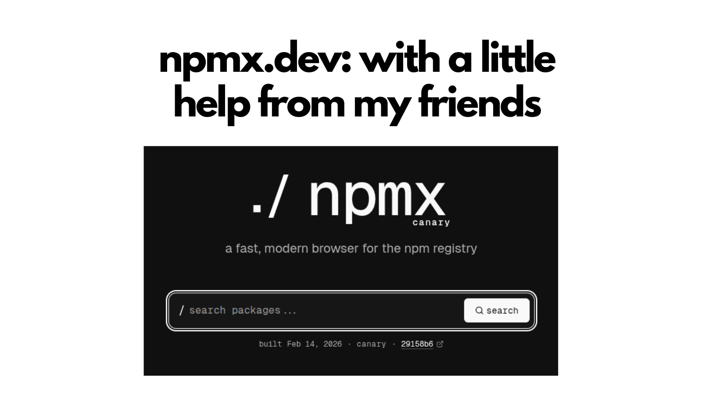
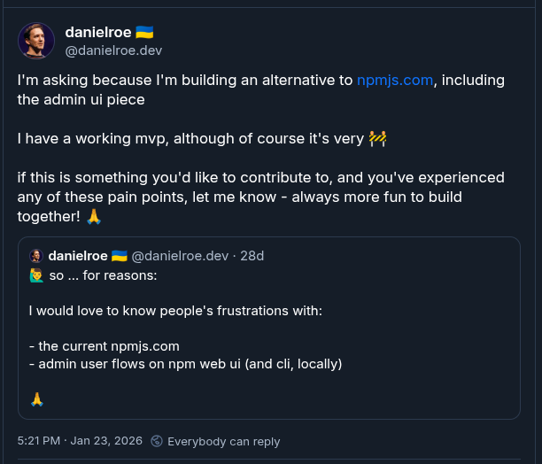
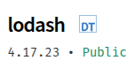
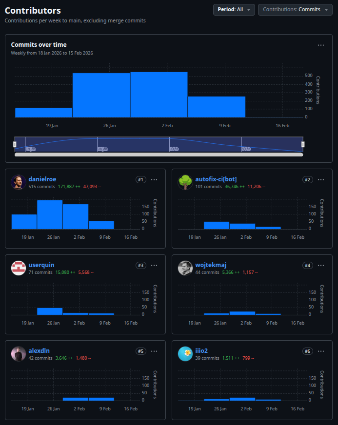
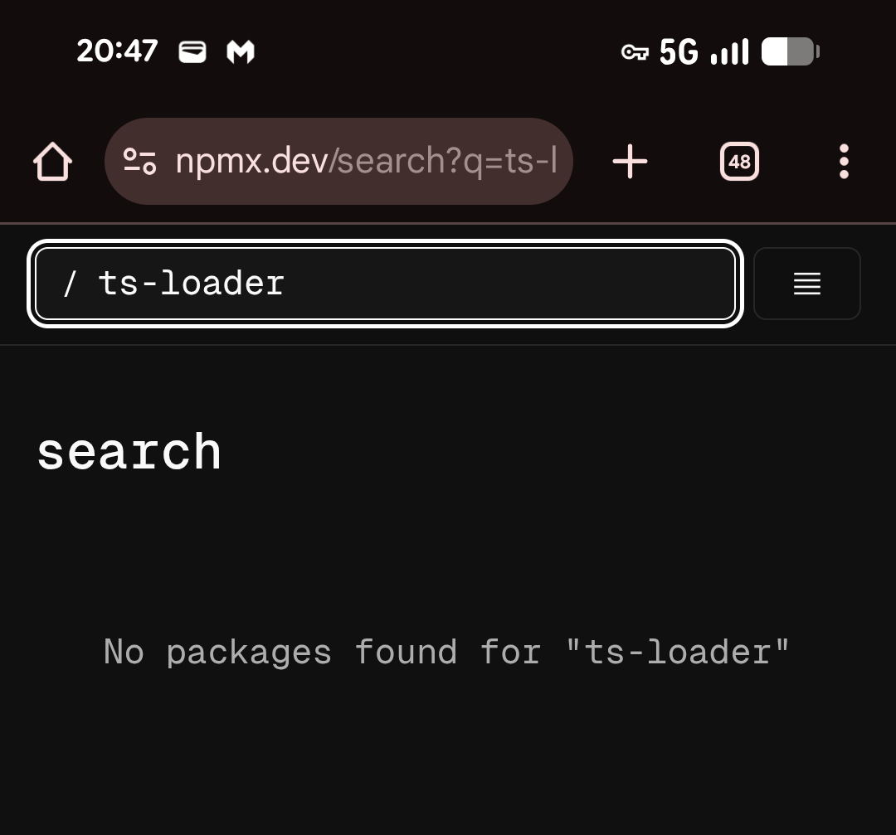
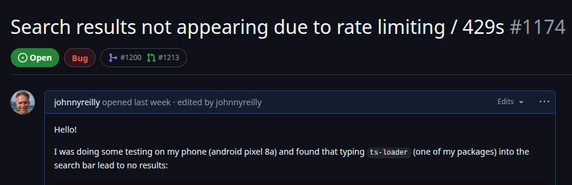
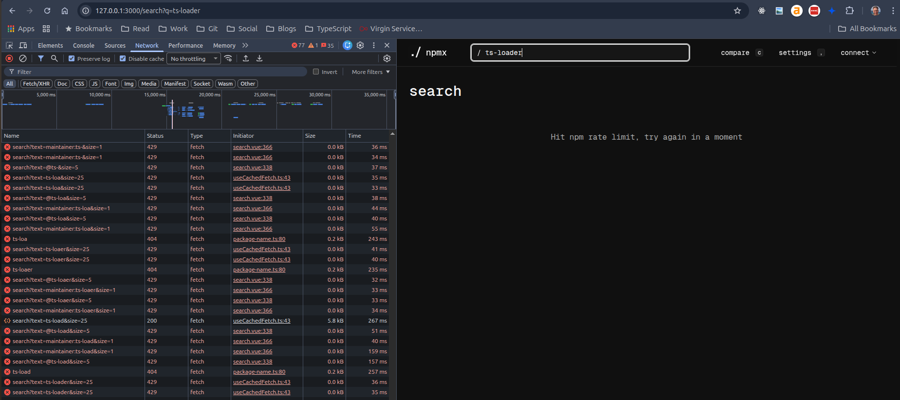

npmx.dev is an exciting new reimagining of the npmjs.com website. Did I mention it's new? It's new!

I do not write this post not as one of the most significant contributors to npmx.dev. I'm not; I barely rank. At the point of writing I've submitted two PRs, one of which was merged, and one was not (for reasons I entirely agree with).

I'm writing as I'm excited by npmx; I really want it to succeed. So I thought I'd share my own mini story of npmx. If you walk away from this post with one thought I hope it's this: "npmx is a welcoming community, doing good work and very open to contributions, however minor".

<!--truncate-->

## Genesis

I saw [Daniel Roe's post on Bluesky in January](https://bsky.app/profile/danielroe.dev/post/3md47mg7qjs22) and I thought "huh, that's interesting!":

I'd long felt that the npm website might generously be described as "adequate". It works, sure. But it does not spark joy. The last time I could remember a feature being added to the npm website was the addition of a "DT" badge to packages which had TypeScript type definitions available via Definitely Typed.

That was added a long time ago, and possibly by [Orta Therox](https://github.com/orta), during his time with the TypeScript compiler team if my memory serves me right. The point is, npmjs is in no way under active development.

Daniel's post seemed really punk rock. "I'll do it myself!"

## What happened Nuxt?

Little pun there 😅. Given Daniel is the lead maintainer of Nuxt, it entirely made sense he would use that for the npm rewrite.

I was interested, but I wasn't sure whether I'd make any contributions myself. Given my web background is mostly React. Also, life was and is quite full in other ways.

But before I knew what had happened, there was already this "npmx.dev" website in existence. It was new, shiny and impressive. Many people were [actively contributing to the codebase day by day](https://github.com/npmx-dev/npmx.dev/graphs/contributors):

I starred the repo in GitHub and allowed the flood of notifications to flow into my inbox. As a matter of course, I do this rarely. Generally there's too much noise to have notifications on. But I was interested in seeing if I might pick something up through the osmosis. Similarly I joined the (very active) Discord.

## A bug?

I'd expected my contributions to npmx to be limited to a bit of testing. So I thought I'd do some testing. I looked up a project I work on called `ts-loader` and was surprised to discover it was missing from npmx.

I found myself raising [an issue](https://github.com/npmx-dev/npmx.dev/issues/1174), puzzled at the absence:

It turned out that I was running into npm rate limiting API requests. So when I was typing in "ts-loader", behind the scenes API requests were firing at npmjs.com, and at a point the server decided to say "you've had enough!" and returning 429 Too Many Requests responses.

But the npmx.dev website didn't reflect that. It rather suggested that the package didn't exist. This niggled at me. And one fine Saturday morning I decided to see if I could have a go working on this.

## Contributing

The repo for npmx.dev has a very fine [`CONTRIBUTING.md`](https://github.com/npmx-dev/npmx.dev/blob/main/CONTRIBUTING.md). By following that I was quickly able to get a working version of the website on my machine.

I had two ideas of potential fixes. First idea: debounce the input box people type into.

As I've mentioned, I don't know Vue / Nuxt. I know TypeScript, but not the frameworks. So I fired up Claude Code, told it what I wanted to do and it wrote the code for idea 1. It didn't work. The implementation did; we had debounced successfully. But that was not sufficient to stop 429s from showing up.

So I reverted that. I blooming love Git.

Idea number two was more straightforward: when a 429 happens make the UI simply say "you've been rate limited - give it a moment".

For the second time I gave Claude Code his marching orders. (Sidebar: is Claude a "he"? Probably. Claude sounds like a gent 😅. Sorry.)

This time the approach worked. When I typed into the input box now, and 429s happened, I now saw something like this:

Beautiful right?

When I looked at the code produced, it seemed plausible. It seemed to reflect the idioms of the codebase as best I could tell. And crucially, it worked.

The [CONTRIBUTING.md specifically calls out using AI](https://github.com/npmx-dev/npmx.dev/blob/main/CONTRIBUTING.md#using-ai). Let me quote the guidance in full as I think it is excellent:

> ## Using AI
>
> You're welcome to use AI tools to help you contribute. But there are two important ground rules:
>
> ### 1. Never let an LLM speak for you
>
> When you write a comment, issue, or PR description, use your own words. Grammar and spelling don't matter &ndash; real connection does. AI-generated summaries tend to be long-winded, dense, and often inaccurate. Simplicity is an art. The goal is not to sound impressive, but to communicate clearly.
>
> ### 2. Never let an LLM think for you
>
> Feel free to use AI to write code, tests, or point you in the right direction. But always understand what it's written before contributing it. Take personal responsibility for your contributions. Don't say "ChatGPT says..." &ndash; tell us what _you_ think.
>
> For more context, see [Using AI in open source](https://roe.dev/blog/using-ai-in-open-source).

I made sure that my usage of AI for this change was above board. I looked at what code I'd ended up with and learned a bit about how Vue and Nuxt work. It was PR time: https://github.com/npmx-dev/npmx.dev/pull/1200

## You can contribute too!

Some PRs have a lot of back and forth. This one just landed. Which was nice!

Ironically, by the time you read this the original issue I raised, and the fix I provided, is I think generally no longer relevant. The npmx.dev website is now not just querying npmjs.com for package information, so the likelihood of running into npm rate limits is much lower. But that's the nature of development. You fix one thing, and then the world changes and that thing is no longer an issue. But that's fine.

I'm really happy npmx.dev exists and I've a good feeling about it. If you're thinking about something in npmx.dev that you might be able to improve, you should have a crack. It's a wonderful community; get involved!

LINK TO OFFICIAL LAUNCH POST HERE
