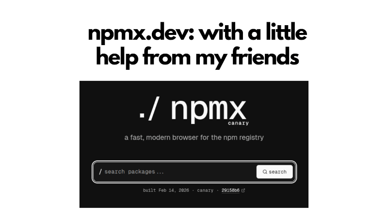

I've recently been experimenting with [Node.js subpath imports](https://nodejs.org/api/packages.html#subpath-imports). My motivate is a general dislike of relative imports. I don't like seeing `import { thing } from '../../file.js'` in my code, and when I can avoid them. By using subpath imports instead I might have `import { thing } from 'src/folder/file.js'` and that feels much cleaner to me.

But I also like consistency in my codebase, and I don't want to have a mix of import styles. So while using subpath imports can help me avoid relative imports, I also want to make sure that everyone on the team is using the same style. How? Here's how!



<!--truncate-->

## First a warning

Before I dive into the details, I want to be clear that this is a very opinionated setup. It's not necessarily the best approach for every team or project. I'm sharing it because it's what I'm trying out right now, but I fully expect that there are trade-offs and that it might not be the right choice for everyone. I'm not even sure if it's the right choice for me in the long run. So take this with a grain of salt and consider whether it makes sense for your own context.

## Node.js subpaths only

The first thing to do is to set up Node.js subpath imports in `package.json`:

```json
{
  "type": "module",
  "imports": {
    "#src/*": {
      "types": "./src/*",
      "default": "./lib/*"
    },
    "#test/*": {
      "types": "./test/*",
      "default": "./test/*"
    }
  }
}
```

The idea is straightforward:

- When developing / at type-check time, TypeScript maps imports from `#src/*` to `./src/*`.
- At runtime, Node resolves from `#src/*` to `./lib/*` (where our compiled output goes - yours could go somewhere else like `dist`).
- Test code maps imports from `#test/*` to `./test/*`.

The practical result is that I can write `import { thing } from '#src/features/thing.js';` everywhere and avoid relative import gymnastics.

At this point, I have subpaths working, but other import styles are still allowed. Time to end that and enforce that everyone uses the `#src/*` style for imports.

## Block alternatives with `no-restricted-imports`

We achieve this is two ways using ESLint's [`no-restricted-imports` rule](https://eslint.org/docs/latest/rules/no-restricted-imports). First, I make sure that no one can use relative imports or other path styles:

```js
rules: {
	"no-restricted-imports": [
		"error",
		{
			patterns: [
				{
					group: ["~/*", "@/*", "./*"],
					message: "Use #src/... subpath imports instead.",
				},
			],
		},
	],
}
```

This is intentionally strict. If someone reaches for `~/`, `@/`, or `./`, linting pushes them back to `#src/...`.

Is this heavy-handed? Yes. That's the point.

## Keep import groups predictable with `perfectionist/sort-imports`

I'm a big fan of consistent import grouping and sorting, and I achieve that with the [`perfectionist/sort-imports` rule](https://perfectionist.dev/rules/sort-imports). This rule allows me to define custom groups and enforce a specific order for imports.

Once everything uses subpaths, I also want imports grouped consistently:

```js
rules: {
	"perfectionist/sort-imports": [
		"error",
		{
			groups: [
				"type-import",
				["value-builtin", "value-external"],
				["type-subpath", "value-subpath"],
				["type-parent", "type-sibling", "type-index"],
				["value-parent", "value-sibling", "value-index"],
				"ts-equals-import",
				"unknown",
			],
		},
	],
}
```

The key bit is placing subpath imports after `value-external` imports. It makes `#src/*` style imports appear after imports from packages. So instead of this:

```js
import type { Logger } from "#src/shared/cli/logger.js";

import { DefaultAzureCredential } from "@azure/identity";
```

We have this:

```js
import { DefaultAzureCredential } from "@azure/identity";

import type { Logger } from "#src/shared/cli/logger.js";
```

As a side note, I have asked on the perfectionist repo about whether an approach like this could / should be supported by default, as opposed to being configurable. I don't know if it will be - but you [can follow along here](https://github.com/azat-io/eslint-plugin-perfectionist/issues/723).

## Does this work with TypeScript?

Yes! Support has been in place since TypeScript 5.4, thanks to [microsoft/TypeScript#55015](https://github.com/microsoft/TypeScript/pull/55015).

## Is this actually a good idea?

Possibly not.

This approach is highly opinionated, and maybe too rigid for many teams. I'm not fully convinced it's a universally good pattern. I'm trying it because the consistency is appealing, but I haven't come to a settled view yet. I'm writing this post in part to share the approach, but also to help me mull over the idea.

## Conclusion

If you want one import path to rule them all, Node.js subpaths plus ESLint enforcement can absolutely do it.

But this is a strong convention with sharp edges. I don't yet know whether it's a great long-term idea. It is definitely interesting to try out, and I like the consistency it brings. But whether it's the right choice for your team or project is something only you can decide.
