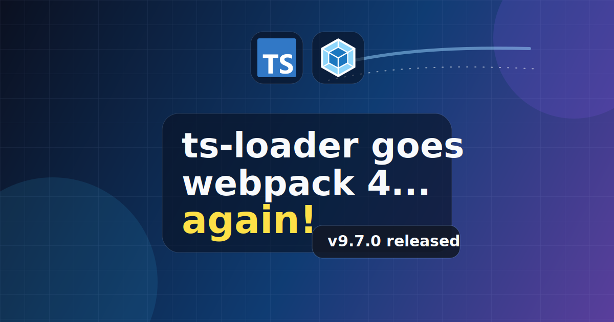
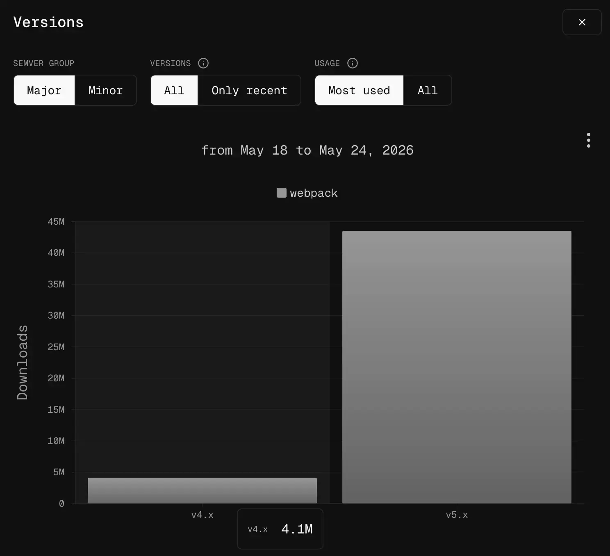

Back in 2021 I published a post called [`ts-loader` goes webpack 5](../2021-04-20-ts-loader-goes-webpack-5/index.md) which was a big exciting post about how `ts-loader` was upgraded to directly support webpack 5, and drop support for webpack 4 in v9 of `ts-loader`.

For reasons which I'll get into shortly, as of v9.7.0, `ts-loader` now supports both webpack 5 (as it did already) **and** webpack 4. So if you're a webpack 4 user, you can now use `ts-loader@9`, rather than using `ts-loader@8`.

<!--truncate-->

## Why support webpack 4 again?

It is 2026. `ts-loader@9` was released in 2021. I made the (bold) decision then to drop support for webpack 4 there and then. I would maintain [webpack 4 branch in `ts-loader`](https://github.com/TypeStrong/ts-loader/tree/webpack-4) so I could make any patches that might be necessary over time.

At the time this seemed reasonable; webpack had been evolving quickly. However, that was about to change. After webpack 5 shipping, it took people a very long time to make the migration across from 4 to 5. A very, very long time.

Take a look at this screenshot of webpack major version usage on [npmx](https://npmx.dev/package/webpack?activeTab=versions&modal=versions):

Whilst you might be thinking "wow - people really are using webpack 5!", what you should also be thinking is "wow - webpack 4 still has 4 million downloads a week!" As we can see, webpack 4 has not gone away, and is probably not going to any time soon.

Occasionally I've found myself patching `ts-loader@8` for the webpack 4 users ([often with community help](https://github.com/TypeStrong/ts-loader/pull/1446)). The TypeScript 6 release contained a change that lead me to [patching `ts-loader@9`](https://github.com/TypeStrong/ts-loader/issues/1678). The TypeScript 6 patch shipped as part of [`ts-loader@9.5.7`](https://github.com/TypeStrong/ts-loader/releases/tag/v9.5.7). Sure enough though, there are also webpack 4 users out there who would like to use TypeScript 6. A PR was raised against ts-loader to backport the patch to `ts-loader@8`: https://github.com/TypeStrong/ts-loader/pull/1695

Since I last patched `ts-loader@8`, we've migrated to [npm Trusted Publishing](https://docs.npmjs.com/trusted-publishers). It's a little fiddly, but `ts-loader@9` is on that train. We could port that to `ts-loader@8` as well, but I found myself wondering this: why not just support webpack 4 on `ts-loader@9` instead?

## Let the experiment begin!

So I decided to experiment adding webpack 4 support back. I didn't want to do do it by hand, so I threw GitHub Copilot at the problem:

I was pretty sure that this could be achieved without masses of code changes and without impacting performance. If that wasn't the case, I wouldn't bother.

Copilot zigged and zagged a bit, but it did build a version of `ts-loader` that supported both webpack 4 and 5, and the changes required were not extensive. It did make a few odd choices which I amended. But all in all, a solid job.

The changes required generally came down to:

- different APIs in webpack 4 as compared to webpack 5
- options in webpack 4 require usage of a dedicated library called `loader-utils`. This is a dependency of webpack 4, and so we've added it to the `peerDependencies` of `ts-loader` and marked it as optional (since it won't be used for webpack 5)
- the execution test pack in `ts-loader` now supports both webpack 4 and webpack 5. We're not going to bother with the comparison test pack for now.

I also upgraded ESLint whilst I was there, and that lead to some general tidy ups. You can see the PR where this all happened here: https://github.com/TypeStrong/ts-loader/pull/1697

## `ts-loader@9.7.0` supports webpack 4

After mulling for a little while, I decided to ship. So if you're using webpack 4, you should now be able to use `ts-loader@9`.

For me, this hopefully means an end to supporting webpack 4 via the dedicated branch, so my hope is this makes my life easier. I'm not quite sure what will happen to `ts-loader` when TypeScript 7 lands, but if there's work to do on `ts-loader` my hope is it only needs to be done in one place.

Let me take this moment to confirm that `ts-loader` is unlikely to get support back for webpacks 3, 2 or 1 as well; there are limits! 😅
