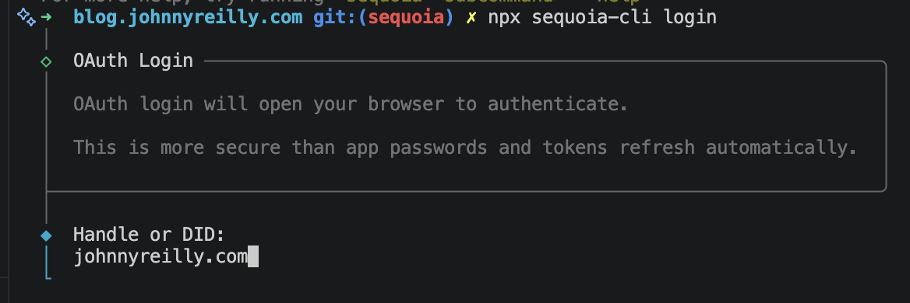
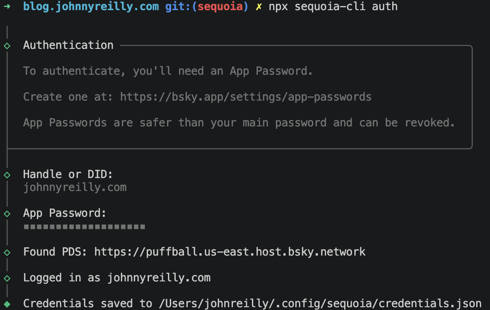
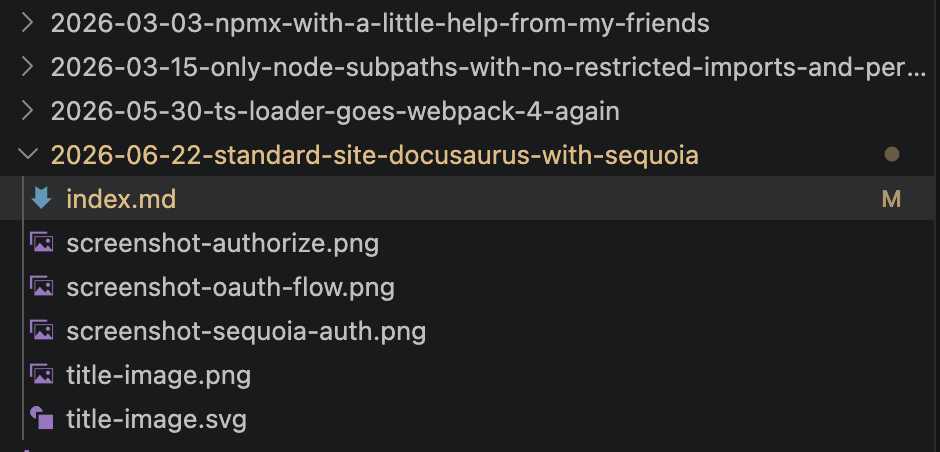

I've kept hearing talk of [Standard.site](https://standard.site/) recently. But every time I heard about it, I didn't get it. I then read this [primer on it](https://lab.leaflet.pub/3moomxyjssk2p), and if I'm totally honest, I still didn't entirely get it. I'm feeling a bit thick. But that's okay.

I _think_ that it's sort of like RSS + AtProto. Ish. Well. I have a blog - you're reading it! It has an RSS feed. I'm on [Bluesky](https://bsky.app/profile/johnnyreilly.com) - mostly (if I'm honest) for the purposes of posting picture of Hammerton's Ferry terminal each morning at dawn.

Well, since I have these two things, let's see if I can plug Standard.site support in using [Sequoia](https://sequoia.pub/). I may even learn, along the way what I'm actually doing! (And I may not, and that's okay too.)


<!--truncate-->

## Sequoia?

[Sequoia](https://sequoia.pub/) is a CLI tool that describes itself as "a simple CLI for creating standard.site documents from your existing static blog." My blog runs on [Docusaurus](https://docusaurus.io/) - which is a Markdown / React flavoured static site generator.

So I think I should be able to plug Sequoia into my blog fairly easily. Probably. I'm going to have a crack anyways.

## Setting up Sequoia

First things first, the [quickstart](https://sequoia.pub/quickstart) tells me to install the Sequoia CLI as a global tool. Already I can feel myself rebelling against this. For reasons that I can't fully explain, I hate installing global tools. Probably they remind me of global variables. Hard to say.

Well, I decide to fight back and roll with this instead:

```
npx sequoia-cli
```

And it's fine. So let's `login`:

```
npx sequoia-cli login
```



Well that went great. This is the alternative option using [app passwords](https://bsky.app/settings/app-passwords):

```
npx sequoia-cli auth
```



I'm pretty sure that I'm going to want this flow, as I want my CI to handle publishing for me, I don't want to do it by hand. I wonder if I'm right...

Time to initialise:

```
npx sequoia-cli init
```

I had to answer a number of questions, which eventually created this `sequoia.json` file:

```json
{
  "$schema": "https://tangled.org/stevedylan.dev/sequoia/raw/main/sequoia.schema.json",
  "siteUrl": "https://johnnyreilly.com",
  "contentDir": "./blog",
  "publicDir": "./static",
  "outputDir": "./dist",
  "publicationUri": "at://did:plc:yy3apqjlms24kso7ahn7lbmb/site.standard.publication/3mova7c4nho2b",
  "pdsUrl": "https://puffball.us-east.host.bsky.network",
  "frontmatter": {
    "coverImage": "image"
  },
  "publishContent": true,
  "bluesky": {
    "enabled": true
  }
}
```

With that, I decided to see what publishing might look like:

```
npx sequoia-cli publish --dry-run
```

It suggested the following:

> Tip: Add "identity": "johnnyreilly.com" to sequoia.json to use this by default.

I followed this advice. Terrifyingly, it also suggested it was going to publish every post I had ever written. Given these is hundreds of posts going back to 2012, this seemed a bit much.

## Docusaurus meet Sequoia

At this point I think we have the basics of Sequoia publishing set up, we now need to make Docusaurus play nice with it. Or try.

So why is it trying to publish everything? My money is on Sequoia not being able to detect when my blogs are published. The [config docs](https://sequoia.pub/config) suggest I need a `frontmatter.publishDate`:

> Field name for publish date (checks "publishDate", "pubDate", "date", "createdAt", and "created_at" by default)

Now if you look at the frontmatter for my blog posts, you'll see there is no field that matches up with the above.

```md
---
slug: standard-site-docusaurus-with-sequoia
title: 'Standard.site Docusaurus with Sequoia'
authors: johnnyreilly
tags: [docusaurus]
image: ./title-image.png
hide_table_of_contents: false
description: 'How to add Standard.site support to a Docusaurus site with Sequoia'
---
```

You can see that the date exists, but it's simply being inferred from the folder name:



This is one of the [many patterns that Docusaurus supports](screenshot-file-system.png). But it happily supports providing `date` as a frontmatter item as well. So I think that's what I'll do. I'll just make every

```md
---
title: Docusaurus 3.9
authors: [slorber]
tags: [release]
image: ./img/social-card.png
date: 2025-09-25
---
```

created_at
