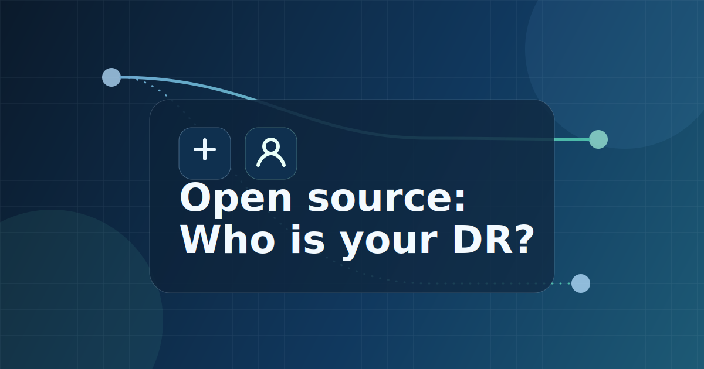

It's been a rough year. In March I was diagnosed with a serious illness. [I've written about my diagnosis on my personal blog](https://johnnyreilly.github.io/reillys-on-tour/rough-road-ahead/) and I won't repeat what I said there here. But the TL;DR is this: I was told that without treatment things looked bleak. Happily, there was a follow up sentence; there is treatment and I am now having it. Whilst nothing is guaranteed, the doctors have used phrases like "cautious optimism". Time will tell what happens, but I am hopeful that I will be around for a while yet.

However, this has made me think about the future of the open source projects I maintain. If I cannot maintain them anymore, what happens? That's what the title of this blog post means; what, or who, is the DR (that's Disaster Recovery not Daniel Rosenwasser) for my open source projects? Maybe there's a better term than "Disaster Recovery". Having worked on various systems over the years, I've often been involved in disaster recovery planning for them. It always comes down to answering this question: what takes over when everything goes wrong?

<!--truncate-->

## What projects actually need a DR plan?

Over the years I've maintained a number of open source projects. Some of them are used by a lot of people, some of them are used by very few. So I got to thinking, of the ones I work on now, which ones would be a problem if I could no longer maintain them?

I've long worked on Definitely Typed. However, whilst there was a point when it really mattered if I was involved, that has not been the case for a very long time. [The TypeScript team have done incredible work on the project](../2019-10-08-definitely-typed-the-movie/index.md) and it no longer really matters if I am involved or not. So I don't need to worry about that one.

For a while I was the primary maintainer of the [`fork-ts-checker-webpack-plugin`](https://github.com/TypeStrong/fork-ts-checker-webpack-plugin). But again, this has been looked after by [Piotr Oleś](https://github.com/piotr-oles) for quite a while now. So I don't need to worry about that one either.

The project that I am currently most involved in that actually does need someone to own it if I can't is [`ts-loader`](https://github.com/TypeStrong/ts-loader). I've been looking after it [for about ten years now](../2016-11-01-but-you-cant-die-i-love-you-ts-loader/index.md). To my increasing amazement, it is still actively used, and (I assume) thanks to AI, it is becoming more used and not less. 50 million downloads a month is a lot of people relying on it. So I need to make sure that if I cannot maintain it anymore, someone else can.

## Introducing Ashley Claymore

I've known [Ashley](https://github.com/acutmore) for years now. He lives near me in London and we regularly go for walks around the River Thames together. Perhaps more relevantly, he is a very talented engineer, a member of TC39, a Bloomberg employee and an open source maintainer. For instance, he works on Bloomberg's [`ts-blank-space`](https://github.com/bloomberg/ts-blank-space).

He's a friend and I trust him. So I asked him if he would be willing to do whatever is necessary for `ts-loader` if I cannot. This is not me signing him up to toil down the open source mines for life. No. Rather, I have given him the relevant access to the `ts-loader` assets, and I trust him to make choices on its behalf if I cannot.

Happily, he said yes. So now I can sleep a little easier at night knowing that if I cannot maintain `ts-loader` anymore, Ashley will be able to do whatever he deems appropriate. He'll know what that is, should the day come. He rocks.

## Signing off (but I hope not for a while)

I've no more to say than that. We should all be thinking about who will look after our open source projects if we cannot. I hope that you have someone you can trust to do that for you. If not, perhaps now is the time to find someone.

I very much hope that I will be around for a while yet, but if I am not, I know that `ts-loader` will be in good hands. Thank you Ashley!
