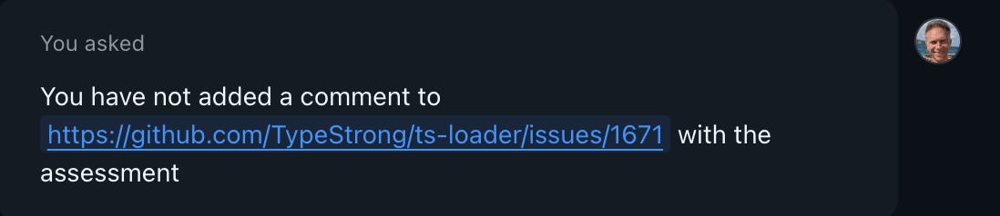
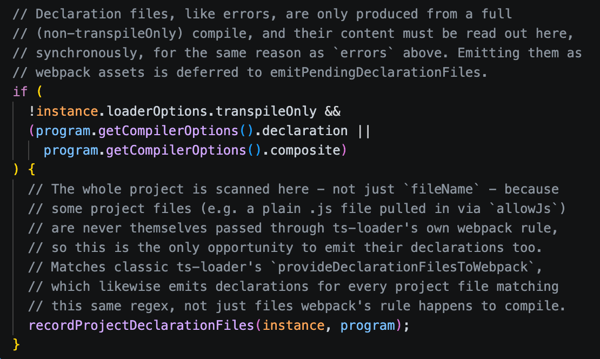

TypeScript is now the [most popular programming language](https://github.blog/news-insights/octoverse/octoverse-a-new-developer-joins-github-every-second-as-ai-leads-typescript-to-1/). Incredible. I was an early adopter back in 2012 and have since worked on a number of open source projects in the TypeScript ecosystem.

One of them is [`ts-loader`](https://github.com/TypeStrong/ts-loader), which integrates TypeScript the language with webpack; which is used to build web applications. You might be surprised to know ts-loader has 54 million downloads a month. I know I am. I'll be honest - I'm using Vite far more than I use webpack these days, but there are still a lot of people using webpack and `ts-loader`. And I intend to continue to support them.

Just lately, TypeScript was ported from being written in TypeScript to being written in Go. The reason being for performance - make TypeScript tooling 10x faster. [TypeScript 7](https://devblogs.microsoft.com/typescript/announcing-typescript-7-0/) is written in Go.

This has implications for `ts-loader` as it is built on APIs the TypeScript library exposed. But those APIs were not ported to TypeScript 7. New ones are being written, recently I heard that [the first APIs had landed in the nightly version of TypeScript](https://github.com/microsoft/typescript-go/pull/4699).

## Porting with AI

I would like `ts-loader` to be able to support TypeScript 7.1 when it comes. This will be the first Go built version of TypeScript which ships with an API. But I'm quite lazy and I have / had very little interest in doing the migration manually.

Instead I intended to use my GitHub Copilot and Claude licenses. What follows is a diary of the port. The things I did, what was useful / wasn't, the principles followed etc.

In fact, let's start there: principles. These are my principles, and if you don't like them... well, I have others: (sorry - couldn't help myself)

1. I wanted AI to do most of the work
2. I reserved the right to not port all features The codebase of `ts-loader` is more than 10 years old, and I was pretty sure we didn't need everything that we'd accreted over the years.
3. I still intended to support webpack 4 and 5 unless there was a compelling reason not to.
4. The minimum supported Node version for `ts-loader` right now is 12. That has long been end-of-life and so it feels appropriate to bump the minimum supported version of Node to something higher; probably 22.

## The initial port

I thought I'd start off by firing [this prompt at GitHub Copilot](https://github.com/TypeStrong/ts-loader/tasks/159bdfb2-8b93-4986-98ec-77e6476f05c9?q=is%3Aclosed+author%3A%40me) to get it to do some analysis and put that on [an existing issue that discussed TypeScript 7](https://github.com/TypeStrong/ts-loader/issues/1671#issuecomment-4937039062):

It did some decent analysis and claimed it had added that to the issue. It had not:

It told me it had added the comment again, and it had not. So I challenged it once more.

And then it happened again, so I tried sarcasm.

At this point I realised I was getting distracted.

The analysis was decent and so I asked it to PR it, [which it did](https://github.com/TypeStrong/ts-loader/pull/1703). One thing I have generally learned about AI is that it loves backwards compatibility. And this PR was that shaped; it was looking to support both the old and new APIs. This seemed complicated. After some fiddling and thinking, I figured I'd rather just support the new API and drop support for the old one.

## Dropping support for the old API

So [I asked it to go again](https://github.com/TypeStrong/ts-loader/tasks/c976c829-4a93-4e31-93f3-f82b97c38c0e?author=johnnyreilly), but this time to drop support for the old API:

![Screenshot of second prompt which reads "https://github.com/TypeStrong/ts-loader/pull/1703 is a good first attempt at implementing the new tsgo API support but is too complicated because it maintains existing support as well. Please try implementing new API support alone instead. Drop existing support. We would like execution-tests to pass - comparison-tests need not pass initially. Use npm:typescript@7.1.0-dev.20260725.1 or newer for implementing. See https://github.com/microsoft/typescript-go/pull/4699 for additional context."](./screenshot-second-prompt.webp)

The PR it came up with was decent: https://github.com/TypeStrong/ts-loader/pull/1704 - this became the basis for the port.

A little bit of context; `ts-loader` has two test packs. The comparison test pack are tests that compare the output of `ts-loader` with known outputs; they're effectively [snapshot tests](https://jestjs.io/docs/snapshot-testing). The execution test pack are tests that run the output of `ts-loader` and check that it behaves as expected. The execution tests are more reliable than the comparison tests and can be run against multiple versions of webpack and TypeScript. The comparison tests are only run against a single version of webpack / TypeScript, and are somewhat brittle. But they're useful for checking error states.

With minimal assistance from me, it got the execution tests passing. This was an awesome start.

## Getting the comparison tests passing

At this point I had a version of `ts-loader` that supported TypeScript 7.1. But the comparison tests were failing. It was also at this point that my GitHub Copilot tokens ran out; so I switched to using Claude.

From here on out my workflow became pretty simple. I would point Claude at a failing comparison test, and ask it to fix it:

> please fix `yarn comparison-tests --single-test basic`

A lesson I learned early on, was to start with the simpler tests and work up to the more complex ones. I'd initially not used that approach and found that Claude was "fixing" the more complex tests in a way that broke other ones. So I started with the simpler tests and worked my way up.

As I was doing this I also decided to drop some functionality that had existing in `ts-loader` for a while. For instance, [Happypack](https://github.com/amireh/happypack) is archived and no longer maintained. So I decided to drop support for it in `ts-loader`.

## Giving Claude a Windows avatar in GitHub Actions

In a couple of days of fiddling in my spare time, we got to the point of fully passing execution tests and comparison tests. However, they were only passing on Linux and Mac. The Windows tests were failing. I do have access to Windows machines, but my boys have hijacked them for gaming. So I pondered if Claude could somehow make use of Windows machines running in GitHub Actions.

The answer was yes. If it had access to the GitHub CLI and we created a GitHub Actions workflow that ran on Windows, it could use the CLI to run commands on the Windows runner. So we created a workflow that ran on Windows: https://github.com/TypeStrong/ts-loader/pull/1705

With that in place, Claude was able to run the comparison tests on Windows and fix the issues. It was a bit of a slow process, but it worked. After some time, we got to the point where all tests were passing on all platforms. This made me very happy!

Also, the boys were pleased as I didn't have to use their machines for testing. I say "their machines" - technically these are my laptops that they borrowed and never gave back. But I digress.

## What is still to come?

Around this time I got excited and posted on Bluesky about the progress. Andrew Branch, one of the TypeScript team members that has worked on the API, [replied to my post](https://bsky.app/profile/andrewbran.ch/post/3mrmtyco7cs2k):

This was a good reminder that what we had done was not the end of the story. If you're a `ts-loader` user then you might be familiar with the `transpileOnly` option. This allows you to transpile TypeScript code without type checking. The port as it stands does not properly support this option as the APIs aren't yet there. When they land, we'll look again.

There's also other features that are not yet supported. For instance, custom transformers and project references. If / when APIs appear for these, we'll look to support them in `ts-loader`.

## How good is the code?

It's not too bad. I've deliberately not looked too hard at it as yet. It made a few peculiar choices that I have addressed, but overall it is pretty good. I'm planning to have a proper look at it further down the line.

One surprising thing is that it has added a lot of comments to the code.

I don't like it. However, for now I'm leaving the comments in place, on the assumption that it helps Claude understand the code better. I will remove them before we merge.

## When do we ship?

Well, not before the API has been released, which is likely to be later this year. But when it is, we will ship a new version of `ts-loader` that supports TypeScript 7.1. It's probably going to be v10 of `ts-loader`, so we can drop support for the old TypeScript API, Node 12, Happypack etc.

For now, if you want to try out the port, the pull request is up and can be found here: https://github.com/TypeStrong/ts-loader/pull/1704
