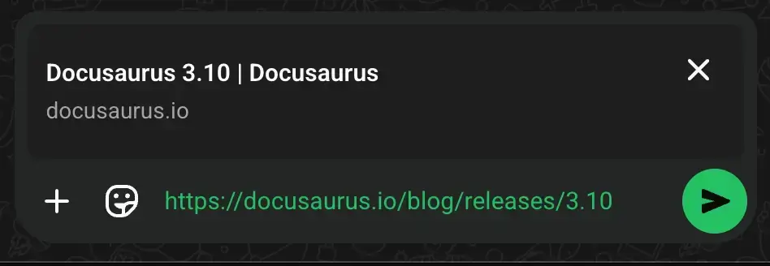
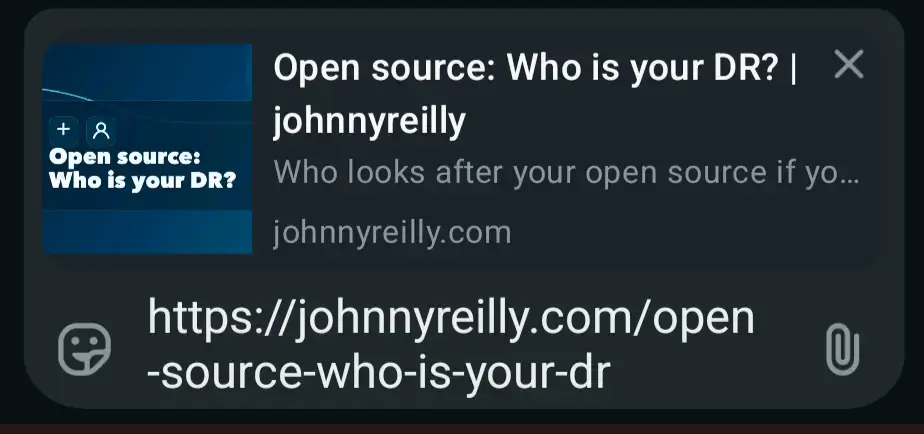
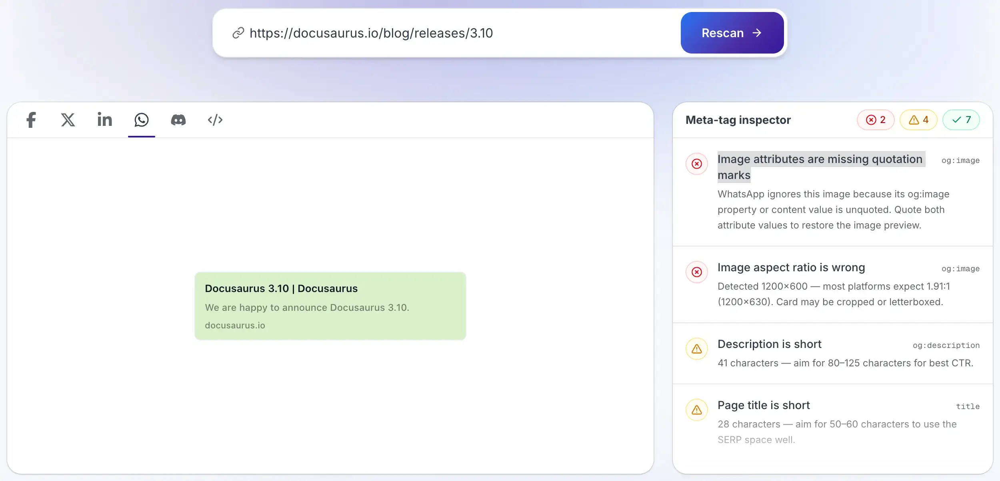

I'd recently started to notice that when I shared links to my Docusaurus blog on WhatsApp, the preview image was missing. I assumed it was a problem with my `og:image` tag, but it turns out it's a bug in WhatsApp's Open Graph handling caused by Docusaurus's newer, faster build pipeline, that minifies the HTML and strips the quotes from the `og:image` attribute. This post explains the problem and how to work around it.


<!-- truncate -->

## The problem

Docusaurus's [`Faster`](https://docusaurus.io/blog/releases/3.6#docusaurus-faster) build mode (on by default via `future.v4: true`) swaps in an [SWC-based HTML minifier](https://swc.rs/docs/configuration/minification). That minifier is aggressive: it strips the quotes from HTML attributes wherever it can.

So a meta tag that starts like this:

```html
<meta
  data-rh="true"
  property="og:image"
  content="https://docusaurus.io/assets/images/social-card-77e4a0d9b978e519751c324db47003e5.png"
/>
```

...gets minified to this:

```html
<meta data-rh=true property=og:image content=https://docusaurus.io/assets/images/social-card-77e4a0d9b978e519751c324db47003e5.png/>
```

That's still valid HTML - unquoted attribute values are permitted by the spec, and most Open Graph consumers cope fine with it. WhatsApp does not. Its link-preview parser chokes on the unquoted `og:image` and simply renders the preview without an image:



I ran into this on my own site which uses `faster`. I turn out to be slightly overzealous with my care for open graph support; I'm not really sure why. But I do know that I want my blog posts to have a preview image when shared on WhatsApp, so I needed a workaround.

## The workaround

The SWC minifier is used when `future.v4` is enabled. There's a [config flag called `swcHtmlMinimizer`](https://docusaurus.io/docs/api/docusaurus-config) to opt back into the old `html-minifier-terser` minifier instead, which never strips attribute quotes:

```diff title="docusaurus.config.js"
  future: {
    v4: true, // Improve compatibility with the upcoming Docusaurus v4
+    faster: {
+      // `v4: true` turns this on by default (via fasterByDefault), but the
+      // SWC HTML minifier strips quotes from attributes like og:image,
+      // which breaks strict/RDFa parsers. The html-minifier-terser
+      // fallback (used when this is false) never strips attribute quotes.
+      swcHtmlMinimizer: false,
+    },
  },
```

I applied this exact change to my blog in [this commit](https://github.com/johnnyreilly/blog.johnnyreilly.com/commit/dc0411b79e2091bc2be45dff5b8c8d5447135de6). Rebuild and deploy, and the quotes come back:

```html
<meta data-rh="true" property="og:image" content="..." />
```

...and with them, WhatsApp link previews now show the image as expected:



A little side note here; WhatsApp caches link previews for a while, so if you share a link that was previously shared without an image, you may still see the broken preview. I restarted my phone to flush the cache - there may be better ways.

The trade-off from using this approach: you lose a little of the build-time speed that `swcHtmlMinimizer` buys you. I'd rather have my Open Graph images working than not, so this is a trade-off I'm happy to make.

## OpenGraph.xyz emulator

I've long been a user of [OpenGraph.xyz](https://www.opengraph.xyz/) to check my Open Graph tags. It has a nice emulator that shows you what the link preview will look like on various platforms, including WhatsApp. Emulators are not always correct, and it turned out that OpenGraph.xyz was not showing the missing image problem, so I reported that to them too.

I didn't hear back from them, but it seems they are now emulating WhatsApp's behavior correctly, as you can see in the screenshot below:



It even explicitly explains that the image is missing because the `og:image` attribute is unquoted. Nice touch.

## Where things stand upstream

I [raised this as an issue](https://github.com/facebook/docusaurus/issues/12368) on the Docusaurus repo. There's already been some discussion. I don't know if it will go anywhere.

I've reported it to WhatsApp too, as I'd rather that they fixed the bug than needing consumers to work around it. I don't know if they are likely to act on my feedback - I'm not really expecting them to. Come on WhatsApp, be more like OpenGraph.xyz on the responding-to-feedback front!

For now, if your Docusaurus site's social previews are broken on WhatsApp (or possibly elsewhere in the Meta ecosystem), setting `swcHtmlMinimizer: false` is a quick, safe way to get your `og:image` working again.
