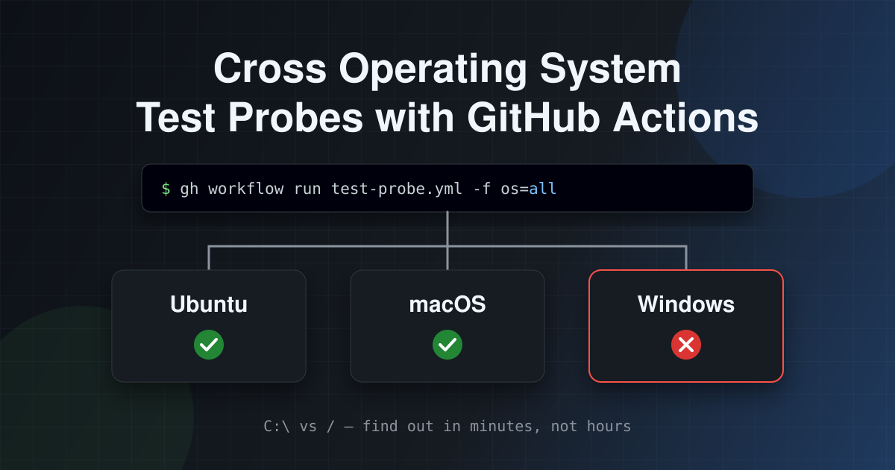

"It works on my machine" is an old joke. "It works on my Mac but fails on Windows CI" is a less funny version of the same joke, and one I've been living with while [porting `ts-loader` to TypeScript 7](../2026-07-31-ts-loader-go/index.md). It gets less funny again when an AI agent is doing the porting, and the only way it can find out what went wrong on Windows is for me to copy and paste CI logs into the chat.

This post is about a small GitHub Actions workflow that removed me from that loop: a "test probe" that runs a targeted subset of tests, on demand, on Ubuntu, macOS and / or Windows, and which an agent can trigger and read for itself.



<!--truncate-->

## A tale of lockdown and operating systems

First, a little story. You remember lockdown? I remember lockdown. For most of my working life, I'd been dev-ing on Windows machines. I was aware there were other operating systems out there, but I'd just never quite got round to doing much with them. But I meant to. To that end, a friend had helped me repave an old Dell XPS from Windows to Ubuntu.

On Monday 23rd March 2020 I was leaving the office. Whilst we didn't actually know for sure then, there were rumours of some kind of lockdown coming. Nothing had been announced, but it was in the air. On a whim, as I left, I decided to take home my Ubuntu laptop, which had been sitting unused in my locker. That night we went into lockdown.

To entertain myself during lockdown I decided I wouldn't allow myself to use my Windows laptop at home, only the Ubuntu one. That'll pass the time until we can emerge from our homes again. Brilliant idea! And I found I liked Ubuntu. It's really nice. Thus I stopped using Windows for development. Since that time, I've only really used Ubuntu and Macs to write code. Right now I'm using a MacBook Air M2.

Why am I telling you this? Well, one of the projects I work on is [`ts-loader`](https://github.com/TypeStrong/ts-loader), which is a webpack loader for TypeScript. I've looked after it for [many moons](../2016-11-01-but-you-cant-die-i-love-you-ts-loader/index.md) and it has long worked on Mac, Windows and Linux.

Now, the codebase for `ts-loader` hadn't changed much in years, but it's now changing massively, in order to support the TypeScript 7.1+ APIs that are under development. (Work in progress is [happening here](https://github.com/TypeStrong/ts-loader/pull/1704).)

The near enough complete rewrite of `ts-loader` has been powered by AI (mostly Claude) and has been underpinned by the existing integration test packs that `ts-loader` has had in place for years. By and large, the test packs aren't actually changing much and they are providing validation that the new codebase works.

Now we come to the "but", and the reason for the story. The "but" was that tests started breaking on Windows. Locally on my Mac they were fine. According to GitHub Actions they were fine on Linux as well. But on Windows the tests were failing.

Two pieces of information that are relevant here:

1. I had no interest in getting a Windows machine set up to debug this.
2. My sons had both half-inched the Windows laptops that I owned and repurposed them for gaming. So it wasn't like it would have been straightforward anyway.

So what to do? So far, so anecdotal. Let us now transition into a more typical blog post, wherein we shall discuss problems and solutions.

## The problem: Windows-only failures

`ts-loader` has a suite of "comparison tests". Each one is a mini webpack project; the test harness compiles it and diffs the output against snapshot files. They run on Ubuntu, macOS and Windows in CI.

During the TypeScript 7 port, we kept hitting comparison test failures that only happened on Windows. They all had the same root cause. The new TypeScript API (`typescript/unstable/sync`) returns forward-slash-normalised paths on every operating system - that's a long-standing TypeScript compiler convention. Node's `path.resolve` / `path.join` / `path.normalize`, on the other hand, return OS-native paths; which on Windows means backslashes.

So any code that built a path with Node's `path` module and then compared it against something the TypeScript API returned - say, a `Set` keyed by `program.getSourceFileNames()` - silently stopped matching on Windows. And it went the other way too: webpack's `addDependency` rejects absolute paths that aren't OS-native, so handing it a TypeScript-API-flavoured path also broke on Windows only.

None of this shows up on a Mac. The agent (I was mostly using Claude Code) would make a change, run the tests locally, see green, and push. Then Windows CI would go red. Then I would open the run, find the failing job, copy the relevant section of the log, and paste it back into the session. Then we'd go round again.

There were two problems with this:

1. **I was the bottleneck.** The agent was blocked on me relaying CI output. If I wandered off, everything stopped.
2. **The feedback loop was slow.** The full CI run for `ts-loader` covers comparison tests and a matrix of execution tests across Node, TypeScript and webpack versions. Waiting for all of that to find out whether one Windows comparison test passed is a waste of time and of runner minutes.

What I wanted was something the agent could run itself, that would only run the tests it cared about, on the operating system it cared about, and come back fast.

## Version one: a Windows test probe

The first iteration was Windows only, since that was where the pain was. It's a `workflow_dispatch` workflow - it never runs on push or pull request, so it adds no cost or noise to normal CI - which takes two optional inputs: a single test name, or a regex to match several tests.

```yaml
name: Windows test probe

on:
  workflow_dispatch:
    inputs:
      single_test:
        description: 'Run only this comparison test (matches the test directory name, e.g. "dependencyErrors")'
        required: false
        type: string
      match_test:
        description: 'Run only comparison tests whose name matches this regex (ignored if single_test is set)'
        required: false
        type: string

jobs:
  probe:
    name: Windows comparison test probe
    runs-on: windows-latest
    timeout-minutes: 25
    steps:
      - uses: actions/checkout@v6

      - name: copy files
        shell: pwsh
        run: |
          New-Item C:\source\ts-loader -ItemType Directory
          Copy-Item .\* C:\source\ts-loader -Recurse -Force

      - name: install
        run: yarn install
        working-directory: C:\source\ts-loader

      - name: build
        run: yarn build
        working-directory: C:\source\ts-loader

      - name: test
        shell: pwsh
        working-directory: C:\source\ts-loader
        env:
          SINGLE_TEST: ${{ inputs.single_test }}
          MATCH_TEST: ${{ inputs.match_test }}
        run: |
          if ($env:SINGLE_TEST -ne "") {
            yarn comparison-tests --single-test "$env:SINGLE_TEST"
          } elseif ($env:MATCH_TEST -ne "") {
            yarn comparison-tests --match-test "$env:MATCH_TEST"
          } else {
            yarn comparison-tests
          }
```

A couple of things are worth calling out:

- **The "copy files" step.** The comparison tests normalise paths in their output so that snapshots are stable across machines. On Windows that normalisation expects the repo to live at `C:\source\ts-loader`, so we copy the checkout there and run everything from that directory. Your project almost certainly won't need this, but you may well have some equivalent quirk.
- **Inputs are passed through `env`, not interpolated into the script.** Writing `${{ inputs.match_test }}` directly inside `run:` means GitHub substitutes the value into the script text before the shell sees it. A regex like `^(testA|testB)$` is full of characters a shell has opinions about, and an input is user-controlled text, so [script injection](https://docs.github.com/en/actions/security-for-github-actions/security-guides/security-hardening-for-github-actions#understanding-the-risk-of-script-injections) is a real concern. Going via an environment variable sidesteps both issues.

This was added in [ts-loader#1705](https://github.com/TypeStrong/ts-loader/pull/1705), and it immediately helped. The agent could fix a Windows bug, trigger the probe for just the affected tests, and see the result for itself in a couple of minutes.

## Version two: all three operating systems

Once the Windows-only problems were under control, it became obvious that the same idea was useful everywhere. Sometimes you want to iterate on a single failing test on Ubuntu without kicking off the whole matrix. Or on macOS, which was joining the comparison test runs as a third target.

At around the same time, the CI setup was being restructured in [ts-loader#1710](https://github.com/TypeStrong/ts-loader/pull/1710): the single monolithic `push.yml` was split into reusable workflows (`comparison-tests.yml`, `execution-tests.yml`, `lint.yml` and so on), and the install / build steps - including that Windows copy dance - moved into a composite action. macOS was added to the comparison test runs, and the Windows test probe was generalised into `test-probe.yml`, all as part of that work.

### The composite action

Every workflow that builds `ts-loader` now uses `.github/actions/build-ts-loader/action.yml`:

```yaml
name: Build ts-loader
description: >
  Install and build ts-loader (expects actions/checkout to have already run).
  On Windows runners this first copies the checkout to C:\source\ts-loader
  and installs/builds there, giving a consistent path that the comparison
  tests' output normalisation expects - later Windows steps should use
  working-directory: C:\source\ts-loader.
runs:
  using: composite
  steps:
    - name: copy files
      if: runner.os == 'Windows'
      shell: pwsh
      run: |
        New-Item C:\source\ts-loader -ItemType Directory
        Copy-Item .\* C:\source\ts-loader -Recurse -Force

    - name: install
      shell: bash
      working-directory: ${{ runner.os == 'Windows' && 'C:\source\ts-loader' || '.' }}
      run: yarn install

    - name: build
      shell: bash
      working-directory: ${{ runner.os == 'Windows' && 'C:\source\ts-loader' || '.' }}
      run: yarn build
```

The `runner.os == 'Windows' && 'C:\source\ts-loader' || '.'` expression is the GitHub Actions approximation of a ternary. It means the same action works on every runner, and the OS-specific behaviour lives in one place. If the build steps ever need to change, there's one file to edit rather than five or six workflows.

### The test probe workflow

Here's `test-probe.yml`:

```yaml
name: Test probe

# A deliberately lean, on-demand counterpart to the `comparison_test_*` jobs
# in comparison-tests.yml - triggered only via workflow_dispatch (never on
# push/PR, so it adds no cost/noise to normal CI) and able to target a single
# test or a name pattern, so a single iteration comes back in a couple of
# minutes instead of running the full comparison/execution test matrix.

on:
  workflow_dispatch:
    inputs:
      os:
        description: 'Which OS(es) to run the probe on'
        required: false
        type: choice
        default: all
        options:
          - all
          - ubuntu-latest
          - macos-latest
          - windows-latest
      single_test:
        description: 'Run only this comparison test (matches the test directory name, e.g. "dependencyErrors")'
        required: false
        type: string
      match_test:
        description: 'Run only comparison tests whose name matches this regex (ignored if single_test is set)'
        required: false
        type: string

jobs:
  probe_ubuntu:
    name: Comparison test probe (Ubuntu)
    if: inputs.os == 'all' || inputs.os == 'ubuntu-latest'
    runs-on: ubuntu-latest
    timeout-minutes: 25
    steps:
      - uses: actions/checkout@v7

      - uses: actions/setup-node@v7
        with:
          node-version: 24
          cache: yarn

      - uses: ./.github/actions/build-ts-loader

      - name: test
        shell: bash
        env:
          SINGLE_TEST: ${{ inputs.single_test }}
          MATCH_TEST: ${{ inputs.match_test }}
        run: |
          if [ -n "$SINGLE_TEST" ]; then
            yarn comparison-tests --single-test "$SINGLE_TEST"
          elif [ -n "$MATCH_TEST" ]; then
            yarn comparison-tests --match-test "$MATCH_TEST"
          else
            yarn comparison-tests
          fi

  probe_macos:
    name: Comparison test probe (macOS)
    if: inputs.os == 'all' || inputs.os == 'macos-latest'
    runs-on: macos-latest
    timeout-minutes: 25
    steps:
      # ...identical to probe_ubuntu

  probe_windows:
    name: Comparison test probe (Windows)
    if: inputs.os == 'all' || inputs.os == 'windows-latest'
    runs-on: windows-latest
    timeout-minutes: 25
    steps:
      - uses: actions/checkout@v7

      - uses: actions/setup-node@v7
        with:
          node-version: 24
          cache: yarn

      - uses: ./.github/actions/build-ts-loader

      - name: test
        shell: bash
        working-directory: C:\source\ts-loader
        env:
          SINGLE_TEST: ${{ inputs.single_test }}
          MATCH_TEST: ${{ inputs.match_test }}
        run: |
          if [ -n "$SINGLE_TEST" ]; then
            yarn comparison-tests --single-test "$SINGLE_TEST"
          elif [ -n "$MATCH_TEST" ]; then
            yarn comparison-tests --match-test "$MATCH_TEST"
          else
            yarn comparison-tests
          fi
```

The changes from version one:

- **An `os` input of `type: choice`.** It defaults to `all`, and can be narrowed to `ubuntu-latest`, `macos-latest` or `windows-latest`. Using `choice` rather than `string` means the GitHub UI renders a dropdown, and a typo is rejected at dispatch time rather than silently running nothing.
- **Three jobs, each gated with `if:`.** You might wonder why this isn't a single job with a `strategy.matrix`. You _can_ filter a matrix based on an input, but it's fiddly - you end up building the matrix with `fromJSON` or using `exclude` tricks. Three jobs with a simple `if:` each is more verbose, but it's very easy to read, and the Windows job needs a different `working-directory` anyway. When `os` is `all`, the three jobs run in parallel.
- **Bash everywhere.** Version one used PowerShell for the test step. Now that all three jobs run the same script, `shell: bash` (which is available on the Windows runners via Git Bash) means a single script for every OS.

## Teaching the agent to use it

A workflow an agent doesn't know about is a workflow an agent won't use. This is where [`AGENTS.md`](https://agents.md/) comes in. `ts-loader` has one at the root of the repo, and it contains a section on the test probe. Here's the important bit:

````md
### Test probe workflow

`.github/workflows/test-probe.yml` (registered on `main`, so dispatchable against any branch/ref) runs just the comparison tests via `workflow_dispatch` on Ubuntu, macOS, and/or Windows — much faster than the full CI run from `ci.yml` (which also runs the full Node/TS/webpack execution-test matrix). Use it to iterate on a failing test, or an OS-specific failure, without asking a human to relay CI output.

Requires `gh` CLI authenticated with the `workflow` scope (`gh auth login`, then `gh auth refresh -s workflow` if `gh auth status` doesn't already list `workflow` — both scopes need a human to complete the browser device-flow prompt, they can't be scripted).

```bash
# trigger — omit single_test/match_test to run the full comparison-test suite;
# omit os (or pass os=all) to run on every platform
gh workflow run test-probe.yml --repo TypeStrong/ts-loader \
  --ref <branch> -f os=windows-latest -f single_test=<name>            # one test, Windows only
gh workflow run test-probe.yml --repo TypeStrong/ts-loader \
  --ref <branch> -f match_test='^(testA|testB)$'                       # several, by regex, all OSes

# the trigger command prints the run URL directly - grab the numeric id from it, then:
gh run watch <run-id> --repo TypeStrong/ts-loader --exit-status   # blocks until done

# `gh run watch` can itself fail on a transient network blip even when the run
# succeeded - always verify conclusion this way rather than trusting its exit code
gh run view <run-id> --repo TypeStrong/ts-loader --json status,conclusion

gh run view <run-id> --repo TypeStrong/ts-loader --log-failed    # full failure log text
```
````

There's a lot packed into that, so let's unpick it.

### Registered on `main`, dispatchable anywhere

A `workflow_dispatch` workflow has to exist on the default branch before GitHub will let you trigger it. Once it's there, though, `--ref <branch>` runs it against _any_ branch - and it uses the version of the workflow file (and the composite action, and the code) from that branch. So the probe needs merging to `main` once, and from then on an agent working on a feature branch can probe its own changes without the branch needing to touch the workflow.

### The `gh` CLI is the interface

Agents are good at running shell commands. They are not good at clicking around the GitHub UI. The [`gh` CLI](https://cli.github.com/) gives us everything we need:

1. `gh workflow run` dispatches the workflow with inputs (`-f os=windows-latest -f single_test=<name>`).
2. `gh run watch --exit-status` blocks until the run completes.
3. `gh run view --json status,conclusion` gives a machine-readable verdict.
4. `gh run view --log-failed` gives just the logs from the failed steps - exactly the thing I used to copy and paste.

### Writing down the gotchas

A couple of lines in that section are there because we got bitten:

- **`gh run watch` can lie.** It can exit non-zero because of a transient network blip, even though the run itself succeeded. An agent that trusts the exit code will go off and "fix" a problem that doesn't exist. So the instructions say to always confirm with `gh run view --json status,conclusion`.
- **The `workflow` scope needs a human.** Dispatching workflows requires the `gh` token to have the `workflow` scope. Getting that scope means completing a browser-based device flow, which an agent can't do. Stating this explicitly means the agent asks me to run `gh auth refresh -s workflow` once, rather than flailing around trying to work out why it's getting permission errors.

`AGENTS.md` also has a section describing the forward-slash vs backslash root cause from earlier. So when a new Windows-only failure turns up, the agent knows both where to look first _and_ how to verify a fix without me.

## What the loop looks like now

With all of that in place, iterating on a Windows-only failure goes something like this:

1. The agent makes a change and runs the relevant comparison test locally. It passes, because it's on a Mac.
2. The agent pushes the branch and triggers the probe: `gh workflow run test-probe.yml --ref my-branch -f os=windows-latest -f single_test=dependencyErrors`.
3. It watches the run, checks the conclusion, and if it failed, reads the failure log with `--log-failed`.
4. It makes another change and goes back to step 2.

I'm not in that loop at all. I can come back to a branch where the agent has already been round several times and either has a fix or has a much better understanding of the problem. And each round takes a couple of minutes, rather than waiting for the full CI matrix.

## Applying this to your own project

Nothing here is specific to `ts-loader`. If you have tests that behave differently across operating systems, or a CI run that's too slow to iterate against, the recipe is:

1. **Create a `workflow_dispatch`-only workflow** so it never runs on push / PR.
2. **Add inputs to narrow the scope** - which OS, which test(s). Use `type: choice` for anything with a fixed set of values.
3. **Pass inputs through `env`** rather than interpolating them into scripts.
4. **Share setup steps via a composite action** so the probe and your real CI can't drift apart.
5. **Merge it to your default branch** so it can be dispatched against any branch.
6. **Document it in `AGENTS.md`** with copy-pasteable `gh` commands, and write down any gotchas you hit.

That last step is the one that turns a handy workflow into something that changes how you work. The workflow gives an agent the _ability_ to test on other operating systems; the documentation is what makes it actually do it.
